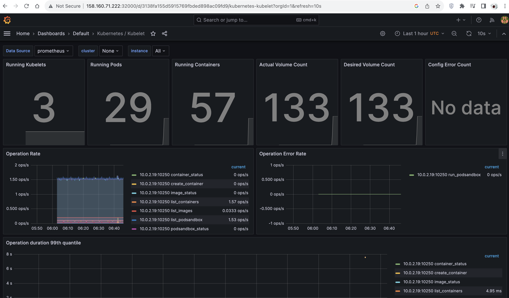
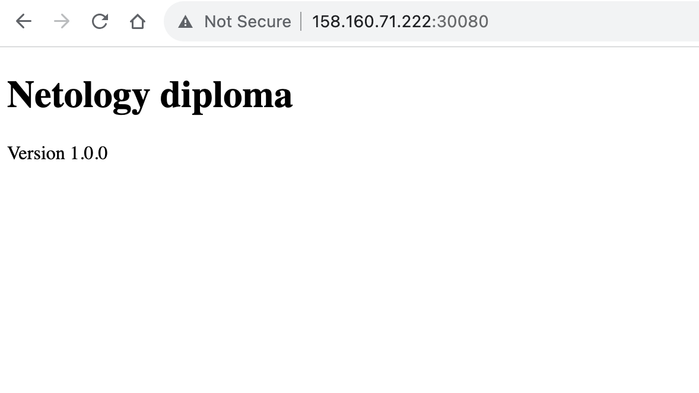
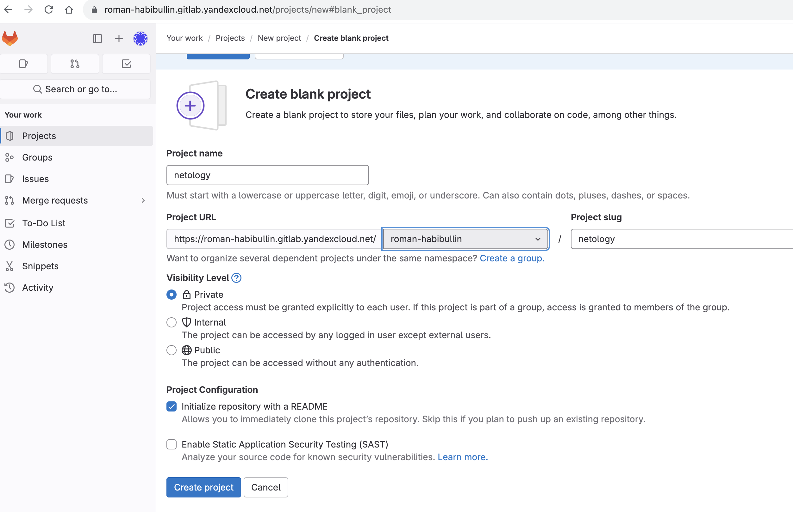
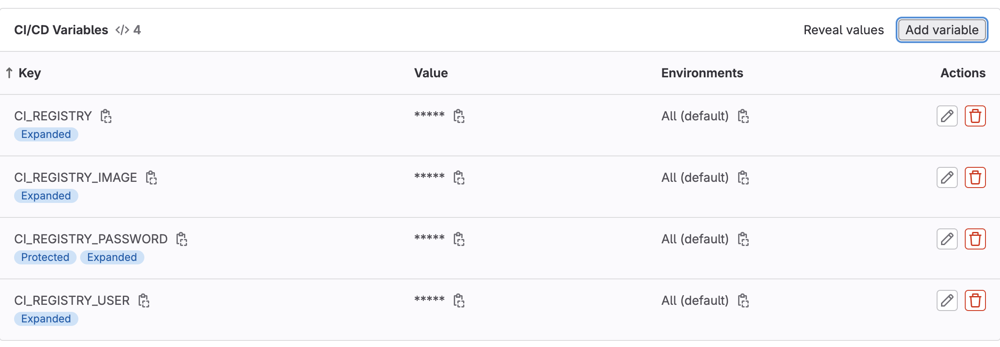
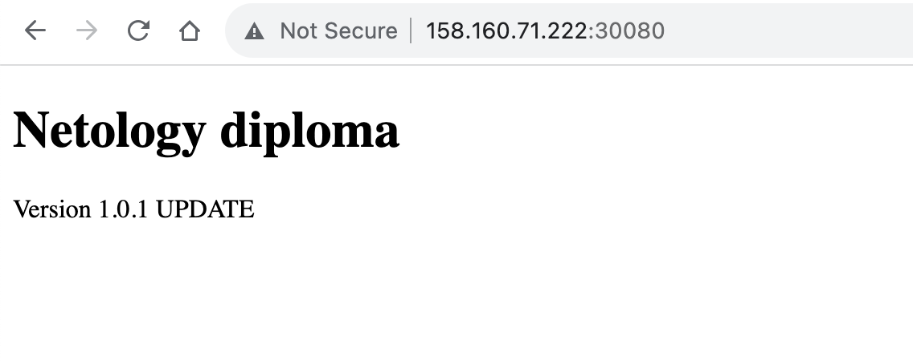

# Дипломный практикум в Yandex.Cloud
  * [Цели:](#цели)
  * [Этапы выполнения:](#этапы-выполнения)
     * [Создание облачной инфраструктуры](#создание-облачной-инфраструктуры)
     * [Создание Kubernetes кластера](#создание-kubernetes-кластера)
     * [Создание тестового приложения](#создание-тестового-приложения)
     * [Подготовка cистемы мониторинга и деплой приложения](#подготовка-cистемы-мониторинга-и-деплой-приложения)
     * [Установка и настройка CI/CD](#установка-и-настройка-cicd)
  * [Что необходимо для сдачи задания?](#что-необходимо-для-сдачи-задания)
  * [Как правильно задавать вопросы дипломному руководителю?](#как-правильно-задавать-вопросы-дипломному-руководителю)

**Перед началом работы над дипломным заданием изучите [Инструкция по экономии облачных ресурсов](https://github.com/netology-code/devops-materials/blob/master/cloudwork.MD).**

---
## Цели:

1. Подготовить облачную инфраструктуру на базе облачного провайдера Яндекс.Облако.
2. Запустить и сконфигурировать Kubernetes кластер.
3. Установить и настроить систему мониторинга.
4. Настроить и автоматизировать сборку тестового приложения с использованием Docker-контейнеров.
5. Настроить CI для автоматической сборки и тестирования.
6. Настроить CD для автоматического развёртывания приложения.

---
## Этапы выполнения:


### Создание облачной инфраструктуры

   [Репозиторий с terraform манифестами](https://github.com/RamiresHab/terraform-diploma)

Я подготовил облачную инфраструктуру в Яндекс Облаке для работы с Terraform, создал сервисный аккаунт и выгрузил ключ в файл authorized_key.json.

Для создания инфраструктуры я использовал только один workspace.

По условию задачи создал VPC с тремя подсетями в разных зонах доступности.

Результат выполнения `terraform apply` и `terraform destroy`:

<details>
<summary>➜  terraform terraform apply -auto-approve</summary>

```
Terraform used the selected providers to generate the following execution plan. Resource actions are indicated with the following symbols:
  + create

Terraform will perform the following actions:

  # yandex_compute_instance_group.master_nodes_group will be created
  + resource "yandex_compute_instance_group" "master_nodes_group" {
      + created_at          = (known after apply)
      + deletion_protection = false
      + folder_id           = "b1gjbcdp4ij0bkm2gt1q"
      + id                  = (known after apply)
      + instances           = (known after apply)
      + name                = "master-node-group"
      + service_account_id  = "ajes7237iag9t836la6q"
      + status              = (known after apply)

      + allocation_policy {
          + zones = [
              + "ru-central1-a",
              + "ru-central1-b",
              + "ru-central1-c",
            ]
        }

      + deploy_policy {
          + max_creating     = 0
          + max_deleting     = 0
          + max_expansion    = 0
          + max_unavailable  = 1
          + startup_duration = 0
          + strategy         = (known after apply)
        }

      + instance_template {
          + hostname    = "master-{instance.index}"
          + labels      = (known after apply)
          + metadata    = {
              + "user-data" = <<-EOT
                    #cloud-config
                    users:
                      - name: ro.khabibullin
                        groups: sudo
                        shell: /bin/bash
                        sudo: ['ALL=(ALL) NOPASSWD:ALL']
                        ssh_authorized_keys:
                          - ssh-rsa AAAAB3NzaC1yc2EAAAADAQABAAABgQC867cZghizFw+gpNMoOOx6Dm8z4E/P0iRsfKge3yZTn1DINKFr6rV/21Nx3SFs3tIXiHRywnVUiFHFGCLe3WOVqvuYxEswujC84UFsWDH+euvEO7GyrILpf4vwZlz6wdc3vsGQXjyHAFxZZUsDUfyGiG/xwEFsqxLcwvx3YQacbKDftQVS8nc/g4bbhrCcUqcjoj9Abiabj53DM0ig2uJGjsjM4Y2FH4PV0kfiNeEqFKqV6E963BuQiufX4+fEFzSbW+sIu7c9LhiGy4vyl5MjwQlGERgdqxr62+IzMdpptE7D8jBnY/ZyiZrCPi28o7dKCCCSBWtiutdtM/Dn0qGqofp/FlFt4SLxIlF36L4jZyC0ZHJSuEiecTpIGeyrIvr3HtrgdErQQhBE/9/GtWQfsjvcBKyBypxmePGqg+0DNyPF5868zy/O1YOIcgXqDdlELAeA/GRWwx+rheBbR89D3EJ8/dlW5tkjBq0zIw6PZgWyrka+5qVKpJMs6PRhW3s= ro.khabibullin@NB0557.local
                EOT
            }
          + name        = "master-{instance.index}"
          + platform_id = "standard-v3"

          + boot_disk {
              + device_name = (known after apply)
              + mode        = "READ_WRITE"

              + initialize_params {
                  + image_id    = "fd8oshj0osht8svg6rfs"
                  + size        = 30
                  + snapshot_id = (known after apply)
                  + type        = "network-hdd"
                }
            }

          + network_interface {
              + ip_address   = (known after apply)
              + ipv4         = true
              + ipv6         = false
              + ipv6_address = (known after apply)
              + nat          = true
              + network_id   = (known after apply)
              + subnet_ids   = (known after apply)
            }

          + resources {
              + core_fraction = 20
              + cores         = 2
              + memory        = 4
            }
        }

      + scale_policy {
          + fixed_scale {
              + size = 1
            }
        }
    }

  # yandex_compute_instance_group.worker_nodes_group will be created
  + resource "yandex_compute_instance_group" "worker_nodes_group" {
      + created_at          = (known after apply)
      + deletion_protection = false
      + folder_id           = "b1gjbcdp4ij0bkm2gt1q"
      + id                  = (known after apply)
      + instances           = (known after apply)
      + name                = "worker-node-group"
      + service_account_id  = "ajes7237iag9t836la6q"
      + status              = (known after apply)

      + allocation_policy {
          + zones = [
              + "ru-central1-a",
              + "ru-central1-b",
              + "ru-central1-c",
            ]
        }

      + deploy_policy {
          + max_creating     = 0
          + max_deleting     = 0
          + max_expansion    = 0
          + max_unavailable  = 1
          + startup_duration = 0
          + strategy         = (known after apply)
        }

      + instance_template {
          + hostname    = "worker-{instance.index}"
          + labels      = (known after apply)
          + metadata    = {
              + "user-data" = <<-EOT
                    #cloud-config
                    users:
                      - name: ro.khabibullin
                        groups: sudo
                        shell: /bin/bash
                        sudo: ['ALL=(ALL) NOPASSWD:ALL']
                        ssh_authorized_keys:
                          - ssh-rsa AAAAB3NzaC1yc2EAAAADAQABAAABgQC867cZghizFw+gpNMoOOx6Dm8z4E/P0iRsfKge3yZTn1DINKFr6rV/21Nx3SFs3tIXiHRywnVUiFHFGCLe3WOVqvuYxEswujC84UFsWDH+euvEO7GyrILpf4vwZlz6wdc3vsGQXjyHAFxZZUsDUfyGiG/xwEFsqxLcwvx3YQacbKDftQVS8nc/g4bbhrCcUqcjoj9Abiabj53DM0ig2uJGjsjM4Y2FH4PV0kfiNeEqFKqV6E963BuQiufX4+fEFzSbW+sIu7c9LhiGy4vyl5MjwQlGERgdqxr62+IzMdpptE7D8jBnY/ZyiZrCPi28o7dKCCCSBWtiutdtM/Dn0qGqofp/FlFt4SLxIlF36L4jZyC0ZHJSuEiecTpIGeyrIvr3HtrgdErQQhBE/9/GtWQfsjvcBKyBypxmePGqg+0DNyPF5868zy/O1YOIcgXqDdlELAeA/GRWwx+rheBbR89D3EJ8/dlW5tkjBq0zIw6PZgWyrka+5qVKpJMs6PRhW3s= ro.khabibullin@NB0557.local
                EOT
            }
          + name        = "worker-{instance.index}"
          + platform_id = "standard-v3"

          + boot_disk {
              + device_name = (known after apply)
              + mode        = "READ_WRITE"

              + initialize_params {
                  + image_id    = "fd8oshj0osht8svg6rfs"
                  + size        = 30
                  + snapshot_id = (known after apply)
                  + type        = "network-hdd"
                }
            }

          + network_interface {
              + ip_address   = (known after apply)
              + ipv4         = true
              + ipv6         = false
              + ipv6_address = (known after apply)
              + nat          = true
              + network_id   = (known after apply)
              + subnet_ids   = (known after apply)
            }

          + resources {
              + core_fraction = 20
              + cores         = 2
              + memory        = 4
            }
        }

      + scale_policy {
          + fixed_scale {
              + size = 2
            }
        }
    }

  # yandex_vpc_network.diploma_vpc will be created
  + resource "yandex_vpc_network" "diploma_vpc" {
      + created_at                = (known after apply)
      + default_security_group_id = (known after apply)
      + folder_id                 = (known after apply)
      + id                        = (known after apply)
      + labels                    = (known after apply)
      + name                      = "diploma-vpc"
      + subnet_ids                = (known after apply)
    }

  # yandex_vpc_subnet.diploma_subnet_a will be created
  + resource "yandex_vpc_subnet" "diploma_subnet_a" {
      + created_at     = (known after apply)
      + folder_id      = (known after apply)
      + id             = (known after apply)
      + labels         = (known after apply)
      + name           = "diploma_net_a"
      + network_id     = (known after apply)
      + v4_cidr_blocks = [
          + "10.0.1.0/24",
        ]
      + v6_cidr_blocks = (known after apply)
      + zone           = "ru-central1-a"
    }

  # yandex_vpc_subnet.diploma_subnet_b will be created
  + resource "yandex_vpc_subnet" "diploma_subnet_b" {
      + created_at     = (known after apply)
      + folder_id      = (known after apply)
      + id             = (known after apply)
      + labels         = (known after apply)
      + name           = "diploma_net_b"
      + network_id     = (known after apply)
      + v4_cidr_blocks = [
          + "10.0.2.0/24",
        ]
      + v6_cidr_blocks = (known after apply)
      + zone           = "ru-central1-b"
    }

  # yandex_vpc_subnet.diploma_subnet_c will be created
  + resource "yandex_vpc_subnet" "diploma_subnet_c" {
      + created_at     = (known after apply)
      + folder_id      = (known after apply)
      + id             = (known after apply)
      + labels         = (known after apply)
      + name           = "diploma_net_c"
      + network_id     = (known after apply)
      + v4_cidr_blocks = [
          + "10.0.3.0/24",
        ]
      + v6_cidr_blocks = (known after apply)
      + zone           = "ru-central1-c"
    }

Plan: 6 to add, 0 to change, 0 to destroy.

Changes to Outputs:
  + ansible_inventory = (known after apply)
yandex_vpc_network.diploma_vpc: Creating...
yandex_vpc_network.diploma_vpc: Creation complete after 3s [id=enpno6opmmsicl3ognom]
yandex_vpc_subnet.diploma_subnet_b: Creating...
yandex_vpc_subnet.diploma_subnet_a: Creating...
yandex_vpc_subnet.diploma_subnet_c: Creating...
yandex_vpc_subnet.diploma_subnet_a: Creation complete after 1s [id=e9b3k1o5vovfbk7c7mqu]
yandex_vpc_subnet.diploma_subnet_b: Creation complete after 1s [id=e2l6hmn34ploujikngq8]
yandex_vpc_subnet.diploma_subnet_c: Creation complete after 3s [id=b0c2oi8evgsnis3f3b24]
yandex_compute_instance_group.master_nodes_group: Creating...
yandex_compute_instance_group.worker_nodes_group: Creating...
yandex_compute_instance_group.worker_nodes_group: Still creating... [10s elapsed]
yandex_compute_instance_group.master_nodes_group: Still creating... [10s elapsed]
yandex_compute_instance_group.master_nodes_group: Still creating... [20s elapsed]
yandex_compute_instance_group.worker_nodes_group: Still creating... [20s elapsed]
yandex_compute_instance_group.worker_nodes_group: Still creating... [30s elapsed]
yandex_compute_instance_group.master_nodes_group: Still creating... [30s elapsed]
yandex_compute_instance_group.master_nodes_group: Still creating... [40s elapsed]
yandex_compute_instance_group.worker_nodes_group: Still creating... [40s elapsed]
yandex_compute_instance_group.worker_nodes_group: Still creating... [50s elapsed]
yandex_compute_instance_group.master_nodes_group: Still creating... [50s elapsed]
yandex_compute_instance_group.worker_nodes_group: Still creating... [1m0s elapsed]
yandex_compute_instance_group.master_nodes_group: Still creating... [1m0s elapsed]
yandex_compute_instance_group.master_nodes_group: Still creating... [1m10s elapsed]
yandex_compute_instance_group.worker_nodes_group: Still creating... [1m10s elapsed]
yandex_compute_instance_group.master_nodes_group: Creation complete after 1m15s [id=cl16630r4j6vtfqd1pq1]
yandex_compute_instance_group.worker_nodes_group: Still creating... [1m20s elapsed]
yandex_compute_instance_group.worker_nodes_group: Creation complete after 1m29s [id=cl11e2h8crppfiajlc31]

Apply complete! Resources: 6 added, 0 changed, 0 destroyed.

Outputs:

ansible_inventory = <<EOT
[masters]
master1 ansible_host=158.160.84.238 ansible_user=ro.khabibullin

[workers]
worker1 ansible_host=158.160.67.25 ansible_user=ro.khabibullin
worker2 ansible_host=84.201.149.186 ansible_user=ro.khabibullin

[all:vars]
ansible_python_interpreter=/usr/bin/python3
EOT
```

</details>


<details>
<summary>➜  terraform terraform destroy -auto-approve</summary>

```
yandex_vpc_network.diploma_vpc: Refreshing state... [id=enpno6opmmsicl3ognom]
yandex_vpc_subnet.diploma_subnet_a: Refreshing state... [id=e9b3k1o5vovfbk7c7mqu]
yandex_vpc_subnet.diploma_subnet_c: Refreshing state... [id=b0c2oi8evgsnis3f3b24]
yandex_vpc_subnet.diploma_subnet_b: Refreshing state... [id=e2l6hmn34ploujikngq8]
yandex_compute_instance_group.master_nodes_group: Refreshing state... [id=cl16630r4j6vtfqd1pq1]
yandex_compute_instance_group.worker_nodes_group: Refreshing state... [id=cl11e2h8crppfiajlc31]

Terraform used the selected providers to generate the following execution plan. Resource actions are indicated with the following symbols:
  - destroy

Terraform will perform the following actions:

  # yandex_compute_instance_group.master_nodes_group will be destroyed
  - resource "yandex_compute_instance_group" "master_nodes_group" {
      - created_at          = "2023-11-09T04:57:20Z" -> null
      - deletion_protection = false -> null
      - folder_id           = "b1gjbcdp4ij0bkm2gt1q" -> null
      - id                  = "cl16630r4j6vtfqd1pq1" -> null
      - instances           = [
          - {
              - fqdn              = "master-1.ru-central1.internal"
              - instance_id       = "epdh85r268r120448o1b"
              - instance_tag      = ""
              - name              = "master-1"
              - network_interface = [
                  - {
                      - index          = 0
                      - ip_address     = "10.0.2.21"
                      - ipv4           = true
                      - ipv6           = false
                      - ipv6_address   = ""
                      - mac_address    = "d0:0d:11:41:76:23"
                      - nat            = true
                      - nat_ip_address = "158.160.84.238"
                      - nat_ip_version = "IPV4"
                      - subnet_id      = "e2l6hmn34ploujikngq8"
                    },
                ]
              - status            = "RUNNING_ACTUAL"
              - status_changed_at = "2023-11-09T04:58:32Z"
              - status_message    = ""
              - zone_id           = "ru-central1-b"
            },
        ] -> null
      - labels              = {} -> null
      - name                = "master-node-group" -> null
      - service_account_id  = "ajes7237iag9t836la6q" -> null
      - status              = "ACTIVE" -> null
      - variables           = {} -> null

      - allocation_policy {
          - zones = [
              - "ru-central1-a",
              - "ru-central1-b",
              - "ru-central1-c",
            ] -> null
        }

      - deploy_policy {
          - max_creating     = 0 -> null
          - max_deleting     = 0 -> null
          - max_expansion    = 0 -> null
          - max_unavailable  = 1 -> null
          - startup_duration = 0 -> null
          - strategy         = "proactive" -> null
        }

      - instance_template {
          - hostname    = "master-{instance.index}" -> null
          - labels      = {} -> null
          - metadata    = {
              - "user-data" = <<-EOT
                    #cloud-config
                    users:
                      - name: ro.khabibullin
                        groups: sudo
                        shell: /bin/bash
                        sudo: ['ALL=(ALL) NOPASSWD:ALL']
                        ssh_authorized_keys:
                          - ssh-rsa AAAAB3NzaC1yc2EAAAADAQABAAABgQC867cZghizFw+gpNMoOOx6Dm8z4E/P0iRsfKge3yZTn1DINKFr6rV/21Nx3SFs3tIXiHRywnVUiFHFGCLe3WOVqvuYxEswujC84UFsWDH+euvEO7GyrILpf4vwZlz6wdc3vsGQXjyHAFxZZUsDUfyGiG/xwEFsqxLcwvx3YQacbKDftQVS8nc/g4bbhrCcUqcjoj9Abiabj53DM0ig2uJGjsjM4Y2FH4PV0kfiNeEqFKqV6E963BuQiufX4+fEFzSbW+sIu7c9LhiGy4vyl5MjwQlGERgdqxr62+IzMdpptE7D8jBnY/ZyiZrCPi28o7dKCCCSBWtiutdtM/Dn0qGqofp/FlFt4SLxIlF36L4jZyC0ZHJSuEiecTpIGeyrIvr3HtrgdErQQhBE/9/GtWQfsjvcBKyBypxmePGqg+0DNyPF5868zy/O1YOIcgXqDdlELAeA/GRWwx+rheBbR89D3EJ8/dlW5tkjBq0zIw6PZgWyrka+5qVKpJMs6PRhW3s= ro.khabibullin@NB0557.local
                EOT
            } -> null
          - name        = "master-{instance.index}" -> null
          - platform_id = "standard-v3" -> null

          - boot_disk {
              - mode = "READ_WRITE" -> null

              - initialize_params {
                  - image_id = "fd8oshj0osht8svg6rfs" -> null
                  - size     = 30 -> null
                  - type     = "network-hdd" -> null
                }
            }

          - network_interface {
              - ipv4               = true -> null
              - ipv6               = false -> null
              - nat                = true -> null
              - network_id         = "enpno6opmmsicl3ognom" -> null
              - security_group_ids = [] -> null
              - subnet_ids         = [
                  - "b0c2oi8evgsnis3f3b24",
                  - "e2l6hmn34ploujikngq8",
                  - "e9b3k1o5vovfbk7c7mqu",
                ] -> null
            }

          - resources {
              - core_fraction = 20 -> null
              - cores         = 2 -> null
              - gpus          = 0 -> null
              - memory        = 4 -> null
            }

          - scheduling_policy {
              - preemptible = false -> null
            }
        }

      - scale_policy {
          - fixed_scale {
              - size = 1 -> null
            }
        }
    }

  # yandex_compute_instance_group.worker_nodes_group will be destroyed
  - resource "yandex_compute_instance_group" "worker_nodes_group" {
      - created_at          = "2023-11-09T04:57:19Z" -> null
      - deletion_protection = false -> null
      - folder_id           = "b1gjbcdp4ij0bkm2gt1q" -> null
      - id                  = "cl11e2h8crppfiajlc31" -> null
      - instances           = [
          - {
              - fqdn              = "worker-1.ru-central1.internal"
              - instance_id       = "epd6c7shuoqjclful5tk"
              - instance_tag      = ""
              - name              = "worker-1"
              - network_interface = [
                  - {
                      - index          = 0
                      - ip_address     = "10.0.2.27"
                      - ipv4           = true
                      - ipv6           = false
                      - ipv6_address   = ""
                      - mac_address    = "d0:0d:66:1f:91:f6"
                      - nat            = true
                      - nat_ip_address = "158.160.67.25"
                      - nat_ip_version = "IPV4"
                      - subnet_id      = "e2l6hmn34ploujikngq8"
                    },
                ]
              - status            = "RUNNING_ACTUAL"
              - status_changed_at = "2023-11-09T04:58:26Z"
              - status_message    = ""
              - zone_id           = "ru-central1-b"
            },
          - {
              - fqdn              = "worker-2.ru-central1.internal"
              - instance_id       = "ef3uf8d52p4sgkiq0dmg"
              - instance_tag      = ""
              - name              = "worker-2"
              - network_interface = [
                  - {
                      - index          = 0
                      - ip_address     = "10.0.3.4"
                      - ipv4           = true
                      - ipv6           = false
                      - ipv6_address   = ""
                      - mac_address    = "d0:0d:1e:7a:1a:51"
                      - nat            = true
                      - nat_ip_address = "84.201.149.186"
                      - nat_ip_version = "IPV4"
                      - subnet_id      = "b0c2oi8evgsnis3f3b24"
                    },
                ]
              - status            = "RUNNING_ACTUAL"
              - status_changed_at = "2023-11-09T04:58:46Z"
              - status_message    = ""
              - zone_id           = "ru-central1-c"
            },
        ] -> null
      - labels              = {} -> null
      - name                = "worker-node-group" -> null
      - service_account_id  = "ajes7237iag9t836la6q" -> null
      - status              = "ACTIVE" -> null
      - variables           = {} -> null

      - allocation_policy {
          - zones = [
              - "ru-central1-a",
              - "ru-central1-b",
              - "ru-central1-c",
            ] -> null
        }

      - deploy_policy {
          - max_creating     = 0 -> null
          - max_deleting     = 0 -> null
          - max_expansion    = 0 -> null
          - max_unavailable  = 1 -> null
          - startup_duration = 0 -> null
          - strategy         = "proactive" -> null
        }

      - instance_template {
          - hostname    = "worker-{instance.index}" -> null
          - labels      = {} -> null
          - metadata    = {
              - "user-data" = <<-EOT
                    #cloud-config
                    users:
                      - name: ro.khabibullin
                        groups: sudo
                        shell: /bin/bash
                        sudo: ['ALL=(ALL) NOPASSWD:ALL']
                        ssh_authorized_keys:
                          - ssh-rsa AAAAB3NzaC1yc2EAAAADAQABAAABgQC867cZghizFw+gpNMoOOx6Dm8z4E/P0iRsfKge3yZTn1DINKFr6rV/21Nx3SFs3tIXiHRywnVUiFHFGCLe3WOVqvuYxEswujC84UFsWDH+euvEO7GyrILpf4vwZlz6wdc3vsGQXjyHAFxZZUsDUfyGiG/xwEFsqxLcwvx3YQacbKDftQVS8nc/g4bbhrCcUqcjoj9Abiabj53DM0ig2uJGjsjM4Y2FH4PV0kfiNeEqFKqV6E963BuQiufX4+fEFzSbW+sIu7c9LhiGy4vyl5MjwQlGERgdqxr62+IzMdpptE7D8jBnY/ZyiZrCPi28o7dKCCCSBWtiutdtM/Dn0qGqofp/FlFt4SLxIlF36L4jZyC0ZHJSuEiecTpIGeyrIvr3HtrgdErQQhBE/9/GtWQfsjvcBKyBypxmePGqg+0DNyPF5868zy/O1YOIcgXqDdlELAeA/GRWwx+rheBbR89D3EJ8/dlW5tkjBq0zIw6PZgWyrka+5qVKpJMs6PRhW3s= ro.khabibullin@NB0557.local
                EOT
            } -> null
          - name        = "worker-{instance.index}" -> null
          - platform_id = "standard-v3" -> null

          - boot_disk {
              - mode = "READ_WRITE" -> null

              - initialize_params {
                  - image_id = "fd8oshj0osht8svg6rfs" -> null
                  - size     = 30 -> null
                  - type     = "network-hdd" -> null
                }
            }

          - network_interface {
              - ipv4               = true -> null
              - ipv6               = false -> null
              - nat                = true -> null
              - network_id         = "enpno6opmmsicl3ognom" -> null
              - security_group_ids = [] -> null
              - subnet_ids         = [
                  - "b0c2oi8evgsnis3f3b24",
                  - "e2l6hmn34ploujikngq8",
                  - "e9b3k1o5vovfbk7c7mqu",
                ] -> null
            }

          - resources {
              - core_fraction = 20 -> null
              - cores         = 2 -> null
              - gpus          = 0 -> null
              - memory        = 4 -> null
            }

          - scheduling_policy {
              - preemptible = false -> null
            }
        }

      - scale_policy {
          - fixed_scale {
              - size = 2 -> null
            }
        }
    }

  # yandex_vpc_network.diploma_vpc will be destroyed
  - resource "yandex_vpc_network" "diploma_vpc" {
      - created_at                = "2023-11-09T04:57:13Z" -> null
      - default_security_group_id = "enpbp94f4pus02ost088" -> null
      - folder_id                 = "b1gjbcdp4ij0bkm2gt1q" -> null
      - id                        = "enpno6opmmsicl3ognom" -> null
      - labels                    = {} -> null
      - name                      = "diploma-vpc" -> null
      - subnet_ids                = [
          - "b0c2oi8evgsnis3f3b24",
          - "e2l6hmn34ploujikngq8",
          - "e9b3k1o5vovfbk7c7mqu",
        ] -> null
    }

  # yandex_vpc_subnet.diploma_subnet_a will be destroyed
  - resource "yandex_vpc_subnet" "diploma_subnet_a" {
      - created_at     = "2023-11-09T04:57:16Z" -> null
      - folder_id      = "b1gjbcdp4ij0bkm2gt1q" -> null
      - id             = "e9b3k1o5vovfbk7c7mqu" -> null
      - labels         = {} -> null
      - name           = "diploma_net_a" -> null
      - network_id     = "enpno6opmmsicl3ognom" -> null
      - v4_cidr_blocks = [
          - "10.0.1.0/24",
        ] -> null
      - v6_cidr_blocks = [] -> null
      - zone           = "ru-central1-a" -> null
    }

  # yandex_vpc_subnet.diploma_subnet_b will be destroyed
  - resource "yandex_vpc_subnet" "diploma_subnet_b" {
      - created_at     = "2023-11-09T04:57:16Z" -> null
      - folder_id      = "b1gjbcdp4ij0bkm2gt1q" -> null
      - id             = "e2l6hmn34ploujikngq8" -> null
      - labels         = {} -> null
      - name           = "diploma_net_b" -> null
      - network_id     = "enpno6opmmsicl3ognom" -> null
      - v4_cidr_blocks = [
          - "10.0.2.0/24",
        ] -> null
      - v6_cidr_blocks = [] -> null
      - zone           = "ru-central1-b" -> null
    }

  # yandex_vpc_subnet.diploma_subnet_c will be destroyed
  - resource "yandex_vpc_subnet" "diploma_subnet_c" {
      - created_at     = "2023-11-09T04:57:18Z" -> null
      - folder_id      = "b1gjbcdp4ij0bkm2gt1q" -> null
      - id             = "b0c2oi8evgsnis3f3b24" -> null
      - labels         = {} -> null
      - name           = "diploma_net_c" -> null
      - network_id     = "enpno6opmmsicl3ognom" -> null
      - v4_cidr_blocks = [
          - "10.0.3.0/24",
        ] -> null
      - v6_cidr_blocks = [] -> null
      - zone           = "ru-central1-c" -> null
    }

Plan: 0 to add, 0 to change, 6 to destroy.

Changes to Outputs:
  - ansible_inventory = <<-EOT
        [masters]
        master1 ansible_host=158.160.84.238 ansible_user=ro.khabibullin
        
        [workers]
        worker1 ansible_host=158.160.67.25 ansible_user=ro.khabibullin
        worker2 ansible_host=84.201.149.186 ansible_user=ro.khabibullin
        
        [all:vars]
        ansible_python_interpreter=/usr/bin/python3
    EOT -> null
yandex_compute_instance_group.master_nodes_group: Destroying... [id=cl16630r4j6vtfqd1pq1]
yandex_compute_instance_group.worker_nodes_group: Destroying... [id=cl11e2h8crppfiajlc31]
yandex_compute_instance_group.master_nodes_group: Still destroying... [id=cl16630r4j6vtfqd1pq1, 10s elapsed]
yandex_compute_instance_group.worker_nodes_group: Still destroying... [id=cl11e2h8crppfiajlc31, 10s elapsed]
yandex_compute_instance_group.worker_nodes_group: Still destroying... [id=cl11e2h8crppfiajlc31, 20s elapsed]
yandex_compute_instance_group.master_nodes_group: Still destroying... [id=cl16630r4j6vtfqd1pq1, 20s elapsed]
yandex_compute_instance_group.master_nodes_group: Still destroying... [id=cl16630r4j6vtfqd1pq1, 30s elapsed]
yandex_compute_instance_group.worker_nodes_group: Still destroying... [id=cl11e2h8crppfiajlc31, 30s elapsed]
yandex_compute_instance_group.master_nodes_group: Still destroying... [id=cl16630r4j6vtfqd1pq1, 40s elapsed]
yandex_compute_instance_group.worker_nodes_group: Still destroying... [id=cl11e2h8crppfiajlc31, 40s elapsed]
yandex_compute_instance_group.worker_nodes_group: Still destroying... [id=cl11e2h8crppfiajlc31, 50s elapsed]
yandex_compute_instance_group.master_nodes_group: Still destroying... [id=cl16630r4j6vtfqd1pq1, 50s elapsed]
yandex_compute_instance_group.worker_nodes_group: Still destroying... [id=cl11e2h8crppfiajlc31, 1m0s elapsed]
yandex_compute_instance_group.master_nodes_group: Still destroying... [id=cl16630r4j6vtfqd1pq1, 1m0s elapsed]
yandex_compute_instance_group.worker_nodes_group: Destruction complete after 1m9s
yandex_compute_instance_group.master_nodes_group: Still destroying... [id=cl16630r4j6vtfqd1pq1, 1m10s elapsed]
yandex_compute_instance_group.master_nodes_group: Destruction complete after 1m11s
yandex_vpc_subnet.diploma_subnet_a: Destroying... [id=e9b3k1o5vovfbk7c7mqu]
yandex_vpc_subnet.diploma_subnet_b: Destroying... [id=e2l6hmn34ploujikngq8]
yandex_vpc_subnet.diploma_subnet_c: Destroying... [id=b0c2oi8evgsnis3f3b24]
yandex_vpc_subnet.diploma_subnet_a: Destruction complete after 3s
yandex_vpc_subnet.diploma_subnet_c: Destruction complete after 5s
yandex_vpc_subnet.diploma_subnet_b: Destruction complete after 9s
yandex_vpc_network.diploma_vpc: Destroying... [id=enpno6opmmsicl3ognom]
yandex_vpc_network.diploma_vpc: Destruction complete after 1s

Destroy complete! Resources: 6 destroyed.
```

</details>
                                                     
---
### Создание Kubernetes кластера

   [Репозиторий с ansible](https://github.com/RamiresHab/ansible-diploma)

После создания инфраструктуры мы получаем output от Terraform, который сформирован специально для ansible hosts. Импортируем его командой

```
terraform output ansible_inventory | sed '/<<EOT/d' | sed '/EOT/d' > ../ansible/hosts
```

После этого перейдём в каталог с ansible и установим Kubernetes через kubeadm, для этого у нас есть роль install_kubeadm

<details>
<summary>➜  ansible ansible-playbook -i hosts playbook.yml --tags install_kubeadm -v --ssh-common-args='-o StrictHostKeyChecking=no'</summary>

```
No config file found; using defaults

PLAY [Install k8s from kubeadm] *********************************************************************************************************************************

TASK [Gathering Facts] ******************************************************************************************************************************************
ok: [worker2]
ok: [master1]
ok: [worker1]

TASK [install_kubeadm : Disable swap] ***************************************************************************************************************************
changed: [worker2] => {"changed": true, "cmd": "swapoff -a", "delta": "0:00:00.006867", "end": "2023-11-09 05:54:07.304047", "msg": "", "rc": 0, "start": "2023-11-09 05:54:07.297180", "stderr": "", "stderr_lines": [], "stdout": "", "stdout_lines": []}
changed: [master1] => {"changed": true, "cmd": "swapoff -a", "delta": "0:00:00.006226", "end": "2023-11-09 05:54:07.452089", "msg": "", "rc": 0, "start": "2023-11-09 05:54:07.445863", "stderr": "", "stderr_lines": [], "stdout": "", "stdout_lines": []}
changed: [worker1] => {"changed": true, "cmd": "swapoff -a", "delta": "0:00:00.005331", "end": "2023-11-09 05:54:07.456086", "msg": "", "rc": 0, "start": "2023-11-09 05:54:07.450755", "stderr": "", "stderr_lines": [], "stdout": "", "stdout_lines": []}

TASK [install_kubeadm : Turn off swap in fstab] *****************************************************************************************************************
ok: [worker2] => {"changed": false, "msg": "", "rc": 0}
ok: [worker1] => {"changed": false, "msg": "", "rc": 0}
ok: [master1] => {"changed": false, "msg": "", "rc": 0}

TASK [install_kubeadm : Install gnupg] **************************************************************************************************************************
changed: [worker2] => {"cache_update_time": 1699509260, "cache_updated": true, "changed": true, "stderr": "", "stderr_lines": [], "stdout": "Reading package lists...\nBuilding dependency tree...\nReading state information...\nThe following additional packages will be installed:\n  dirmngr git-man gnupg-l10n gnupg-utils gpg gpg-agent gpg-wks-client\n  gpg-wks-server gpgconf gpgsm libassuan0 libcurl3-gnutls liberror-perl\n  libksba8 libnpth0 patch pinentry-curses\nSuggested packages:\n  dbus-user-session pinentry-gnome3 tor git-daemon-run | git-daemon-sysvinit\n  git-doc git-el git-email git-gui gitk gitweb git-cvs git-mediawiki git-svn\n  parcimonie xloadimage scdaemon ed diffutils-doc pinentry-doc\nThe following NEW packages will be installed:\n  dirmngr git git-man gnupg gnupg-l10n gnupg-utils gpg gpg-agent\n  gpg-wks-client gpg-wks-server gpgconf gpgsm libassuan0 libcurl3-gnutls\n  liberror-perl libksba8 libnpth0 patch pinentry-curses\n0 upgraded, 19 newly installed, 0 to remove and 53 not upgraded.\nNeed to get 15.5 MB of archives.\nAfter this operation, 54.6 MB of additional disk space will be used.\nGet:1 http://mirror.yandex.ru/debian bullseye/main amd64 libassuan0 amd64 2.5.3-7.1 [50.5 kB]\nGet:2 http://mirror.yandex.ru/debian bullseye/main amd64 gpgconf amd64 2.2.27-2+deb11u2 [548 kB]\nGet:3 http://mirror.yandex.ru/debian bullseye/main amd64 libksba8 amd64 1.5.0-3+deb11u2 [123 kB]\nGet:4 http://security.debian.org bullseye-security/main amd64 libcurl3-gnutls amd64 7.74.0-1.3+deb11u10 [344 kB]\nGet:5 http://mirror.yandex.ru/debian bullseye/main amd64 libnpth0 amd64 1.6-3 [19.0 kB]\nGet:6 http://mirror.yandex.ru/debian bullseye/main amd64 dirmngr amd64 2.2.27-2+deb11u2 [763 kB]\nGet:7 http://mirror.yandex.ru/debian bullseye/main amd64 liberror-perl all 0.17029-1 [31.0 kB]\nGet:8 http://mirror.yandex.ru/debian bullseye/main amd64 git-man all 1:2.30.2-1+deb11u2 [1828 kB]\nGet:9 http://mirror.yandex.ru/debian bullseye/main amd64 git amd64 1:2.30.2-1+deb11u2 [5518 kB]\nGet:10 http://mirror.yandex.ru/debian bullseye/main amd64 gnupg-l10n all 2.2.27-2+deb11u2 [1086 kB]\nGet:11 http://mirror.yandex.ru/debian bullseye/main amd64 gnupg-utils amd64 2.2.27-2+deb11u2 [905 kB]\nGet:12 http://mirror.yandex.ru/debian bullseye/main amd64 gpg amd64 2.2.27-2+deb11u2 [928 kB]\nGet:13 http://mirror.yandex.ru/debian bullseye/main amd64 pinentry-curses amd64 1.1.0-4 [64.9 kB]\nGet:14 http://mirror.yandex.ru/debian bullseye/main amd64 gpg-agent amd64 2.2.27-2+deb11u2 [669 kB]\nGet:15 http://mirror.yandex.ru/debian bullseye/main amd64 gpg-wks-client amd64 2.2.27-2+deb11u2 [524 kB]\nGet:16 http://mirror.yandex.ru/debian bullseye/main amd64 gpg-wks-server amd64 2.2.27-2+deb11u2 [516 kB]\nGet:17 http://mirror.yandex.ru/debian bullseye/main amd64 gpgsm amd64 2.2.27-2+deb11u2 [645 kB]\nGet:18 http://mirror.yandex.ru/debian bullseye/main amd64 gnupg all 2.2.27-2+deb11u2 [825 kB]\nGet:19 http://mirror.yandex.ru/debian bullseye/main amd64 patch amd64 2.7.6-7 [128 kB]\nFetched 15.5 MB in 1s (15.2 MB/s)\nSelecting previously unselected package libassuan0:amd64.\r\n(Reading database ... \r(Reading database ... 5%\r(Reading database ... 10%\r(Reading database ... 15%\r(Reading database ... 20%\r(Reading database ... 25%\r(Reading database ... 30%\r(Reading database ... 35%\r(Reading database ... 40%\r(Reading database ... 45%\r(Reading database ... 50%\r(Reading database ... 55%\r(Reading database ... 60%\r(Reading database ... 65%\r(Reading database ... 70%\r(Reading database ... 75%\r(Reading database ... 80%\r(Reading database ... 85%\r(Reading database ... 90%\r(Reading database ... 95%\r(Reading database ... 100%\r(Reading database ... 34362 files and directories currently installed.)\r\nPreparing to unpack .../00-libassuan0_2.5.3-7.1_amd64.deb ...\r\nUnpacking libassuan0:amd64 (2.5.3-7.1) ...\r\nSelecting previously unselected package gpgconf.\r\nPreparing to unpack .../01-gpgconf_2.2.27-2+deb11u2_amd64.deb ...\r\nUnpacking gpgconf (2.2.27-2+deb11u2) ...\r\nSelecting previously unselected package libksba8:amd64.\r\nPreparing to unpack .../02-libksba8_1.5.0-3+deb11u2_amd64.deb ...\r\nUnpacking libksba8:amd64 (1.5.0-3+deb11u2) ...\r\nSelecting previously unselected package libnpth0:amd64.\r\nPreparing to unpack .../03-libnpth0_1.6-3_amd64.deb ...\r\nUnpacking libnpth0:amd64 (1.6-3) ...\r\nSelecting previously unselected package dirmngr.\r\nPreparing to unpack .../04-dirmngr_2.2.27-2+deb11u2_amd64.deb ...\r\nUnpacking dirmngr (2.2.27-2+deb11u2) ...\r\nSelecting previously unselected package libcurl3-gnutls:amd64.\r\nPreparing to unpack .../05-libcurl3-gnutls_7.74.0-1.3+deb11u10_amd64.deb ...\r\nUnpacking libcurl3-gnutls:amd64 (7.74.0-1.3+deb11u10) ...\r\nSelecting previously unselected package liberror-perl.\r\nPreparing to unpack .../06-liberror-perl_0.17029-1_all.deb ...\r\nUnpacking liberror-perl (0.17029-1) ...\r\nSelecting previously unselected package git-man.\r\nPreparing to unpack .../07-git-man_1%3a2.30.2-1+deb11u2_all.deb ...\r\nUnpacking git-man (1:2.30.2-1+deb11u2) ...\r\nSelecting previously unselected package git.\r\nPreparing to unpack .../08-git_1%3a2.30.2-1+deb11u2_amd64.deb ...\r\nUnpacking git (1:2.30.2-1+deb11u2) ...\r\nSelecting previously unselected package gnupg-l10n.\r\nPreparing to unpack .../09-gnupg-l10n_2.2.27-2+deb11u2_all.deb ...\r\nUnpacking gnupg-l10n (2.2.27-2+deb11u2) ...\r\nSelecting previously unselected package gnupg-utils.\r\nPreparing to unpack .../10-gnupg-utils_2.2.27-2+deb11u2_amd64.deb ...\r\nUnpacking gnupg-utils (2.2.27-2+deb11u2) ...\r\nSelecting previously unselected package gpg.\r\nPreparing to unpack .../11-gpg_2.2.27-2+deb11u2_amd64.deb ...\r\nUnpacking gpg (2.2.27-2+deb11u2) ...\r\nSelecting previously unselected package pinentry-curses.\r\nPreparing to unpack .../12-pinentry-curses_1.1.0-4_amd64.deb ...\r\nUnpacking pinentry-curses (1.1.0-4) ...\r\nSelecting previously unselected package gpg-agent.\r\nPreparing to unpack .../13-gpg-agent_2.2.27-2+deb11u2_amd64.deb ...\r\nUnpacking gpg-agent (2.2.27-2+deb11u2) ...\r\nSelecting previously unselected package gpg-wks-client.\r\nPreparing to unpack .../14-gpg-wks-client_2.2.27-2+deb11u2_amd64.deb ...\r\nUnpacking gpg-wks-client (2.2.27-2+deb11u2) ...\r\nSelecting previously unselected package gpg-wks-server.\r\nPreparing to unpack .../15-gpg-wks-server_2.2.27-2+deb11u2_amd64.deb ...\r\nUnpacking gpg-wks-server (2.2.27-2+deb11u2) ...\r\nSelecting previously unselected package gpgsm.\r\nPreparing to unpack .../16-gpgsm_2.2.27-2+deb11u2_amd64.deb ...\r\nUnpacking gpgsm (2.2.27-2+deb11u2) ...\r\nSelecting previously unselected package gnupg.\r\nPreparing to unpack .../17-gnupg_2.2.27-2+deb11u2_all.deb ...\r\nUnpacking gnupg (2.2.27-2+deb11u2) ...\r\nSelecting previously unselected package patch.\r\nPreparing to unpack .../18-patch_2.7.6-7_amd64.deb ...\r\nUnpacking patch (2.7.6-7) ...\r\nSetting up libksba8:amd64 (1.5.0-3+deb11u2) ...\r\nSetting up libcurl3-gnutls:amd64 (7.74.0-1.3+deb11u10) ...\r\nSetting up libnpth0:amd64 (1.6-3) ...\r\nSetting up libassuan0:amd64 (2.5.3-7.1) ...\r\nSetting up liberror-perl (0.17029-1) ...\r\nSetting up gnupg-l10n (2.2.27-2+deb11u2) ...\r\nSetting up patch (2.7.6-7) ...\r\nSetting up gpgconf (2.2.27-2+deb11u2) ...\r\nSetting up git-man (1:2.30.2-1+deb11u2) ...\r\nSetting up gpg (2.2.27-2+deb11u2) ...\r\nSetting up gnupg-utils (2.2.27-2+deb11u2) ...\r\nSetting up pinentry-curses (1.1.0-4) ...\r\nSetting up gpg-agent (2.2.27-2+deb11u2) ...\r\nCreated symlink /etc/systemd/user/sockets.target.wants/gpg-agent-browser.socket → /usr/lib/systemd/user/gpg-agent-browser.socket.\r\nCreated symlink /etc/systemd/user/sockets.target.wants/gpg-agent-extra.socket → /usr/lib/systemd/user/gpg-agent-extra.socket.\r\nCreated symlink /etc/systemd/user/sockets.target.wants/gpg-agent-ssh.socket → /usr/lib/systemd/user/gpg-agent-ssh.socket.\r\nCreated symlink /etc/systemd/user/sockets.target.wants/gpg-agent.socket → /usr/lib/systemd/user/gpg-agent.socket.\r\nSetting up gpgsm (2.2.27-2+deb11u2) ...\r\nSetting up dirmngr (2.2.27-2+deb11u2) ...\r\nCreated symlink /etc/systemd/user/sockets.target.wants/dirmngr.socket → /usr/lib/systemd/user/dirmngr.socket.\r\nSetting up git (1:2.30.2-1+deb11u2) ...\r\nSetting up gpg-wks-server (2.2.27-2+deb11u2) ...\r\nSetting up gpg-wks-client (2.2.27-2+deb11u2) ...\r\nSetting up gnupg (2.2.27-2+deb11u2) ...\r\nProcessing triggers for libc-bin (2.31-13+deb11u6) ...\r\n", "stdout_lines": ["Reading package lists...", "Building dependency tree...", "Reading state information...", "The following additional packages will be installed:", "  dirmngr git-man gnupg-l10n gnupg-utils gpg gpg-agent gpg-wks-client", "  gpg-wks-server gpgconf gpgsm libassuan0 libcurl3-gnutls liberror-perl", "  libksba8 libnpth0 patch pinentry-curses", "Suggested packages:", "  dbus-user-session pinentry-gnome3 tor git-daemon-run | git-daemon-sysvinit", "  git-doc git-el git-email git-gui gitk gitweb git-cvs git-mediawiki git-svn", "  parcimonie xloadimage scdaemon ed diffutils-doc pinentry-doc", "The following NEW packages will be installed:", "  dirmngr git git-man gnupg gnupg-l10n gnupg-utils gpg gpg-agent", "  gpg-wks-client gpg-wks-server gpgconf gpgsm libassuan0 libcurl3-gnutls", "  liberror-perl libksba8 libnpth0 patch pinentry-curses", "0 upgraded, 19 newly installed, 0 to remove and 53 not upgraded.", "Need to get 15.5 MB of archives.", "After this operation, 54.6 MB of additional disk space will be used.", "Get:1 http://mirror.yandex.ru/debian bullseye/main amd64 libassuan0 amd64 2.5.3-7.1 [50.5 kB]", "Get:2 http://mirror.yandex.ru/debian bullseye/main amd64 gpgconf amd64 2.2.27-2+deb11u2 [548 kB]", "Get:3 http://mirror.yandex.ru/debian bullseye/main amd64 libksba8 amd64 1.5.0-3+deb11u2 [123 kB]", "Get:4 http://security.debian.org bullseye-security/main amd64 libcurl3-gnutls amd64 7.74.0-1.3+deb11u10 [344 kB]", "Get:5 http://mirror.yandex.ru/debian bullseye/main amd64 libnpth0 amd64 1.6-3 [19.0 kB]", "Get:6 http://mirror.yandex.ru/debian bullseye/main amd64 dirmngr amd64 2.2.27-2+deb11u2 [763 kB]", "Get:7 http://mirror.yandex.ru/debian bullseye/main amd64 liberror-perl all 0.17029-1 [31.0 kB]", "Get:8 http://mirror.yandex.ru/debian bullseye/main amd64 git-man all 1:2.30.2-1+deb11u2 [1828 kB]", "Get:9 http://mirror.yandex.ru/debian bullseye/main amd64 git amd64 1:2.30.2-1+deb11u2 [5518 kB]", "Get:10 http://mirror.yandex.ru/debian bullseye/main amd64 gnupg-l10n all 2.2.27-2+deb11u2 [1086 kB]", "Get:11 http://mirror.yandex.ru/debian bullseye/main amd64 gnupg-utils amd64 2.2.27-2+deb11u2 [905 kB]", "Get:12 http://mirror.yandex.ru/debian bullseye/main amd64 gpg amd64 2.2.27-2+deb11u2 [928 kB]", "Get:13 http://mirror.yandex.ru/debian bullseye/main amd64 pinentry-curses amd64 1.1.0-4 [64.9 kB]", "Get:14 http://mirror.yandex.ru/debian bullseye/main amd64 gpg-agent amd64 2.2.27-2+deb11u2 [669 kB]", "Get:15 http://mirror.yandex.ru/debian bullseye/main amd64 gpg-wks-client amd64 2.2.27-2+deb11u2 [524 kB]", "Get:16 http://mirror.yandex.ru/debian bullseye/main amd64 gpg-wks-server amd64 2.2.27-2+deb11u2 [516 kB]", "Get:17 http://mirror.yandex.ru/debian bullseye/main amd64 gpgsm amd64 2.2.27-2+deb11u2 [645 kB]", "Get:18 http://mirror.yandex.ru/debian bullseye/main amd64 gnupg all 2.2.27-2+deb11u2 [825 kB]", "Get:19 http://mirror.yandex.ru/debian bullseye/main amd64 patch amd64 2.7.6-7 [128 kB]", "Fetched 15.5 MB in 1s (15.2 MB/s)", "Selecting previously unselected package libassuan0:amd64.", "(Reading database ... ", "(Reading database ... 5%", "(Reading database ... 10%", "(Reading database ... 15%", "(Reading database ... 20%", "(Reading database ... 25%", "(Reading database ... 30%", "(Reading database ... 35%", "(Reading database ... 40%", "(Reading database ... 45%", "(Reading database ... 50%", "(Reading database ... 55%", "(Reading database ... 60%", "(Reading database ... 65%", "(Reading database ... 70%", "(Reading database ... 75%", "(Reading database ... 80%", "(Reading database ... 85%", "(Reading database ... 90%", "(Reading database ... 95%", "(Reading database ... 100%", "(Reading database ... 34362 files and directories currently installed.)", "Preparing to unpack .../00-libassuan0_2.5.3-7.1_amd64.deb ...", "Unpacking libassuan0:amd64 (2.5.3-7.1) ...", "Selecting previously unselected package gpgconf.", "Preparing to unpack .../01-gpgconf_2.2.27-2+deb11u2_amd64.deb ...", "Unpacking gpgconf (2.2.27-2+deb11u2) ...", "Selecting previously unselected package libksba8:amd64.", "Preparing to unpack .../02-libksba8_1.5.0-3+deb11u2_amd64.deb ...", "Unpacking libksba8:amd64 (1.5.0-3+deb11u2) ...", "Selecting previously unselected package libnpth0:amd64.", "Preparing to unpack .../03-libnpth0_1.6-3_amd64.deb ...", "Unpacking libnpth0:amd64 (1.6-3) ...", "Selecting previously unselected package dirmngr.", "Preparing to unpack .../04-dirmngr_2.2.27-2+deb11u2_amd64.deb ...", "Unpacking dirmngr (2.2.27-2+deb11u2) ...", "Selecting previously unselected package libcurl3-gnutls:amd64.", "Preparing to unpack .../05-libcurl3-gnutls_7.74.0-1.3+deb11u10_amd64.deb ...", "Unpacking libcurl3-gnutls:amd64 (7.74.0-1.3+deb11u10) ...", "Selecting previously unselected package liberror-perl.", "Preparing to unpack .../06-liberror-perl_0.17029-1_all.deb ...", "Unpacking liberror-perl (0.17029-1) ...", "Selecting previously unselected package git-man.", "Preparing to unpack .../07-git-man_1%3a2.30.2-1+deb11u2_all.deb ...", "Unpacking git-man (1:2.30.2-1+deb11u2) ...", "Selecting previously unselected package git.", "Preparing to unpack .../08-git_1%3a2.30.2-1+deb11u2_amd64.deb ...", "Unpacking git (1:2.30.2-1+deb11u2) ...", "Selecting previously unselected package gnupg-l10n.", "Preparing to unpack .../09-gnupg-l10n_2.2.27-2+deb11u2_all.deb ...", "Unpacking gnupg-l10n (2.2.27-2+deb11u2) ...", "Selecting previously unselected package gnupg-utils.", "Preparing to unpack .../10-gnupg-utils_2.2.27-2+deb11u2_amd64.deb ...", "Unpacking gnupg-utils (2.2.27-2+deb11u2) ...", "Selecting previously unselected package gpg.", "Preparing to unpack .../11-gpg_2.2.27-2+deb11u2_amd64.deb ...", "Unpacking gpg (2.2.27-2+deb11u2) ...", "Selecting previously unselected package pinentry-curses.", "Preparing to unpack .../12-pinentry-curses_1.1.0-4_amd64.deb ...", "Unpacking pinentry-curses (1.1.0-4) ...", "Selecting previously unselected package gpg-agent.", "Preparing to unpack .../13-gpg-agent_2.2.27-2+deb11u2_amd64.deb ...", "Unpacking gpg-agent (2.2.27-2+deb11u2) ...", "Selecting previously unselected package gpg-wks-client.", "Preparing to unpack .../14-gpg-wks-client_2.2.27-2+deb11u2_amd64.deb ...", "Unpacking gpg-wks-client (2.2.27-2+deb11u2) ...", "Selecting previously unselected package gpg-wks-server.", "Preparing to unpack .../15-gpg-wks-server_2.2.27-2+deb11u2_amd64.deb ...", "Unpacking gpg-wks-server (2.2.27-2+deb11u2) ...", "Selecting previously unselected package gpgsm.", "Preparing to unpack .../16-gpgsm_2.2.27-2+deb11u2_amd64.deb ...", "Unpacking gpgsm (2.2.27-2+deb11u2) ...", "Selecting previously unselected package gnupg.", "Preparing to unpack .../17-gnupg_2.2.27-2+deb11u2_all.deb ...", "Unpacking gnupg (2.2.27-2+deb11u2) ...", "Selecting previously unselected package patch.", "Preparing to unpack .../18-patch_2.7.6-7_amd64.deb ...", "Unpacking patch (2.7.6-7) ...", "Setting up libksba8:amd64 (1.5.0-3+deb11u2) ...", "Setting up libcurl3-gnutls:amd64 (7.74.0-1.3+deb11u10) ...", "Setting up libnpth0:amd64 (1.6-3) ...", "Setting up libassuan0:amd64 (2.5.3-7.1) ...", "Setting up liberror-perl (0.17029-1) ...", "Setting up gnupg-l10n (2.2.27-2+deb11u2) ...", "Setting up patch (2.7.6-7) ...", "Setting up gpgconf (2.2.27-2+deb11u2) ...", "Setting up git-man (1:2.30.2-1+deb11u2) ...", "Setting up gpg (2.2.27-2+deb11u2) ...", "Setting up gnupg-utils (2.2.27-2+deb11u2) ...", "Setting up pinentry-curses (1.1.0-4) ...", "Setting up gpg-agent (2.2.27-2+deb11u2) ...", "Created symlink /etc/systemd/user/sockets.target.wants/gpg-agent-browser.socket → /usr/lib/systemd/user/gpg-agent-browser.socket.", "Created symlink /etc/systemd/user/sockets.target.wants/gpg-agent-extra.socket → /usr/lib/systemd/user/gpg-agent-extra.socket.", "Created symlink /etc/systemd/user/sockets.target.wants/gpg-agent-ssh.socket → /usr/lib/systemd/user/gpg-agent-ssh.socket.", "Created symlink /etc/systemd/user/sockets.target.wants/gpg-agent.socket → /usr/lib/systemd/user/gpg-agent.socket.", "Setting up gpgsm (2.2.27-2+deb11u2) ...", "Setting up dirmngr (2.2.27-2+deb11u2) ...", "Created symlink /etc/systemd/user/sockets.target.wants/dirmngr.socket → /usr/lib/systemd/user/dirmngr.socket.", "Setting up git (1:2.30.2-1+deb11u2) ...", "Setting up gpg-wks-server (2.2.27-2+deb11u2) ...", "Setting up gpg-wks-client (2.2.27-2+deb11u2) ...", "Setting up gnupg (2.2.27-2+deb11u2) ...", "Processing triggers for libc-bin (2.31-13+deb11u6) ..."]}
changed: [master1] => {"cache_update_time": 1699509261, "cache_updated": true, "changed": true, "stderr": "", "stderr_lines": [], "stdout": "Reading package lists...\nBuilding dependency tree...\nReading state information...\nThe following additional packages will be installed:\n  dirmngr git-man gnupg-l10n gnupg-utils gpg gpg-agent gpg-wks-client\n  gpg-wks-server gpgconf gpgsm libassuan0 libcurl3-gnutls liberror-perl\n  libksba8 libnpth0 patch pinentry-curses\nSuggested packages:\n  dbus-user-session pinentry-gnome3 tor git-daemon-run | git-daemon-sysvinit\n  git-doc git-el git-email git-gui gitk gitweb git-cvs git-mediawiki git-svn\n  parcimonie xloadimage scdaemon ed diffutils-doc pinentry-doc\nThe following NEW packages will be installed:\n  dirmngr git git-man gnupg gnupg-l10n gnupg-utils gpg gpg-agent\n  gpg-wks-client gpg-wks-server gpgconf gpgsm libassuan0 libcurl3-gnutls\n  liberror-perl libksba8 libnpth0 patch pinentry-curses\n0 upgraded, 19 newly installed, 0 to remove and 53 not upgraded.\nNeed to get 15.5 MB of archives.\nAfter this operation, 54.6 MB of additional disk space will be used.\nGet:1 http://mirror.yandex.ru/debian bullseye/main amd64 libassuan0 amd64 2.5.3-7.1 [50.5 kB]\nGet:2 http://mirror.yandex.ru/debian bullseye/main amd64 gpgconf amd64 2.2.27-2+deb11u2 [548 kB]\nGet:3 http://mirror.yandex.ru/debian bullseye/main amd64 libksba8 amd64 1.5.0-3+deb11u2 [123 kB]\nGet:4 http://mirror.yandex.ru/debian bullseye/main amd64 libnpth0 amd64 1.6-3 [19.0 kB]\nGet:5 http://mirror.yandex.ru/debian bullseye/main amd64 dirmngr amd64 2.2.27-2+deb11u2 [763 kB]\nGet:6 http://mirror.yandex.ru/debian bullseye/main amd64 liberror-perl all 0.17029-1 [31.0 kB]\nGet:7 http://mirror.yandex.ru/debian bullseye/main amd64 git-man all 1:2.30.2-1+deb11u2 [1828 kB]\nGet:8 http://mirror.yandex.ru/debian bullseye/main amd64 git amd64 1:2.30.2-1+deb11u2 [5518 kB]\nGet:9 http://mirror.yandex.ru/debian bullseye/main amd64 gnupg-l10n all 2.2.27-2+deb11u2 [1086 kB]\nGet:10 http://mirror.yandex.ru/debian bullseye/main amd64 gnupg-utils amd64 2.2.27-2+deb11u2 [905 kB]\nGet:11 http://mirror.yandex.ru/debian bullseye/main amd64 gpg amd64 2.2.27-2+deb11u2 [928 kB]\nGet:12 http://mirror.yandex.ru/debian bullseye/main amd64 pinentry-curses amd64 1.1.0-4 [64.9 kB]\nGet:13 http://mirror.yandex.ru/debian bullseye/main amd64 gpg-agent amd64 2.2.27-2+deb11u2 [669 kB]\nGet:14 http://mirror.yandex.ru/debian bullseye/main amd64 gpg-wks-client amd64 2.2.27-2+deb11u2 [524 kB]\nGet:15 http://mirror.yandex.ru/debian bullseye/main amd64 gpg-wks-server amd64 2.2.27-2+deb11u2 [516 kB]\nGet:16 http://mirror.yandex.ru/debian bullseye/main amd64 gpgsm amd64 2.2.27-2+deb11u2 [645 kB]\nGet:17 http://mirror.yandex.ru/debian bullseye/main amd64 gnupg all 2.2.27-2+deb11u2 [825 kB]\nGet:18 http://security.debian.org bullseye-security/main amd64 libcurl3-gnutls amd64 7.74.0-1.3+deb11u10 [344 kB]\nGet:19 http://mirror.yandex.ru/debian bullseye/main amd64 patch amd64 2.7.6-7 [128 kB]\nFetched 15.5 MB in 0s (56.1 MB/s)\nSelecting previously unselected package libassuan0:amd64.\r\n(Reading database ... \r(Reading database ... 5%\r(Reading database ... 10%\r(Reading database ... 15%\r(Reading database ... 20%\r(Reading database ... 25%\r(Reading database ... 30%\r(Reading database ... 35%\r(Reading database ... 40%\r(Reading database ... 45%\r(Reading database ... 50%\r(Reading database ... 55%\r(Reading database ... 60%\r(Reading database ... 65%\r(Reading database ... 70%\r(Reading database ... 75%\r(Reading database ... 80%\r(Reading database ... 85%\r(Reading database ... 90%\r(Reading database ... 95%\r(Reading database ... 100%\r(Reading database ... 34362 files and directories currently installed.)\r\nPreparing to unpack .../00-libassuan0_2.5.3-7.1_amd64.deb ...\r\nUnpacking libassuan0:amd64 (2.5.3-7.1) ...\r\nSelecting previously unselected package gpgconf.\r\nPreparing to unpack .../01-gpgconf_2.2.27-2+deb11u2_amd64.deb ...\r\nUnpacking gpgconf (2.2.27-2+deb11u2) ...\r\nSelecting previously unselected package libksba8:amd64.\r\nPreparing to unpack .../02-libksba8_1.5.0-3+deb11u2_amd64.deb ...\r\nUnpacking libksba8:amd64 (1.5.0-3+deb11u2) ...\r\nSelecting previously unselected package libnpth0:amd64.\r\nPreparing to unpack .../03-libnpth0_1.6-3_amd64.deb ...\r\nUnpacking libnpth0:amd64 (1.6-3) ...\r\nSelecting previously unselected package dirmngr.\r\nPreparing to unpack .../04-dirmngr_2.2.27-2+deb11u2_amd64.deb ...\r\nUnpacking dirmngr (2.2.27-2+deb11u2) ...\r\nSelecting previously unselected package libcurl3-gnutls:amd64.\r\nPreparing to unpack .../05-libcurl3-gnutls_7.74.0-1.3+deb11u10_amd64.deb ...\r\nUnpacking libcurl3-gnutls:amd64 (7.74.0-1.3+deb11u10) ...\r\nSelecting previously unselected package liberror-perl.\r\nPreparing to unpack .../06-liberror-perl_0.17029-1_all.deb ...\r\nUnpacking liberror-perl (0.17029-1) ...\r\nSelecting previously unselected package git-man.\r\nPreparing to unpack .../07-git-man_1%3a2.30.2-1+deb11u2_all.deb ...\r\nUnpacking git-man (1:2.30.2-1+deb11u2) ...\r\nSelecting previously unselected package git.\r\nPreparing to unpack .../08-git_1%3a2.30.2-1+deb11u2_amd64.deb ...\r\nUnpacking git (1:2.30.2-1+deb11u2) ...\r\nSelecting previously unselected package gnupg-l10n.\r\nPreparing to unpack .../09-gnupg-l10n_2.2.27-2+deb11u2_all.deb ...\r\nUnpacking gnupg-l10n (2.2.27-2+deb11u2) ...\r\nSelecting previously unselected package gnupg-utils.\r\nPreparing to unpack .../10-gnupg-utils_2.2.27-2+deb11u2_amd64.deb ...\r\nUnpacking gnupg-utils (2.2.27-2+deb11u2) ...\r\nSelecting previously unselected package gpg.\r\nPreparing to unpack .../11-gpg_2.2.27-2+deb11u2_amd64.deb ...\r\nUnpacking gpg (2.2.27-2+deb11u2) ...\r\nSelecting previously unselected package pinentry-curses.\r\nPreparing to unpack .../12-pinentry-curses_1.1.0-4_amd64.deb ...\r\nUnpacking pinentry-curses (1.1.0-4) ...\r\nSelecting previously unselected package gpg-agent.\r\nPreparing to unpack .../13-gpg-agent_2.2.27-2+deb11u2_amd64.deb ...\r\nUnpacking gpg-agent (2.2.27-2+deb11u2) ...\r\nSelecting previously unselected package gpg-wks-client.\r\nPreparing to unpack .../14-gpg-wks-client_2.2.27-2+deb11u2_amd64.deb ...\r\nUnpacking gpg-wks-client (2.2.27-2+deb11u2) ...\r\nSelecting previously unselected package gpg-wks-server.\r\nPreparing to unpack .../15-gpg-wks-server_2.2.27-2+deb11u2_amd64.deb ...\r\nUnpacking gpg-wks-server (2.2.27-2+deb11u2) ...\r\nSelecting previously unselected package gpgsm.\r\nPreparing to unpack .../16-gpgsm_2.2.27-2+deb11u2_amd64.deb ...\r\nUnpacking gpgsm (2.2.27-2+deb11u2) ...\r\nSelecting previously unselected package gnupg.\r\nPreparing to unpack .../17-gnupg_2.2.27-2+deb11u2_all.deb ...\r\nUnpacking gnupg (2.2.27-2+deb11u2) ...\r\nSelecting previously unselected package patch.\r\nPreparing to unpack .../18-patch_2.7.6-7_amd64.deb ...\r\nUnpacking patch (2.7.6-7) ...\r\nSetting up libksba8:amd64 (1.5.0-3+deb11u2) ...\r\nSetting up libcurl3-gnutls:amd64 (7.74.0-1.3+deb11u10) ...\r\nSetting up libnpth0:amd64 (1.6-3) ...\r\nSetting up libassuan0:amd64 (2.5.3-7.1) ...\r\nSetting up liberror-perl (0.17029-1) ...\r\nSetting up gnupg-l10n (2.2.27-2+deb11u2) ...\r\nSetting up patch (2.7.6-7) ...\r\nSetting up gpgconf (2.2.27-2+deb11u2) ...\r\nSetting up git-man (1:2.30.2-1+deb11u2) ...\r\nSetting up gpg (2.2.27-2+deb11u2) ...\r\nSetting up gnupg-utils (2.2.27-2+deb11u2) ...\r\nSetting up pinentry-curses (1.1.0-4) ...\r\nSetting up gpg-agent (2.2.27-2+deb11u2) ...\r\nCreated symlink /etc/systemd/user/sockets.target.wants/gpg-agent-browser.socket → /usr/lib/systemd/user/gpg-agent-browser.socket.\r\nCreated symlink /etc/systemd/user/sockets.target.wants/gpg-agent-extra.socket → /usr/lib/systemd/user/gpg-agent-extra.socket.\r\nCreated symlink /etc/systemd/user/sockets.target.wants/gpg-agent-ssh.socket → /usr/lib/systemd/user/gpg-agent-ssh.socket.\r\nCreated symlink /etc/systemd/user/sockets.target.wants/gpg-agent.socket → /usr/lib/systemd/user/gpg-agent.socket.\r\nSetting up gpgsm (2.2.27-2+deb11u2) ...\r\nSetting up dirmngr (2.2.27-2+deb11u2) ...\r\nCreated symlink /etc/systemd/user/sockets.target.wants/dirmngr.socket → /usr/lib/systemd/user/dirmngr.socket.\r\nSetting up git (1:2.30.2-1+deb11u2) ...\r\nSetting up gpg-wks-server (2.2.27-2+deb11u2) ...\r\nSetting up gpg-wks-client (2.2.27-2+deb11u2) ...\r\nSetting up gnupg (2.2.27-2+deb11u2) ...\r\nProcessing triggers for libc-bin (2.31-13+deb11u6) ...\r\n", "stdout_lines": ["Reading package lists...", "Building dependency tree...", "Reading state information...", "The following additional packages will be installed:", "  dirmngr git-man gnupg-l10n gnupg-utils gpg gpg-agent gpg-wks-client", "  gpg-wks-server gpgconf gpgsm libassuan0 libcurl3-gnutls liberror-perl", "  libksba8 libnpth0 patch pinentry-curses", "Suggested packages:", "  dbus-user-session pinentry-gnome3 tor git-daemon-run | git-daemon-sysvinit", "  git-doc git-el git-email git-gui gitk gitweb git-cvs git-mediawiki git-svn", "  parcimonie xloadimage scdaemon ed diffutils-doc pinentry-doc", "The following NEW packages will be installed:", "  dirmngr git git-man gnupg gnupg-l10n gnupg-utils gpg gpg-agent", "  gpg-wks-client gpg-wks-server gpgconf gpgsm libassuan0 libcurl3-gnutls", "  liberror-perl libksba8 libnpth0 patch pinentry-curses", "0 upgraded, 19 newly installed, 0 to remove and 53 not upgraded.", "Need to get 15.5 MB of archives.", "After this operation, 54.6 MB of additional disk space will be used.", "Get:1 http://mirror.yandex.ru/debian bullseye/main amd64 libassuan0 amd64 2.5.3-7.1 [50.5 kB]", "Get:2 http://mirror.yandex.ru/debian bullseye/main amd64 gpgconf amd64 2.2.27-2+deb11u2 [548 kB]", "Get:3 http://mirror.yandex.ru/debian bullseye/main amd64 libksba8 amd64 1.5.0-3+deb11u2 [123 kB]", "Get:4 http://mirror.yandex.ru/debian bullseye/main amd64 libnpth0 amd64 1.6-3 [19.0 kB]", "Get:5 http://mirror.yandex.ru/debian bullseye/main amd64 dirmngr amd64 2.2.27-2+deb11u2 [763 kB]", "Get:6 http://mirror.yandex.ru/debian bullseye/main amd64 liberror-perl all 0.17029-1 [31.0 kB]", "Get:7 http://mirror.yandex.ru/debian bullseye/main amd64 git-man all 1:2.30.2-1+deb11u2 [1828 kB]", "Get:8 http://mirror.yandex.ru/debian bullseye/main amd64 git amd64 1:2.30.2-1+deb11u2 [5518 kB]", "Get:9 http://mirror.yandex.ru/debian bullseye/main amd64 gnupg-l10n all 2.2.27-2+deb11u2 [1086 kB]", "Get:10 http://mirror.yandex.ru/debian bullseye/main amd64 gnupg-utils amd64 2.2.27-2+deb11u2 [905 kB]", "Get:11 http://mirror.yandex.ru/debian bullseye/main amd64 gpg amd64 2.2.27-2+deb11u2 [928 kB]", "Get:12 http://mirror.yandex.ru/debian bullseye/main amd64 pinentry-curses amd64 1.1.0-4 [64.9 kB]", "Get:13 http://mirror.yandex.ru/debian bullseye/main amd64 gpg-agent amd64 2.2.27-2+deb11u2 [669 kB]", "Get:14 http://mirror.yandex.ru/debian bullseye/main amd64 gpg-wks-client amd64 2.2.27-2+deb11u2 [524 kB]", "Get:15 http://mirror.yandex.ru/debian bullseye/main amd64 gpg-wks-server amd64 2.2.27-2+deb11u2 [516 kB]", "Get:16 http://mirror.yandex.ru/debian bullseye/main amd64 gpgsm amd64 2.2.27-2+deb11u2 [645 kB]", "Get:17 http://mirror.yandex.ru/debian bullseye/main amd64 gnupg all 2.2.27-2+deb11u2 [825 kB]", "Get:18 http://security.debian.org bullseye-security/main amd64 libcurl3-gnutls amd64 7.74.0-1.3+deb11u10 [344 kB]", "Get:19 http://mirror.yandex.ru/debian bullseye/main amd64 patch amd64 2.7.6-7 [128 kB]", "Fetched 15.5 MB in 0s (56.1 MB/s)", "Selecting previously unselected package libassuan0:amd64.", "(Reading database ... ", "(Reading database ... 5%", "(Reading database ... 10%", "(Reading database ... 15%", "(Reading database ... 20%", "(Reading database ... 25%", "(Reading database ... 30%", "(Reading database ... 35%", "(Reading database ... 40%", "(Reading database ... 45%", "(Reading database ... 50%", "(Reading database ... 55%", "(Reading database ... 60%", "(Reading database ... 65%", "(Reading database ... 70%", "(Reading database ... 75%", "(Reading database ... 80%", "(Reading database ... 85%", "(Reading database ... 90%", "(Reading database ... 95%", "(Reading database ... 100%", "(Reading database ... 34362 files and directories currently installed.)", "Preparing to unpack .../00-libassuan0_2.5.3-7.1_amd64.deb ...", "Unpacking libassuan0:amd64 (2.5.3-7.1) ...", "Selecting previously unselected package gpgconf.", "Preparing to unpack .../01-gpgconf_2.2.27-2+deb11u2_amd64.deb ...", "Unpacking gpgconf (2.2.27-2+deb11u2) ...", "Selecting previously unselected package libksba8:amd64.", "Preparing to unpack .../02-libksba8_1.5.0-3+deb11u2_amd64.deb ...", "Unpacking libksba8:amd64 (1.5.0-3+deb11u2) ...", "Selecting previously unselected package libnpth0:amd64.", "Preparing to unpack .../03-libnpth0_1.6-3_amd64.deb ...", "Unpacking libnpth0:amd64 (1.6-3) ...", "Selecting previously unselected package dirmngr.", "Preparing to unpack .../04-dirmngr_2.2.27-2+deb11u2_amd64.deb ...", "Unpacking dirmngr (2.2.27-2+deb11u2) ...", "Selecting previously unselected package libcurl3-gnutls:amd64.", "Preparing to unpack .../05-libcurl3-gnutls_7.74.0-1.3+deb11u10_amd64.deb ...", "Unpacking libcurl3-gnutls:amd64 (7.74.0-1.3+deb11u10) ...", "Selecting previously unselected package liberror-perl.", "Preparing to unpack .../06-liberror-perl_0.17029-1_all.deb ...", "Unpacking liberror-perl (0.17029-1) ...", "Selecting previously unselected package git-man.", "Preparing to unpack .../07-git-man_1%3a2.30.2-1+deb11u2_all.deb ...", "Unpacking git-man (1:2.30.2-1+deb11u2) ...", "Selecting previously unselected package git.", "Preparing to unpack .../08-git_1%3a2.30.2-1+deb11u2_amd64.deb ...", "Unpacking git (1:2.30.2-1+deb11u2) ...", "Selecting previously unselected package gnupg-l10n.", "Preparing to unpack .../09-gnupg-l10n_2.2.27-2+deb11u2_all.deb ...", "Unpacking gnupg-l10n (2.2.27-2+deb11u2) ...", "Selecting previously unselected package gnupg-utils.", "Preparing to unpack .../10-gnupg-utils_2.2.27-2+deb11u2_amd64.deb ...", "Unpacking gnupg-utils (2.2.27-2+deb11u2) ...", "Selecting previously unselected package gpg.", "Preparing to unpack .../11-gpg_2.2.27-2+deb11u2_amd64.deb ...", "Unpacking gpg (2.2.27-2+deb11u2) ...", "Selecting previously unselected package pinentry-curses.", "Preparing to unpack .../12-pinentry-curses_1.1.0-4_amd64.deb ...", "Unpacking pinentry-curses (1.1.0-4) ...", "Selecting previously unselected package gpg-agent.", "Preparing to unpack .../13-gpg-agent_2.2.27-2+deb11u2_amd64.deb ...", "Unpacking gpg-agent (2.2.27-2+deb11u2) ...", "Selecting previously unselected package gpg-wks-client.", "Preparing to unpack .../14-gpg-wks-client_2.2.27-2+deb11u2_amd64.deb ...", "Unpacking gpg-wks-client (2.2.27-2+deb11u2) ...", "Selecting previously unselected package gpg-wks-server.", "Preparing to unpack .../15-gpg-wks-server_2.2.27-2+deb11u2_amd64.deb ...", "Unpacking gpg-wks-server (2.2.27-2+deb11u2) ...", "Selecting previously unselected package gpgsm.", "Preparing to unpack .../16-gpgsm_2.2.27-2+deb11u2_amd64.deb ...", "Unpacking gpgsm (2.2.27-2+deb11u2) ...", "Selecting previously unselected package gnupg.", "Preparing to unpack .../17-gnupg_2.2.27-2+deb11u2_all.deb ...", "Unpacking gnupg (2.2.27-2+deb11u2) ...", "Selecting previously unselected package patch.", "Preparing to unpack .../18-patch_2.7.6-7_amd64.deb ...", "Unpacking patch (2.7.6-7) ...", "Setting up libksba8:amd64 (1.5.0-3+deb11u2) ...", "Setting up libcurl3-gnutls:amd64 (7.74.0-1.3+deb11u10) ...", "Setting up libnpth0:amd64 (1.6-3) ...", "Setting up libassuan0:amd64 (2.5.3-7.1) ...", "Setting up liberror-perl (0.17029-1) ...", "Setting up gnupg-l10n (2.2.27-2+deb11u2) ...", "Setting up patch (2.7.6-7) ...", "Setting up gpgconf (2.2.27-2+deb11u2) ...", "Setting up git-man (1:2.30.2-1+deb11u2) ...", "Setting up gpg (2.2.27-2+deb11u2) ...", "Setting up gnupg-utils (2.2.27-2+deb11u2) ...", "Setting up pinentry-curses (1.1.0-4) ...", "Setting up gpg-agent (2.2.27-2+deb11u2) ...", "Created symlink /etc/systemd/user/sockets.target.wants/gpg-agent-browser.socket → /usr/lib/systemd/user/gpg-agent-browser.socket.", "Created symlink /etc/systemd/user/sockets.target.wants/gpg-agent-extra.socket → /usr/lib/systemd/user/gpg-agent-extra.socket.", "Created symlink /etc/systemd/user/sockets.target.wants/gpg-agent-ssh.socket → /usr/lib/systemd/user/gpg-agent-ssh.socket.", "Created symlink /etc/systemd/user/sockets.target.wants/gpg-agent.socket → /usr/lib/systemd/user/gpg-agent.socket.", "Setting up gpgsm (2.2.27-2+deb11u2) ...", "Setting up dirmngr (2.2.27-2+deb11u2) ...", "Created symlink /etc/systemd/user/sockets.target.wants/dirmngr.socket → /usr/lib/systemd/user/dirmngr.socket.", "Setting up git (1:2.30.2-1+deb11u2) ...", "Setting up gpg-wks-server (2.2.27-2+deb11u2) ...", "Setting up gpg-wks-client (2.2.27-2+deb11u2) ...", "Setting up gnupg (2.2.27-2+deb11u2) ...", "Processing triggers for libc-bin (2.31-13+deb11u6) ..."]}
changed: [worker1] => {"cache_update_time": 1699509261, "cache_updated": true, "changed": true, "stderr": "", "stderr_lines": [], "stdout": "Reading package lists...\nBuilding dependency tree...\nReading state information...\nThe following additional packages will be installed:\n  dirmngr git-man gnupg-l10n gnupg-utils gpg gpg-agent gpg-wks-client\n  gpg-wks-server gpgconf gpgsm libassuan0 libcurl3-gnutls liberror-perl\n  libksba8 libnpth0 patch pinentry-curses\nSuggested packages:\n  dbus-user-session pinentry-gnome3 tor git-daemon-run | git-daemon-sysvinit\n  git-doc git-el git-email git-gui gitk gitweb git-cvs git-mediawiki git-svn\n  parcimonie xloadimage scdaemon ed diffutils-doc pinentry-doc\nThe following NEW packages will be installed:\n  dirmngr git git-man gnupg gnupg-l10n gnupg-utils gpg gpg-agent\n  gpg-wks-client gpg-wks-server gpgconf gpgsm libassuan0 libcurl3-gnutls\n  liberror-perl libksba8 libnpth0 patch pinentry-curses\n0 upgraded, 19 newly installed, 0 to remove and 53 not upgraded.\nNeed to get 15.5 MB of archives.\nAfter this operation, 54.6 MB of additional disk space will be used.\nGet:1 http://mirror.yandex.ru/debian bullseye/main amd64 libassuan0 amd64 2.5.3-7.1 [50.5 kB]\nGet:2 http://mirror.yandex.ru/debian bullseye/main amd64 gpgconf amd64 2.2.27-2+deb11u2 [548 kB]\nGet:3 http://mirror.yandex.ru/debian bullseye/main amd64 libksba8 amd64 1.5.0-3+deb11u2 [123 kB]\nGet:4 http://mirror.yandex.ru/debian bullseye/main amd64 libnpth0 amd64 1.6-3 [19.0 kB]\nGet:5 http://mirror.yandex.ru/debian bullseye/main amd64 dirmngr amd64 2.2.27-2+deb11u2 [763 kB]\nGet:6 http://mirror.yandex.ru/debian bullseye/main amd64 liberror-perl all 0.17029-1 [31.0 kB]\nGet:7 http://mirror.yandex.ru/debian bullseye/main amd64 git-man all 1:2.30.2-1+deb11u2 [1828 kB]\nGet:8 http://mirror.yandex.ru/debian bullseye/main amd64 git amd64 1:2.30.2-1+deb11u2 [5518 kB]\nGet:9 http://mirror.yandex.ru/debian bullseye/main amd64 gnupg-l10n all 2.2.27-2+deb11u2 [1086 kB]\nGet:10 http://mirror.yandex.ru/debian bullseye/main amd64 gnupg-utils amd64 2.2.27-2+deb11u2 [905 kB]\nGet:11 http://mirror.yandex.ru/debian bullseye/main amd64 gpg amd64 2.2.27-2+deb11u2 [928 kB]\nGet:12 http://mirror.yandex.ru/debian bullseye/main amd64 pinentry-curses amd64 1.1.0-4 [64.9 kB]\nGet:13 http://mirror.yandex.ru/debian bullseye/main amd64 gpg-agent amd64 2.2.27-2+deb11u2 [669 kB]\nGet:14 http://security.debian.org bullseye-security/main amd64 libcurl3-gnutls amd64 7.74.0-1.3+deb11u10 [344 kB]\nGet:15 http://mirror.yandex.ru/debian bullseye/main amd64 gpg-wks-client amd64 2.2.27-2+deb11u2 [524 kB]\nGet:16 http://mirror.yandex.ru/debian bullseye/main amd64 gpg-wks-server amd64 2.2.27-2+deb11u2 [516 kB]\nGet:17 http://mirror.yandex.ru/debian bullseye/main amd64 gpgsm amd64 2.2.27-2+deb11u2 [645 kB]\nGet:18 http://mirror.yandex.ru/debian bullseye/main amd64 gnupg all 2.2.27-2+deb11u2 [825 kB]\nGet:19 http://mirror.yandex.ru/debian bullseye/main amd64 patch amd64 2.7.6-7 [128 kB]\nFetched 15.5 MB in 0s (57.5 MB/s)\nSelecting previously unselected package libassuan0:amd64.\r\n(Reading database ... \r(Reading database ... 5%\r(Reading database ... 10%\r(Reading database ... 15%\r(Reading database ... 20%\r(Reading database ... 25%\r(Reading database ... 30%\r(Reading database ... 35%\r(Reading database ... 40%\r(Reading database ... 45%\r(Reading database ... 50%\r(Reading database ... 55%\r(Reading database ... 60%\r(Reading database ... 65%\r(Reading database ... 70%\r(Reading database ... 75%\r(Reading database ... 80%\r(Reading database ... 85%\r(Reading database ... 90%\r(Reading database ... 95%\r(Reading database ... 100%\r(Reading database ... 34362 files and directories currently installed.)\r\nPreparing to unpack .../00-libassuan0_2.5.3-7.1_amd64.deb ...\r\nUnpacking libassuan0:amd64 (2.5.3-7.1) ...\r\nSelecting previously unselected package gpgconf.\r\nPreparing to unpack .../01-gpgconf_2.2.27-2+deb11u2_amd64.deb ...\r\nUnpacking gpgconf (2.2.27-2+deb11u2) ...\r\nSelecting previously unselected package libksba8:amd64.\r\nPreparing to unpack .../02-libksba8_1.5.0-3+deb11u2_amd64.deb ...\r\nUnpacking libksba8:amd64 (1.5.0-3+deb11u2) ...\r\nSelecting previously unselected package libnpth0:amd64.\r\nPreparing to unpack .../03-libnpth0_1.6-3_amd64.deb ...\r\nUnpacking libnpth0:amd64 (1.6-3) ...\r\nSelecting previously unselected package dirmngr.\r\nPreparing to unpack .../04-dirmngr_2.2.27-2+deb11u2_amd64.deb ...\r\nUnpacking dirmngr (2.2.27-2+deb11u2) ...\r\nSelecting previously unselected package libcurl3-gnutls:amd64.\r\nPreparing to unpack .../05-libcurl3-gnutls_7.74.0-1.3+deb11u10_amd64.deb ...\r\nUnpacking libcurl3-gnutls:amd64 (7.74.0-1.3+deb11u10) ...\r\nSelecting previously unselected package liberror-perl.\r\nPreparing to unpack .../06-liberror-perl_0.17029-1_all.deb ...\r\nUnpacking liberror-perl (0.17029-1) ...\r\nSelecting previously unselected package git-man.\r\nPreparing to unpack .../07-git-man_1%3a2.30.2-1+deb11u2_all.deb ...\r\nUnpacking git-man (1:2.30.2-1+deb11u2) ...\r\nSelecting previously unselected package git.\r\nPreparing to unpack .../08-git_1%3a2.30.2-1+deb11u2_amd64.deb ...\r\nUnpacking git (1:2.30.2-1+deb11u2) ...\r\nSelecting previously unselected package gnupg-l10n.\r\nPreparing to unpack .../09-gnupg-l10n_2.2.27-2+deb11u2_all.deb ...\r\nUnpacking gnupg-l10n (2.2.27-2+deb11u2) ...\r\nSelecting previously unselected package gnupg-utils.\r\nPreparing to unpack .../10-gnupg-utils_2.2.27-2+deb11u2_amd64.deb ...\r\nUnpacking gnupg-utils (2.2.27-2+deb11u2) ...\r\nSelecting previously unselected package gpg.\r\nPreparing to unpack .../11-gpg_2.2.27-2+deb11u2_amd64.deb ...\r\nUnpacking gpg (2.2.27-2+deb11u2) ...\r\nSelecting previously unselected package pinentry-curses.\r\nPreparing to unpack .../12-pinentry-curses_1.1.0-4_amd64.deb ...\r\nUnpacking pinentry-curses (1.1.0-4) ...\r\nSelecting previously unselected package gpg-agent.\r\nPreparing to unpack .../13-gpg-agent_2.2.27-2+deb11u2_amd64.deb ...\r\nUnpacking gpg-agent (2.2.27-2+deb11u2) ...\r\nSelecting previously unselected package gpg-wks-client.\r\nPreparing to unpack .../14-gpg-wks-client_2.2.27-2+deb11u2_amd64.deb ...\r\nUnpacking gpg-wks-client (2.2.27-2+deb11u2) ...\r\nSelecting previously unselected package gpg-wks-server.\r\nPreparing to unpack .../15-gpg-wks-server_2.2.27-2+deb11u2_amd64.deb ...\r\nUnpacking gpg-wks-server (2.2.27-2+deb11u2) ...\r\nSelecting previously unselected package gpgsm.\r\nPreparing to unpack .../16-gpgsm_2.2.27-2+deb11u2_amd64.deb ...\r\nUnpacking gpgsm (2.2.27-2+deb11u2) ...\r\nSelecting previously unselected package gnupg.\r\nPreparing to unpack .../17-gnupg_2.2.27-2+deb11u2_all.deb ...\r\nUnpacking gnupg (2.2.27-2+deb11u2) ...\r\nSelecting previously unselected package patch.\r\nPreparing to unpack .../18-patch_2.7.6-7_amd64.deb ...\r\nUnpacking patch (2.7.6-7) ...\r\nSetting up libksba8:amd64 (1.5.0-3+deb11u2) ...\r\nSetting up libcurl3-gnutls:amd64 (7.74.0-1.3+deb11u10) ...\r\nSetting up libnpth0:amd64 (1.6-3) ...\r\nSetting up libassuan0:amd64 (2.5.3-7.1) ...\r\nSetting up liberror-perl (0.17029-1) ...\r\nSetting up gnupg-l10n (2.2.27-2+deb11u2) ...\r\nSetting up patch (2.7.6-7) ...\r\nSetting up gpgconf (2.2.27-2+deb11u2) ...\r\nSetting up git-man (1:2.30.2-1+deb11u2) ...\r\nSetting up gpg (2.2.27-2+deb11u2) ...\r\nSetting up gnupg-utils (2.2.27-2+deb11u2) ...\r\nSetting up pinentry-curses (1.1.0-4) ...\r\nSetting up gpg-agent (2.2.27-2+deb11u2) ...\r\nCreated symlink /etc/systemd/user/sockets.target.wants/gpg-agent-browser.socket → /usr/lib/systemd/user/gpg-agent-browser.socket.\r\nCreated symlink /etc/systemd/user/sockets.target.wants/gpg-agent-extra.socket → /usr/lib/systemd/user/gpg-agent-extra.socket.\r\nCreated symlink /etc/systemd/user/sockets.target.wants/gpg-agent-ssh.socket → /usr/lib/systemd/user/gpg-agent-ssh.socket.\r\nCreated symlink /etc/systemd/user/sockets.target.wants/gpg-agent.socket → /usr/lib/systemd/user/gpg-agent.socket.\r\nSetting up gpgsm (2.2.27-2+deb11u2) ...\r\nSetting up dirmngr (2.2.27-2+deb11u2) ...\r\nCreated symlink /etc/systemd/user/sockets.target.wants/dirmngr.socket → /usr/lib/systemd/user/dirmngr.socket.\r\nSetting up git (1:2.30.2-1+deb11u2) ...\r\nSetting up gpg-wks-server (2.2.27-2+deb11u2) ...\r\nSetting up gpg-wks-client (2.2.27-2+deb11u2) ...\r\nSetting up gnupg (2.2.27-2+deb11u2) ...\r\nProcessing triggers for libc-bin (2.31-13+deb11u6) ...\r\n", "stdout_lines": ["Reading package lists...", "Building dependency tree...", "Reading state information...", "The following additional packages will be installed:", "  dirmngr git-man gnupg-l10n gnupg-utils gpg gpg-agent gpg-wks-client", "  gpg-wks-server gpgconf gpgsm libassuan0 libcurl3-gnutls liberror-perl", "  libksba8 libnpth0 patch pinentry-curses", "Suggested packages:", "  dbus-user-session pinentry-gnome3 tor git-daemon-run | git-daemon-sysvinit", "  git-doc git-el git-email git-gui gitk gitweb git-cvs git-mediawiki git-svn", "  parcimonie xloadimage scdaemon ed diffutils-doc pinentry-doc", "The following NEW packages will be installed:", "  dirmngr git git-man gnupg gnupg-l10n gnupg-utils gpg gpg-agent", "  gpg-wks-client gpg-wks-server gpgconf gpgsm libassuan0 libcurl3-gnutls", "  liberror-perl libksba8 libnpth0 patch pinentry-curses", "0 upgraded, 19 newly installed, 0 to remove and 53 not upgraded.", "Need to get 15.5 MB of archives.", "After this operation, 54.6 MB of additional disk space will be used.", "Get:1 http://mirror.yandex.ru/debian bullseye/main amd64 libassuan0 amd64 2.5.3-7.1 [50.5 kB]", "Get:2 http://mirror.yandex.ru/debian bullseye/main amd64 gpgconf amd64 2.2.27-2+deb11u2 [548 kB]", "Get:3 http://mirror.yandex.ru/debian bullseye/main amd64 libksba8 amd64 1.5.0-3+deb11u2 [123 kB]", "Get:4 http://mirror.yandex.ru/debian bullseye/main amd64 libnpth0 amd64 1.6-3 [19.0 kB]", "Get:5 http://mirror.yandex.ru/debian bullseye/main amd64 dirmngr amd64 2.2.27-2+deb11u2 [763 kB]", "Get:6 http://mirror.yandex.ru/debian bullseye/main amd64 liberror-perl all 0.17029-1 [31.0 kB]", "Get:7 http://mirror.yandex.ru/debian bullseye/main amd64 git-man all 1:2.30.2-1+deb11u2 [1828 kB]", "Get:8 http://mirror.yandex.ru/debian bullseye/main amd64 git amd64 1:2.30.2-1+deb11u2 [5518 kB]", "Get:9 http://mirror.yandex.ru/debian bullseye/main amd64 gnupg-l10n all 2.2.27-2+deb11u2 [1086 kB]", "Get:10 http://mirror.yandex.ru/debian bullseye/main amd64 gnupg-utils amd64 2.2.27-2+deb11u2 [905 kB]", "Get:11 http://mirror.yandex.ru/debian bullseye/main amd64 gpg amd64 2.2.27-2+deb11u2 [928 kB]", "Get:12 http://mirror.yandex.ru/debian bullseye/main amd64 pinentry-curses amd64 1.1.0-4 [64.9 kB]", "Get:13 http://mirror.yandex.ru/debian bullseye/main amd64 gpg-agent amd64 2.2.27-2+deb11u2 [669 kB]", "Get:14 http://security.debian.org bullseye-security/main amd64 libcurl3-gnutls amd64 7.74.0-1.3+deb11u10 [344 kB]", "Get:15 http://mirror.yandex.ru/debian bullseye/main amd64 gpg-wks-client amd64 2.2.27-2+deb11u2 [524 kB]", "Get:16 http://mirror.yandex.ru/debian bullseye/main amd64 gpg-wks-server amd64 2.2.27-2+deb11u2 [516 kB]", "Get:17 http://mirror.yandex.ru/debian bullseye/main amd64 gpgsm amd64 2.2.27-2+deb11u2 [645 kB]", "Get:18 http://mirror.yandex.ru/debian bullseye/main amd64 gnupg all 2.2.27-2+deb11u2 [825 kB]", "Get:19 http://mirror.yandex.ru/debian bullseye/main amd64 patch amd64 2.7.6-7 [128 kB]", "Fetched 15.5 MB in 0s (57.5 MB/s)", "Selecting previously unselected package libassuan0:amd64.", "(Reading database ... ", "(Reading database ... 5%", "(Reading database ... 10%", "(Reading database ... 15%", "(Reading database ... 20%", "(Reading database ... 25%", "(Reading database ... 30%", "(Reading database ... 35%", "(Reading database ... 40%", "(Reading database ... 45%", "(Reading database ... 50%", "(Reading database ... 55%", "(Reading database ... 60%", "(Reading database ... 65%", "(Reading database ... 70%", "(Reading database ... 75%", "(Reading database ... 80%", "(Reading database ... 85%", "(Reading database ... 90%", "(Reading database ... 95%", "(Reading database ... 100%", "(Reading database ... 34362 files and directories currently installed.)", "Preparing to unpack .../00-libassuan0_2.5.3-7.1_amd64.deb ...", "Unpacking libassuan0:amd64 (2.5.3-7.1) ...", "Selecting previously unselected package gpgconf.", "Preparing to unpack .../01-gpgconf_2.2.27-2+deb11u2_amd64.deb ...", "Unpacking gpgconf (2.2.27-2+deb11u2) ...", "Selecting previously unselected package libksba8:amd64.", "Preparing to unpack .../02-libksba8_1.5.0-3+deb11u2_amd64.deb ...", "Unpacking libksba8:amd64 (1.5.0-3+deb11u2) ...", "Selecting previously unselected package libnpth0:amd64.", "Preparing to unpack .../03-libnpth0_1.6-3_amd64.deb ...", "Unpacking libnpth0:amd64 (1.6-3) ...", "Selecting previously unselected package dirmngr.", "Preparing to unpack .../04-dirmngr_2.2.27-2+deb11u2_amd64.deb ...", "Unpacking dirmngr (2.2.27-2+deb11u2) ...", "Selecting previously unselected package libcurl3-gnutls:amd64.", "Preparing to unpack .../05-libcurl3-gnutls_7.74.0-1.3+deb11u10_amd64.deb ...", "Unpacking libcurl3-gnutls:amd64 (7.74.0-1.3+deb11u10) ...", "Selecting previously unselected package liberror-perl.", "Preparing to unpack .../06-liberror-perl_0.17029-1_all.deb ...", "Unpacking liberror-perl (0.17029-1) ...", "Selecting previously unselected package git-man.", "Preparing to unpack .../07-git-man_1%3a2.30.2-1+deb11u2_all.deb ...", "Unpacking git-man (1:2.30.2-1+deb11u2) ...", "Selecting previously unselected package git.", "Preparing to unpack .../08-git_1%3a2.30.2-1+deb11u2_amd64.deb ...", "Unpacking git (1:2.30.2-1+deb11u2) ...", "Selecting previously unselected package gnupg-l10n.", "Preparing to unpack .../09-gnupg-l10n_2.2.27-2+deb11u2_all.deb ...", "Unpacking gnupg-l10n (2.2.27-2+deb11u2) ...", "Selecting previously unselected package gnupg-utils.", "Preparing to unpack .../10-gnupg-utils_2.2.27-2+deb11u2_amd64.deb ...", "Unpacking gnupg-utils (2.2.27-2+deb11u2) ...", "Selecting previously unselected package gpg.", "Preparing to unpack .../11-gpg_2.2.27-2+deb11u2_amd64.deb ...", "Unpacking gpg (2.2.27-2+deb11u2) ...", "Selecting previously unselected package pinentry-curses.", "Preparing to unpack .../12-pinentry-curses_1.1.0-4_amd64.deb ...", "Unpacking pinentry-curses (1.1.0-4) ...", "Selecting previously unselected package gpg-agent.", "Preparing to unpack .../13-gpg-agent_2.2.27-2+deb11u2_amd64.deb ...", "Unpacking gpg-agent (2.2.27-2+deb11u2) ...", "Selecting previously unselected package gpg-wks-client.", "Preparing to unpack .../14-gpg-wks-client_2.2.27-2+deb11u2_amd64.deb ...", "Unpacking gpg-wks-client (2.2.27-2+deb11u2) ...", "Selecting previously unselected package gpg-wks-server.", "Preparing to unpack .../15-gpg-wks-server_2.2.27-2+deb11u2_amd64.deb ...", "Unpacking gpg-wks-server (2.2.27-2+deb11u2) ...", "Selecting previously unselected package gpgsm.", "Preparing to unpack .../16-gpgsm_2.2.27-2+deb11u2_amd64.deb ...", "Unpacking gpgsm (2.2.27-2+deb11u2) ...", "Selecting previously unselected package gnupg.", "Preparing to unpack .../17-gnupg_2.2.27-2+deb11u2_all.deb ...", "Unpacking gnupg (2.2.27-2+deb11u2) ...", "Selecting previously unselected package patch.", "Preparing to unpack .../18-patch_2.7.6-7_amd64.deb ...", "Unpacking patch (2.7.6-7) ...", "Setting up libksba8:amd64 (1.5.0-3+deb11u2) ...", "Setting up libcurl3-gnutls:amd64 (7.74.0-1.3+deb11u10) ...", "Setting up libnpth0:amd64 (1.6-3) ...", "Setting up libassuan0:amd64 (2.5.3-7.1) ...", "Setting up liberror-perl (0.17029-1) ...", "Setting up gnupg-l10n (2.2.27-2+deb11u2) ...", "Setting up patch (2.7.6-7) ...", "Setting up gpgconf (2.2.27-2+deb11u2) ...", "Setting up git-man (1:2.30.2-1+deb11u2) ...", "Setting up gpg (2.2.27-2+deb11u2) ...", "Setting up gnupg-utils (2.2.27-2+deb11u2) ...", "Setting up pinentry-curses (1.1.0-4) ...", "Setting up gpg-agent (2.2.27-2+deb11u2) ...", "Created symlink /etc/systemd/user/sockets.target.wants/gpg-agent-browser.socket → /usr/lib/systemd/user/gpg-agent-browser.socket.", "Created symlink /etc/systemd/user/sockets.target.wants/gpg-agent-extra.socket → /usr/lib/systemd/user/gpg-agent-extra.socket.", "Created symlink /etc/systemd/user/sockets.target.wants/gpg-agent-ssh.socket → /usr/lib/systemd/user/gpg-agent-ssh.socket.", "Created symlink /etc/systemd/user/sockets.target.wants/gpg-agent.socket → /usr/lib/systemd/user/gpg-agent.socket.", "Setting up gpgsm (2.2.27-2+deb11u2) ...", "Setting up dirmngr (2.2.27-2+deb11u2) ...", "Created symlink /etc/systemd/user/sockets.target.wants/dirmngr.socket → /usr/lib/systemd/user/dirmngr.socket.", "Setting up git (1:2.30.2-1+deb11u2) ...", "Setting up gpg-wks-server (2.2.27-2+deb11u2) ...", "Setting up gpg-wks-client (2.2.27-2+deb11u2) ...", "Setting up gnupg (2.2.27-2+deb11u2) ...", "Processing triggers for libc-bin (2.31-13+deb11u6) ..."]}

TASK [install_kubeadm : Creates directory keyrings] *************************************************************************************************************
changed: [worker2] => {"changed": true, "gid": 0, "group": "root", "mode": "0775", "owner": "root", "path": "/etc/apt/keyrings/", "size": 4096, "state": "directory", "uid": 0}
changed: [master1] => {"changed": true, "gid": 0, "group": "root", "mode": "0775", "owner": "root", "path": "/etc/apt/keyrings/", "size": 4096, "state": "directory", "uid": 0}
changed: [worker1] => {"changed": true, "gid": 0, "group": "root", "mode": "0775", "owner": "root", "path": "/etc/apt/keyrings/", "size": 4096, "state": "directory", "uid": 0}

TASK [install_kubeadm : Check docker GPG key exist] *************************************************************************************************************
ok: [worker2] => {"changed": false, "stat": {"exists": false}}
ok: [worker1] => {"changed": false, "stat": {"exists": false}}
ok: [master1] => {"changed": false, "stat": {"exists": false}}

TASK [install_kubeadm : Download docker GPG key] ****************************************************************************************************************
changed: [worker2] => {"changed": true, "cmd": "curl -fsSL https://download.docker.com/linux/debian/gpg | gpg --dearmor -o /etc/apt/keyrings/docker.gpg\n", "delta": "0:00:00.161512", "end": "2023-11-09 05:54:36.666232", "msg": "", "rc": 0, "start": "2023-11-09 05:54:36.504720", "stderr": "", "stderr_lines": [], "stdout": "", "stdout_lines": []}
changed: [worker1] => {"changed": true, "cmd": "curl -fsSL https://download.docker.com/linux/debian/gpg | gpg --dearmor -o /etc/apt/keyrings/docker.gpg\n", "delta": "0:00:00.218046", "end": "2023-11-09 05:54:36.814783", "msg": "", "rc": 0, "start": "2023-11-09 05:54:36.596737", "stderr": "", "stderr_lines": [], "stdout": "", "stdout_lines": []}
changed: [master1] => {"changed": true, "cmd": "curl -fsSL https://download.docker.com/linux/debian/gpg | gpg --dearmor -o /etc/apt/keyrings/docker.gpg\n", "delta": "0:00:00.240785", "end": "2023-11-09 05:54:36.779454", "msg": "", "rc": 0, "start": "2023-11-09 05:54:36.538669", "stderr": "", "stderr_lines": [], "stdout": "", "stdout_lines": []}

TASK [install_kubeadm : Make source list docker] ****************************************************************************************************************
changed: [worker2] => {"changed": true, "cmd": "echo \"deb [arch=$(dpkg --print-architecture) signed-by=/etc/apt/keyrings/docker.gpg] https://download.docker.com/linux/debian $(. /etc/os-release && echo $VERSION_CODENAME) stable\" | tee /etc/apt/sources.list.d/docker.list > /dev/null\n", "delta": "0:00:00.003605", "end": "2023-11-09 05:54:38.155737", "msg": "", "rc": 0, "start": "2023-11-09 05:54:38.152132", "stderr": "", "stderr_lines": [], "stdout": "", "stdout_lines": []}
changed: [worker1] => {"changed": true, "cmd": "echo \"deb [arch=$(dpkg --print-architecture) signed-by=/etc/apt/keyrings/docker.gpg] https://download.docker.com/linux/debian $(. /etc/os-release && echo $VERSION_CODENAME) stable\" | tee /etc/apt/sources.list.d/docker.list > /dev/null\n", "delta": "0:00:00.003231", "end": "2023-11-09 05:54:38.320412", "msg": "", "rc": 0, "start": "2023-11-09 05:54:38.317181", "stderr": "", "stderr_lines": [], "stdout": "", "stdout_lines": []}
changed: [master1] => {"changed": true, "cmd": "echo \"deb [arch=$(dpkg --print-architecture) signed-by=/etc/apt/keyrings/docker.gpg] https://download.docker.com/linux/debian $(. /etc/os-release && echo $VERSION_CODENAME) stable\" | tee /etc/apt/sources.list.d/docker.list > /dev/null\n", "delta": "0:00:00.003563", "end": "2023-11-09 05:54:38.324104", "msg": "", "rc": 0, "start": "2023-11-09 05:54:38.320541", "stderr": "", "stderr_lines": [], "stdout": "", "stdout_lines": []}

TASK [install_kubeadm : Install packages docker] ****************************************************************************************************************
changed: [worker1] => {"cache_update_time": 1699509281, "cache_updated": true, "changed": true, "stderr": "", "stderr_lines": [], "stdout": "Reading package lists...\nBuilding dependency tree...\nReading state information...\nThe following NEW packages will be installed:\n  containerd.io\n0 upgraded, 1 newly installed, 0 to remove and 53 not upgraded.\nNeed to get 28.6 MB of archives.\nAfter this operation, 116 MB of additional disk space will be used.\nGet:1 https://download.docker.com/linux/debian bullseye/stable amd64 containerd.io amd64 1.6.24-1 [28.6 MB]\nFetched 28.6 MB in 1s (29.6 MB/s)\nSelecting previously unselected package containerd.io.\r\n(Reading database ... \r(Reading database ... 5%\r(Reading database ... 10%\r(Reading database ... 15%\r(Reading database ... 20%\r(Reading database ... 25%\r(Reading database ... 30%\r(Reading database ... 35%\r(Reading database ... 40%\r(Reading database ... 45%\r(Reading database ... 50%\r(Reading database ... 55%\r(Reading database ... 60%\r(Reading database ... 65%\r(Reading database ... 70%\r(Reading database ... 75%\r(Reading database ... 80%\r(Reading database ... 85%\r(Reading database ... 90%\r(Reading database ... 95%\r(Reading database ... 100%\r(Reading database ... 35628 files and directories currently installed.)\r\nPreparing to unpack .../containerd.io_1.6.24-1_amd64.deb ...\r\nUnpacking containerd.io (1.6.24-1) ...\r\nSetting up containerd.io (1.6.24-1) ...\r\nCreated symlink /etc/systemd/system/multi-user.target.wants/containerd.service → /lib/systemd/system/containerd.service.\r\n", "stdout_lines": ["Reading package lists...", "Building dependency tree...", "Reading state information...", "The following NEW packages will be installed:", "  containerd.io", "0 upgraded, 1 newly installed, 0 to remove and 53 not upgraded.", "Need to get 28.6 MB of archives.", "After this operation, 116 MB of additional disk space will be used.", "Get:1 https://download.docker.com/linux/debian bullseye/stable amd64 containerd.io amd64 1.6.24-1 [28.6 MB]", "Fetched 28.6 MB in 1s (29.6 MB/s)", "Selecting previously unselected package containerd.io.", "(Reading database ... ", "(Reading database ... 5%", "(Reading database ... 10%", "(Reading database ... 15%", "(Reading database ... 20%", "(Reading database ... 25%", "(Reading database ... 30%", "(Reading database ... 35%", "(Reading database ... 40%", "(Reading database ... 45%", "(Reading database ... 50%", "(Reading database ... 55%", "(Reading database ... 60%", "(Reading database ... 65%", "(Reading database ... 70%", "(Reading database ... 75%", "(Reading database ... 80%", "(Reading database ... 85%", "(Reading database ... 90%", "(Reading database ... 95%", "(Reading database ... 100%", "(Reading database ... 35628 files and directories currently installed.)", "Preparing to unpack .../containerd.io_1.6.24-1_amd64.deb ...", "Unpacking containerd.io (1.6.24-1) ...", "Setting up containerd.io (1.6.24-1) ...", "Created symlink /etc/systemd/system/multi-user.target.wants/containerd.service → /lib/systemd/system/containerd.service."]}
changed: [worker2] => {"cache_update_time": 1699509280, "cache_updated": true, "changed": true, "stderr": "", "stderr_lines": [], "stdout": "Reading package lists...\nBuilding dependency tree...\nReading state information...\nThe following NEW packages will be installed:\n  containerd.io\n0 upgraded, 1 newly installed, 0 to remove and 53 not upgraded.\nNeed to get 28.6 MB of archives.\nAfter this operation, 116 MB of additional disk space will be used.\nGet:1 https://download.docker.com/linux/debian bullseye/stable amd64 containerd.io amd64 1.6.24-1 [28.6 MB]\nFetched 28.6 MB in 1s (56.2 MB/s)\nSelecting previously unselected package containerd.io.\r\n(Reading database ... \r(Reading database ... 5%\r(Reading database ... 10%\r(Reading database ... 15%\r(Reading database ... 20%\r(Reading database ... 25%\r(Reading database ... 30%\r(Reading database ... 35%\r(Reading database ... 40%\r(Reading database ... 45%\r(Reading database ... 50%\r(Reading database ... 55%\r(Reading database ... 60%\r(Reading database ... 65%\r(Reading database ... 70%\r(Reading database ... 75%\r(Reading database ... 80%\r(Reading database ... 85%\r(Reading database ... 90%\r(Reading database ... 95%\r(Reading database ... 100%\r(Reading database ... 35628 files and directories currently installed.)\r\nPreparing to unpack .../containerd.io_1.6.24-1_amd64.deb ...\r\nUnpacking containerd.io (1.6.24-1) ...\r\nSetting up containerd.io (1.6.24-1) ...\r\nCreated symlink /etc/systemd/system/multi-user.target.wants/containerd.service → /lib/systemd/system/containerd.service.\r\n", "stdout_lines": ["Reading package lists...", "Building dependency tree...", "Reading state information...", "The following NEW packages will be installed:", "  containerd.io", "0 upgraded, 1 newly installed, 0 to remove and 53 not upgraded.", "Need to get 28.6 MB of archives.", "After this operation, 116 MB of additional disk space will be used.", "Get:1 https://download.docker.com/linux/debian bullseye/stable amd64 containerd.io amd64 1.6.24-1 [28.6 MB]", "Fetched 28.6 MB in 1s (56.2 MB/s)", "Selecting previously unselected package containerd.io.", "(Reading database ... ", "(Reading database ... 5%", "(Reading database ... 10%", "(Reading database ... 15%", "(Reading database ... 20%", "(Reading database ... 25%", "(Reading database ... 30%", "(Reading database ... 35%", "(Reading database ... 40%", "(Reading database ... 45%", "(Reading database ... 50%", "(Reading database ... 55%", "(Reading database ... 60%", "(Reading database ... 65%", "(Reading database ... 70%", "(Reading database ... 75%", "(Reading database ... 80%", "(Reading database ... 85%", "(Reading database ... 90%", "(Reading database ... 95%", "(Reading database ... 100%", "(Reading database ... 35628 files and directories currently installed.)", "Preparing to unpack .../containerd.io_1.6.24-1_amd64.deb ...", "Unpacking containerd.io (1.6.24-1) ...", "Setting up containerd.io (1.6.24-1) ...", "Created symlink /etc/systemd/system/multi-user.target.wants/containerd.service → /lib/systemd/system/containerd.service."]}
changed: [master1] => {"cache_update_time": 1699509281, "cache_updated": true, "changed": true, "stderr": "", "stderr_lines": [], "stdout": "Reading package lists...\nBuilding dependency tree...\nReading state information...\nThe following NEW packages will be installed:\n  containerd.io\n0 upgraded, 1 newly installed, 0 to remove and 53 not upgraded.\nNeed to get 28.6 MB of archives.\nAfter this operation, 116 MB of additional disk space will be used.\nGet:1 https://download.docker.com/linux/debian bullseye/stable amd64 containerd.io amd64 1.6.24-1 [28.6 MB]\nFetched 28.6 MB in 1s (20.9 MB/s)\nSelecting previously unselected package containerd.io.\r\n(Reading database ... \r(Reading database ... 5%\r(Reading database ... 10%\r(Reading database ... 15%\r(Reading database ... 20%\r(Reading database ... 25%\r(Reading database ... 30%\r(Reading database ... 35%\r(Reading database ... 40%\r(Reading database ... 45%\r(Reading database ... 50%\r(Reading database ... 55%\r(Reading database ... 60%\r(Reading database ... 65%\r(Reading database ... 70%\r(Reading database ... 75%\r(Reading database ... 80%\r(Reading database ... 85%\r(Reading database ... 90%\r(Reading database ... 95%\r(Reading database ... 100%\r(Reading database ... 35628 files and directories currently installed.)\r\nPreparing to unpack .../containerd.io_1.6.24-1_amd64.deb ...\r\nUnpacking containerd.io (1.6.24-1) ...\r\nSetting up containerd.io (1.6.24-1) ...\r\nCreated symlink /etc/systemd/system/multi-user.target.wants/containerd.service → /lib/systemd/system/containerd.service.\r\n", "stdout_lines": ["Reading package lists...", "Building dependency tree...", "Reading state information...", "The following NEW packages will be installed:", "  containerd.io", "0 upgraded, 1 newly installed, 0 to remove and 53 not upgraded.", "Need to get 28.6 MB of archives.", "After this operation, 116 MB of additional disk space will be used.", "Get:1 https://download.docker.com/linux/debian bullseye/stable amd64 containerd.io amd64 1.6.24-1 [28.6 MB]", "Fetched 28.6 MB in 1s (20.9 MB/s)", "Selecting previously unselected package containerd.io.", "(Reading database ... ", "(Reading database ... 5%", "(Reading database ... 10%", "(Reading database ... 15%", "(Reading database ... 20%", "(Reading database ... 25%", "(Reading database ... 30%", "(Reading database ... 35%", "(Reading database ... 40%", "(Reading database ... 45%", "(Reading database ... 50%", "(Reading database ... 55%", "(Reading database ... 60%", "(Reading database ... 65%", "(Reading database ... 70%", "(Reading database ... 75%", "(Reading database ... 80%", "(Reading database ... 85%", "(Reading database ... 90%", "(Reading database ... 95%", "(Reading database ... 100%", "(Reading database ... 35628 files and directories currently installed.)", "Preparing to unpack .../containerd.io_1.6.24-1_amd64.deb ...", "Unpacking containerd.io (1.6.24-1) ...", "Setting up containerd.io (1.6.24-1) ...", "Created symlink /etc/systemd/system/multi-user.target.wants/containerd.service → /lib/systemd/system/containerd.service."]}

TASK [install_kubeadm : Copy config containerd] *****************************************************************************************************************
changed: [worker2] => {"changed": true, "checksum": "e9a1506bcd69eae647e827782ece3dc73c8b3149", "dest": "/etc/containerd/config.toml", "gid": 0, "group": "root", "md5sum": "e1fc1259b44b962bccd615fc949e8a78", "mode": "0644", "owner": "root", "size": 6993, "src": "/home/ro.khabibullin/.ansible/tmp/ansible-tmp-1699509292.2352262-67030-162698688587846/source", "state": "file", "uid": 0}
changed: [master1] => {"changed": true, "checksum": "e9a1506bcd69eae647e827782ece3dc73c8b3149", "dest": "/etc/containerd/config.toml", "gid": 0, "group": "root", "md5sum": "e1fc1259b44b962bccd615fc949e8a78", "mode": "0644", "owner": "root", "size": 6993, "src": "/home/ro.khabibullin/.ansible/tmp/ansible-tmp-1699509292.213226-67027-242840077914762/source", "state": "file", "uid": 0}
changed: [worker1] => {"changed": true, "checksum": "e9a1506bcd69eae647e827782ece3dc73c8b3149", "dest": "/etc/containerd/config.toml", "gid": 0, "group": "root", "md5sum": "e1fc1259b44b962bccd615fc949e8a78", "mode": "0644", "owner": "root", "size": 6993, "src": "/home/ro.khabibullin/.ansible/tmp/ansible-tmp-1699509292.2353668-67028-184873260752722/source", "state": "file", "uid": 0}

TASK [install_kubeadm : Restart containerd service] *************************************************************************************************************
changed: [worker2] => {"changed": true, "enabled": true, "name": "containerd", "state": "started", "status": {"ActiveEnterTimestamp": "Thu 2023-11-09 05:54:50 UTC", "ActiveEnterTimestampMonotonic": "162101773", "ActiveExitTimestampMonotonic": "0", "ActiveState": "active", "After": "network.target sysinit.target local-fs.target systemd-journald.socket basic.target system.slice", "AllowIsolate": "no", "AllowedCPUs": "", "AllowedMemoryNodes": "", "AmbientCapabilities": "", "AssertResult": "yes", "AssertTimestamp": "Thu 2023-11-09 05:54:50 UTC", "AssertTimestampMonotonic": "162015467", "Before": "multi-user.target shutdown.target", "BlockIOAccounting": "no", "BlockIOWeight": "[not set]", "CPUAccounting": "yes", "CPUAffinity": "", "CPUAffinityFromNUMA": "no", "CPUQuotaPerSecUSec": "infinity", "CPUQuotaPeriodUSec": "infinity", "CPUSchedulingPolicy": "0", "CPUSchedulingPriority": "0", "CPUSchedulingResetOnFork": "no", "CPUShares": "[not set]", "CPUUsageNSec": "58688000", "CPUWeight": "[not set]", "CacheDirectoryMode": "0755", "CanFreeze": "yes", "CanIsolate": "no", "CanReload": "no", "CanStart": "yes", "CanStop": "yes", "CapabilityBoundingSet": "cap_chown cap_dac_override cap_dac_read_search cap_fowner cap_fsetid cap_kill cap_setgid cap_setuid cap_setpcap cap_linux_immutable cap_net_bind_service cap_net_broadcast cap_net_admin cap_net_raw cap_ipc_lock cap_ipc_owner cap_sys_module cap_sys_rawio cap_sys_chroot cap_sys_ptrace cap_sys_pacct cap_sys_admin cap_sys_boot cap_sys_nice cap_sys_resource cap_sys_time cap_sys_tty_config cap_mknod cap_lease cap_audit_write cap_audit_control cap_setfcap cap_mac_override cap_mac_admin cap_syslog cap_wake_alarm cap_block_suspend cap_audit_read cap_perfmon cap_bpf cap_checkpoint_restore", "CleanResult": "success", "CollectMode": "inactive", "ConditionResult": "yes", "ConditionTimestamp": "Thu 2023-11-09 05:54:50 UTC", "ConditionTimestampMonotonic": "162015465", "ConfigurationDirectoryMode": "0755", "Conflicts": "shutdown.target", "ControlGroup": "/system.slice/containerd.service", "ControlPID": "0", "CoredumpFilter": "0x33", "DefaultDependencies": "yes", "DefaultMemoryLow": "0", "DefaultMemoryMin": "0", "Delegate": "yes", "DelegateControllers": "cpu cpuacct cpuset io blkio memory devices pids bpf-firewall bpf-devices", "Description": "containerd container runtime", "DevicePolicy": "auto", "Documentation": "https://containerd.io", "DynamicUser": "no", "EffectiveCPUs": "0-1", "EffectiveMemoryNodes": "0", "ExecMainCode": "0", "ExecMainExitTimestampMonotonic": "0", "ExecMainPID": "1940", "ExecMainStartTimestamp": "Thu 2023-11-09 05:54:50 UTC", "ExecMainStartTimestampMonotonic": "162036975", "ExecMainStatus": "0", "ExecStart": "{ path=/usr/bin/containerd ; argv[]=/usr/bin/containerd ; ignore_errors=no ; start_time=[Thu 2023-11-09 05:54:50 UTC] ; stop_time=[n/a] ; pid=1940 ; code=(null) ; status=0/0 }", "ExecStartEx": "{ path=/usr/bin/containerd ; argv[]=/usr/bin/containerd ; flags= ; start_time=[Thu 2023-11-09 05:54:50 UTC] ; stop_time=[n/a] ; pid=1940 ; code=(null) ; status=0/0 }", "ExecStartPre": "{ path=/sbin/modprobe ; argv[]=/sbin/modprobe overlay ; ignore_errors=yes ; start_time=[Thu 2023-11-09 05:54:50 UTC] ; stop_time=[Thu 2023-11-09 05:54:50 UTC] ; pid=1938 ; code=exited ; status=0 }", "ExecStartPreEx": "{ path=/sbin/modprobe ; argv[]=/sbin/modprobe overlay ; flags=ignore-failure ; start_time=[Thu 2023-11-09 05:54:50 UTC] ; stop_time=[Thu 2023-11-09 05:54:50 UTC] ; pid=1938 ; code=exited ; status=0 }", "FailureAction": "none", "FileDescriptorStoreMax": "0", "FinalKillSignal": "9", "FragmentPath": "/lib/systemd/system/containerd.service", "FreezerState": "running", "GID": "[not set]", "GuessMainPID": "yes", "IOAccounting": "no", "IOReadBytes": "18446744073709551615", "IOReadOperations": "18446744073709551615", "IOSchedulingClass": "0", "IOSchedulingPriority": "0", "IOWeight": "[not set]", "IOWriteBytes": "18446744073709551615", "IOWriteOperations": "18446744073709551615", "IPAccounting": "no", "IPEgressBytes": "[no data]", "IPEgressPackets": "[no data]", "IPIngressBytes": "[no data]", "IPIngressPackets": "[no data]", "Id": "containerd.service", "IgnoreOnIsolate": "no", "IgnoreSIGPIPE": "yes", "InactiveEnterTimestampMonotonic": "0", "InactiveExitTimestamp": "Thu 2023-11-09 05:54:50 UTC", "InactiveExitTimestampMonotonic": "162016449", "InvocationID": "a7f9c86b8d5947e08299ae2083199815", "JobRunningTimeoutUSec": "infinity", "JobTimeoutAction": "none", "JobTimeoutUSec": "infinity", "KeyringMode": "private", "KillMode": "process", "KillSignal": "15", "LimitAS": "infinity", "LimitASSoft": "infinity", "LimitCORE": "infinity", "LimitCORESoft": "infinity", "LimitCPU": "infinity", "LimitCPUSoft": "infinity", "LimitDATA": "infinity", "LimitDATASoft": "infinity", "LimitFSIZE": "infinity", "LimitFSIZESoft": "infinity", "LimitLOCKS": "infinity", "LimitLOCKSSoft": "infinity", "LimitMEMLOCK": "65536", "LimitMEMLOCKSoft": "65536", "LimitMSGQUEUE": "819200", "LimitMSGQUEUESoft": "819200", "LimitNICE": "0", "LimitNICESoft": "0", "LimitNOFILE": "infinity", "LimitNOFILESoft": "infinity", "LimitNPROC": "infinity", "LimitNPROCSoft": "infinity", "LimitRSS": "infinity", "LimitRSSSoft": "infinity", "LimitRTPRIO": "0", "LimitRTPRIOSoft": "0", "LimitRTTIME": "infinity", "LimitRTTIMESoft": "infinity", "LimitSIGPENDING": "15594", "LimitSIGPENDINGSoft": "15594", "LimitSTACK": "infinity", "LimitSTACKSoft": "8388608", "LoadState": "loaded", "LockPersonality": "no", "LogLevelMax": "-1", "LogRateLimitBurst": "0", "LogRateLimitIntervalUSec": "0", "LogsDirectoryMode": "0755", "MainPID": "1940", "ManagedOOMMemoryPressure": "auto", "ManagedOOMMemoryPressureLimitPercent": "0%", "ManagedOOMSwap": "auto", "MemoryAccounting": "yes", "MemoryCurrent": "18325504", "MemoryDenyWriteExecute": "no", "MemoryHigh": "infinity", "MemoryLimit": "infinity", "MemoryLow": "0", "MemoryMax": "infinity", "MemoryMin": "0", "MemorySwapMax": "infinity", "MountAPIVFS": "no", "MountFlags": "", "NFileDescriptorStore": "0", "NRestarts": "0", "NUMAMask": "", "NUMAPolicy": "n/a", "Names": "containerd.service", "NeedDaemonReload": "no", "Nice": "0", "NoNewPrivileges": "no", "NonBlocking": "no", "NotifyAccess": "main", "OOMPolicy": "continue", "OOMScoreAdjust": "-999", "OnFailureJobMode": "replace", "Perpetual": "no", "PrivateDevices": "no", "PrivateMounts": "no", "PrivateNetwork": "no", "PrivateTmp": "no", "PrivateUsers": "no", "ProcSubset": "all", "ProtectClock": "no", "ProtectControlGroups": "no", "ProtectHome": "no", "ProtectHostname": "no", "ProtectKernelLogs": "no", "ProtectKernelModules": "no", "ProtectKernelTunables": "no", "ProtectProc": "default", "ProtectSystem": "no", "RefuseManualStart": "no", "RefuseManualStop": "no", "ReloadResult": "success", "RemainAfterExit": "no", "RemoveIPC": "no", "Requires": "system.slice sysinit.target", "Restart": "always", "RestartKillSignal": "15", "RestartUSec": "5s", "RestrictNamespaces": "no", "RestrictRealtime": "no", "RestrictSUIDSGID": "no", "Result": "success", "RootDirectoryStartOnly": "no", "RootHashSignature": "", "RuntimeDirectoryMode": "0755", "RuntimeDirectoryPreserve": "no", "RuntimeMaxUSec": "infinity", "SameProcessGroup": "no", "SecureBits": "0", "SendSIGHUP": "no", "SendSIGKILL": "yes", "Slice": "system.slice", "StandardError": "inherit", "StandardInput": "null", "StandardInputData": "", "StandardOutput": "journal", "StartLimitAction": "none", "StartLimitBurst": "5", "StartLimitIntervalUSec": "10s", "StartupBlockIOWeight": "[not set]", "StartupCPUShares": "[not set]", "StartupCPUWeight": "[not set]", "StartupIOWeight": "[not set]", "StateChangeTimestamp": "Thu 2023-11-09 05:54:50 UTC", "StateChangeTimestampMonotonic": "162101773", "StateDirectoryMode": "0755", "StatusErrno": "0", "StopWhenUnneeded": "no", "SubState": "running", "SuccessAction": "none", "SyslogFacility": "3", "SyslogLevel": "6", "SyslogLevelPrefix": "yes", "SyslogPriority": "30", "SystemCallErrorNumber": "2147483646", "TTYReset": "no", "TTYVHangup": "no", "TTYVTDisallocate": "no", "TasksAccounting": "yes", "TasksCurrent": "8", "TasksMax": "infinity", "TimeoutAbortUSec": "1min 30s", "TimeoutCleanUSec": "infinity", "TimeoutStartFailureMode": "terminate", "TimeoutStartUSec": "1min 30s", "TimeoutStopFailureMode": "terminate", "TimeoutStopUSec": "1min 30s", "TimerSlackNSec": "50000", "Transient": "no", "Type": "notify", "UID": "[not set]", "UMask": "0022", "UnitFilePreset": "enabled", "UnitFileState": "enabled", "UtmpMode": "init", "WantedBy": "multi-user.target", "WatchdogSignal": "6", "WatchdogTimestampMonotonic": "0", "WatchdogUSec": "0"}}
changed: [worker1] => {"changed": true, "enabled": true, "name": "containerd", "state": "started", "status": {"ActiveEnterTimestamp": "Thu 2023-11-09 05:54:50 UTC", "ActiveEnterTimestampMonotonic": "162718248", "ActiveExitTimestampMonotonic": "0", "ActiveState": "active", "After": "basic.target system.slice local-fs.target sysinit.target network.target systemd-journald.socket", "AllowIsolate": "no", "AllowedCPUs": "", "AllowedMemoryNodes": "", "AmbientCapabilities": "", "AssertResult": "yes", "AssertTimestamp": "Thu 2023-11-09 05:54:50 UTC", "AssertTimestampMonotonic": "162622326", "Before": "shutdown.target multi-user.target", "BlockIOAccounting": "no", "BlockIOWeight": "[not set]", "CPUAccounting": "yes", "CPUAffinity": "", "CPUAffinityFromNUMA": "no", "CPUQuotaPerSecUSec": "infinity", "CPUQuotaPeriodUSec": "infinity", "CPUSchedulingPolicy": "0", "CPUSchedulingPriority": "0", "CPUSchedulingResetOnFork": "no", "CPUShares": "[not set]", "CPUUsageNSec": "50348000", "CPUWeight": "[not set]", "CacheDirectoryMode": "0755", "CanFreeze": "yes", "CanIsolate": "no", "CanReload": "no", "CanStart": "yes", "CanStop": "yes", "CapabilityBoundingSet": "cap_chown cap_dac_override cap_dac_read_search cap_fowner cap_fsetid cap_kill cap_setgid cap_setuid cap_setpcap cap_linux_immutable cap_net_bind_service cap_net_broadcast cap_net_admin cap_net_raw cap_ipc_lock cap_ipc_owner cap_sys_module cap_sys_rawio cap_sys_chroot cap_sys_ptrace cap_sys_pacct cap_sys_admin cap_sys_boot cap_sys_nice cap_sys_resource cap_sys_time cap_sys_tty_config cap_mknod cap_lease cap_audit_write cap_audit_control cap_setfcap cap_mac_override cap_mac_admin cap_syslog cap_wake_alarm cap_block_suspend cap_audit_read cap_perfmon cap_bpf cap_checkpoint_restore", "CleanResult": "success", "CollectMode": "inactive", "ConditionResult": "yes", "ConditionTimestamp": "Thu 2023-11-09 05:54:50 UTC", "ConditionTimestampMonotonic": "162622324", "ConfigurationDirectoryMode": "0755", "Conflicts": "shutdown.target", "ControlGroup": "/system.slice/containerd.service", "ControlPID": "0", "CoredumpFilter": "0x33", "DefaultDependencies": "yes", "DefaultMemoryLow": "0", "DefaultMemoryMin": "0", "Delegate": "yes", "DelegateControllers": "cpu cpuacct cpuset io blkio memory devices pids bpf-firewall bpf-devices", "Description": "containerd container runtime", "DevicePolicy": "auto", "Documentation": "https://containerd.io", "DynamicUser": "no", "EffectiveCPUs": "0-1", "EffectiveMemoryNodes": "0", "ExecMainCode": "0", "ExecMainExitTimestampMonotonic": "0", "ExecMainPID": "1911", "ExecMainStartTimestamp": "Thu 2023-11-09 05:54:50 UTC", "ExecMainStartTimestampMonotonic": "162637888", "ExecMainStatus": "0", "ExecStart": "{ path=/usr/bin/containerd ; argv[]=/usr/bin/containerd ; ignore_errors=no ; start_time=[Thu 2023-11-09 05:54:50 UTC] ; stop_time=[n/a] ; pid=1911 ; code=(null) ; status=0/0 }", "ExecStartEx": "{ path=/usr/bin/containerd ; argv[]=/usr/bin/containerd ; flags= ; start_time=[Thu 2023-11-09 05:54:50 UTC] ; stop_time=[n/a] ; pid=1911 ; code=(null) ; status=0/0 }", "ExecStartPre": "{ path=/sbin/modprobe ; argv[]=/sbin/modprobe overlay ; ignore_errors=yes ; start_time=[Thu 2023-11-09 05:54:50 UTC] ; stop_time=[Thu 2023-11-09 05:54:50 UTC] ; pid=1909 ; code=exited ; status=0 }", "ExecStartPreEx": "{ path=/sbin/modprobe ; argv[]=/sbin/modprobe overlay ; flags=ignore-failure ; start_time=[Thu 2023-11-09 05:54:50 UTC] ; stop_time=[Thu 2023-11-09 05:54:50 UTC] ; pid=1909 ; code=exited ; status=0 }", "FailureAction": "none", "FileDescriptorStoreMax": "0", "FinalKillSignal": "9", "FragmentPath": "/lib/systemd/system/containerd.service", "FreezerState": "running", "GID": "[not set]", "GuessMainPID": "yes", "IOAccounting": "no", "IOReadBytes": "18446744073709551615", "IOReadOperations": "18446744073709551615", "IOSchedulingClass": "0", "IOSchedulingPriority": "0", "IOWeight": "[not set]", "IOWriteBytes": "18446744073709551615", "IOWriteOperations": "18446744073709551615", "IPAccounting": "no", "IPEgressBytes": "[no data]", "IPEgressPackets": "[no data]", "IPIngressBytes": "[no data]", "IPIngressPackets": "[no data]", "Id": "containerd.service", "IgnoreOnIsolate": "no", "IgnoreSIGPIPE": "yes", "InactiveEnterTimestampMonotonic": "0", "InactiveExitTimestamp": "Thu 2023-11-09 05:54:50 UTC", "InactiveExitTimestampMonotonic": "162623125", "InvocationID": "e9863a00ce3242c6acc51cec4356556f", "JobRunningTimeoutUSec": "infinity", "JobTimeoutAction": "none", "JobTimeoutUSec": "infinity", "KeyringMode": "private", "KillMode": "process", "KillSignal": "15", "LimitAS": "infinity", "LimitASSoft": "infinity", "LimitCORE": "infinity", "LimitCORESoft": "infinity", "LimitCPU": "infinity", "LimitCPUSoft": "infinity", "LimitDATA": "infinity", "LimitDATASoft": "infinity", "LimitFSIZE": "infinity", "LimitFSIZESoft": "infinity", "LimitLOCKS": "infinity", "LimitLOCKSSoft": "infinity", "LimitMEMLOCK": "65536", "LimitMEMLOCKSoft": "65536", "LimitMSGQUEUE": "819200", "LimitMSGQUEUESoft": "819200", "LimitNICE": "0", "LimitNICESoft": "0", "LimitNOFILE": "infinity", "LimitNOFILESoft": "infinity", "LimitNPROC": "infinity", "LimitNPROCSoft": "infinity", "LimitRSS": "infinity", "LimitRSSSoft": "infinity", "LimitRTPRIO": "0", "LimitRTPRIOSoft": "0", "LimitRTTIME": "infinity", "LimitRTTIMESoft": "infinity", "LimitSIGPENDING": "15594", "LimitSIGPENDINGSoft": "15594", "LimitSTACK": "infinity", "LimitSTACKSoft": "8388608", "LoadState": "loaded", "LockPersonality": "no", "LogLevelMax": "-1", "LogRateLimitBurst": "0", "LogRateLimitIntervalUSec": "0", "LogsDirectoryMode": "0755", "MainPID": "1911", "ManagedOOMMemoryPressure": "auto", "ManagedOOMMemoryPressureLimitPercent": "0%", "ManagedOOMSwap": "auto", "MemoryAccounting": "yes", "MemoryCurrent": "18481152", "MemoryDenyWriteExecute": "no", "MemoryHigh": "infinity", "MemoryLimit": "infinity", "MemoryLow": "0", "MemoryMax": "infinity", "MemoryMin": "0", "MemorySwapMax": "infinity", "MountAPIVFS": "no", "MountFlags": "", "NFileDescriptorStore": "0", "NRestarts": "0", "NUMAMask": "", "NUMAPolicy": "n/a", "Names": "containerd.service", "NeedDaemonReload": "no", "Nice": "0", "NoNewPrivileges": "no", "NonBlocking": "no", "NotifyAccess": "main", "OOMPolicy": "continue", "OOMScoreAdjust": "-999", "OnFailureJobMode": "replace", "Perpetual": "no", "PrivateDevices": "no", "PrivateMounts": "no", "PrivateNetwork": "no", "PrivateTmp": "no", "PrivateUsers": "no", "ProcSubset": "all", "ProtectClock": "no", "ProtectControlGroups": "no", "ProtectHome": "no", "ProtectHostname": "no", "ProtectKernelLogs": "no", "ProtectKernelModules": "no", "ProtectKernelTunables": "no", "ProtectProc": "default", "ProtectSystem": "no", "RefuseManualStart": "no", "RefuseManualStop": "no", "ReloadResult": "success", "RemainAfterExit": "no", "RemoveIPC": "no", "Requires": "system.slice sysinit.target", "Restart": "always", "RestartKillSignal": "15", "RestartUSec": "5s", "RestrictNamespaces": "no", "RestrictRealtime": "no", "RestrictSUIDSGID": "no", "Result": "success", "RootDirectoryStartOnly": "no", "RootHashSignature": "", "RuntimeDirectoryMode": "0755", "RuntimeDirectoryPreserve": "no", "RuntimeMaxUSec": "infinity", "SameProcessGroup": "no", "SecureBits": "0", "SendSIGHUP": "no", "SendSIGKILL": "yes", "Slice": "system.slice", "StandardError": "inherit", "StandardInput": "null", "StandardInputData": "", "StandardOutput": "journal", "StartLimitAction": "none", "StartLimitBurst": "5", "StartLimitIntervalUSec": "10s", "StartupBlockIOWeight": "[not set]", "StartupCPUShares": "[not set]", "StartupCPUWeight": "[not set]", "StartupIOWeight": "[not set]", "StateChangeTimestamp": "Thu 2023-11-09 05:54:50 UTC", "StateChangeTimestampMonotonic": "162718248", "StateDirectoryMode": "0755", "StatusErrno": "0", "StopWhenUnneeded": "no", "SubState": "running", "SuccessAction": "none", "SyslogFacility": "3", "SyslogLevel": "6", "SyslogLevelPrefix": "yes", "SyslogPriority": "30", "SystemCallErrorNumber": "2147483646", "TTYReset": "no", "TTYVHangup": "no", "TTYVTDisallocate": "no", "TasksAccounting": "yes", "TasksCurrent": "8", "TasksMax": "infinity", "TimeoutAbortUSec": "1min 30s", "TimeoutCleanUSec": "infinity", "TimeoutStartFailureMode": "terminate", "TimeoutStartUSec": "1min 30s", "TimeoutStopFailureMode": "terminate", "TimeoutStopUSec": "1min 30s", "TimerSlackNSec": "50000", "Transient": "no", "Type": "notify", "UID": "[not set]", "UMask": "0022", "UnitFilePreset": "enabled", "UnitFileState": "enabled", "UtmpMode": "init", "WantedBy": "multi-user.target", "WatchdogSignal": "6", "WatchdogTimestampMonotonic": "0", "WatchdogUSec": "0"}}
changed: [master1] => {"changed": true, "enabled": true, "name": "containerd", "state": "started", "status": {"ActiveEnterTimestamp": "Thu 2023-11-09 05:54:51 UTC", "ActiveEnterTimestampMonotonic": "151338477", "ActiveExitTimestampMonotonic": "0", "ActiveState": "active", "After": "basic.target network.target sysinit.target system.slice local-fs.target systemd-journald.socket", "AllowIsolate": "no", "AllowedCPUs": "", "AllowedMemoryNodes": "", "AmbientCapabilities": "", "AssertResult": "yes", "AssertTimestamp": "Thu 2023-11-09 05:54:51 UTC", "AssertTimestampMonotonic": "151246037", "Before": "shutdown.target multi-user.target", "BlockIOAccounting": "no", "BlockIOWeight": "[not set]", "CPUAccounting": "yes", "CPUAffinity": "", "CPUAffinityFromNUMA": "no", "CPUQuotaPerSecUSec": "infinity", "CPUQuotaPeriodUSec": "infinity", "CPUSchedulingPolicy": "0", "CPUSchedulingPriority": "0", "CPUSchedulingResetOnFork": "no", "CPUShares": "[not set]", "CPUUsageNSec": "64228000", "CPUWeight": "[not set]", "CacheDirectoryMode": "0755", "CanFreeze": "yes", "CanIsolate": "no", "CanReload": "no", "CanStart": "yes", "CanStop": "yes", "CapabilityBoundingSet": "cap_chown cap_dac_override cap_dac_read_search cap_fowner cap_fsetid cap_kill cap_setgid cap_setuid cap_setpcap cap_linux_immutable cap_net_bind_service cap_net_broadcast cap_net_admin cap_net_raw cap_ipc_lock cap_ipc_owner cap_sys_module cap_sys_rawio cap_sys_chroot cap_sys_ptrace cap_sys_pacct cap_sys_admin cap_sys_boot cap_sys_nice cap_sys_resource cap_sys_time cap_sys_tty_config cap_mknod cap_lease cap_audit_write cap_audit_control cap_setfcap cap_mac_override cap_mac_admin cap_syslog cap_wake_alarm cap_block_suspend cap_audit_read cap_perfmon cap_bpf cap_checkpoint_restore", "CleanResult": "success", "CollectMode": "inactive", "ConditionResult": "yes", "ConditionTimestamp": "Thu 2023-11-09 05:54:51 UTC", "ConditionTimestampMonotonic": "151246035", "ConfigurationDirectoryMode": "0755", "Conflicts": "shutdown.target", "ControlGroup": "/system.slice/containerd.service", "ControlPID": "0", "CoredumpFilter": "0x33", "DefaultDependencies": "yes", "DefaultMemoryLow": "0", "DefaultMemoryMin": "0", "Delegate": "yes", "DelegateControllers": "cpu cpuacct cpuset io blkio memory devices pids bpf-firewall bpf-devices", "Description": "containerd container runtime", "DevicePolicy": "auto", "Documentation": "https://containerd.io", "DynamicUser": "no", "EffectiveCPUs": "0-1", "EffectiveMemoryNodes": "0", "ExecMainCode": "0", "ExecMainExitTimestampMonotonic": "0", "ExecMainPID": "1909", "ExecMainStartTimestamp": "Thu 2023-11-09 05:54:51 UTC", "ExecMainStartTimestampMonotonic": "151277045", "ExecMainStatus": "0", "ExecStart": "{ path=/usr/bin/containerd ; argv[]=/usr/bin/containerd ; ignore_errors=no ; start_time=[Thu 2023-11-09 05:54:51 UTC] ; stop_time=[n/a] ; pid=1909 ; code=(null) ; status=0/0 }", "ExecStartEx": "{ path=/usr/bin/containerd ; argv[]=/usr/bin/containerd ; flags= ; start_time=[Thu 2023-11-09 05:54:51 UTC] ; stop_time=[n/a] ; pid=1909 ; code=(null) ; status=0/0 }", "ExecStartPre": "{ path=/sbin/modprobe ; argv[]=/sbin/modprobe overlay ; ignore_errors=yes ; start_time=[Thu 2023-11-09 05:54:51 UTC] ; stop_time=[Thu 2023-11-09 05:54:51 UTC] ; pid=1907 ; code=exited ; status=0 }", "ExecStartPreEx": "{ path=/sbin/modprobe ; argv[]=/sbin/modprobe overlay ; flags=ignore-failure ; start_time=[Thu 2023-11-09 05:54:51 UTC] ; stop_time=[Thu 2023-11-09 05:54:51 UTC] ; pid=1907 ; code=exited ; status=0 }", "FailureAction": "none", "FileDescriptorStoreMax": "0", "FinalKillSignal": "9", "FragmentPath": "/lib/systemd/system/containerd.service", "FreezerState": "running", "GID": "[not set]", "GuessMainPID": "yes", "IOAccounting": "no", "IOReadBytes": "18446744073709551615", "IOReadOperations": "18446744073709551615", "IOSchedulingClass": "0", "IOSchedulingPriority": "0", "IOWeight": "[not set]", "IOWriteBytes": "18446744073709551615", "IOWriteOperations": "18446744073709551615", "IPAccounting": "no", "IPEgressBytes": "[no data]", "IPEgressPackets": "[no data]", "IPIngressBytes": "[no data]", "IPIngressPackets": "[no data]", "Id": "containerd.service", "IgnoreOnIsolate": "no", "IgnoreSIGPIPE": "yes", "InactiveEnterTimestampMonotonic": "0", "InactiveExitTimestamp": "Thu 2023-11-09 05:54:51 UTC", "InactiveExitTimestampMonotonic": "151260668", "InvocationID": "18248373f4a2471d8294d9f26541b824", "JobRunningTimeoutUSec": "infinity", "JobTimeoutAction": "none", "JobTimeoutUSec": "infinity", "KeyringMode": "private", "KillMode": "process", "KillSignal": "15", "LimitAS": "infinity", "LimitASSoft": "infinity", "LimitCORE": "infinity", "LimitCORESoft": "infinity", "LimitCPU": "infinity", "LimitCPUSoft": "infinity", "LimitDATA": "infinity", "LimitDATASoft": "infinity", "LimitFSIZE": "infinity", "LimitFSIZESoft": "infinity", "LimitLOCKS": "infinity", "LimitLOCKSSoft": "infinity", "LimitMEMLOCK": "65536", "LimitMEMLOCKSoft": "65536", "LimitMSGQUEUE": "819200", "LimitMSGQUEUESoft": "819200", "LimitNICE": "0", "LimitNICESoft": "0", "LimitNOFILE": "infinity", "LimitNOFILESoft": "infinity", "LimitNPROC": "infinity", "LimitNPROCSoft": "infinity", "LimitRSS": "infinity", "LimitRSSSoft": "infinity", "LimitRTPRIO": "0", "LimitRTPRIOSoft": "0", "LimitRTTIME": "infinity", "LimitRTTIMESoft": "infinity", "LimitSIGPENDING": "15594", "LimitSIGPENDINGSoft": "15594", "LimitSTACK": "infinity", "LimitSTACKSoft": "8388608", "LoadState": "loaded", "LockPersonality": "no", "LogLevelMax": "-1", "LogRateLimitBurst": "0", "LogRateLimitIntervalUSec": "0", "LogsDirectoryMode": "0755", "MainPID": "1909", "ManagedOOMMemoryPressure": "auto", "ManagedOOMMemoryPressureLimitPercent": "0%", "ManagedOOMSwap": "auto", "MemoryAccounting": "yes", "MemoryCurrent": "16465920", "MemoryDenyWriteExecute": "no", "MemoryHigh": "infinity", "MemoryLimit": "infinity", "MemoryLow": "0", "MemoryMax": "infinity", "MemoryMin": "0", "MemorySwapMax": "infinity", "MountAPIVFS": "no", "MountFlags": "", "NFileDescriptorStore": "0", "NRestarts": "0", "NUMAMask": "", "NUMAPolicy": "n/a", "Names": "containerd.service", "NeedDaemonReload": "no", "Nice": "0", "NoNewPrivileges": "no", "NonBlocking": "no", "NotifyAccess": "main", "OOMPolicy": "continue", "OOMScoreAdjust": "-999", "OnFailureJobMode": "replace", "Perpetual": "no", "PrivateDevices": "no", "PrivateMounts": "no", "PrivateNetwork": "no", "PrivateTmp": "no", "PrivateUsers": "no", "ProcSubset": "all", "ProtectClock": "no", "ProtectControlGroups": "no", "ProtectHome": "no", "ProtectHostname": "no", "ProtectKernelLogs": "no", "ProtectKernelModules": "no", "ProtectKernelTunables": "no", "ProtectProc": "default", "ProtectSystem": "no", "RefuseManualStart": "no", "RefuseManualStop": "no", "ReloadResult": "success", "RemainAfterExit": "no", "RemoveIPC": "no", "Requires": "sysinit.target system.slice", "Restart": "always", "RestartKillSignal": "15", "RestartUSec": "5s", "RestrictNamespaces": "no", "RestrictRealtime": "no", "RestrictSUIDSGID": "no", "Result": "success", "RootDirectoryStartOnly": "no", "RootHashSignature": "", "RuntimeDirectoryMode": "0755", "RuntimeDirectoryPreserve": "no", "RuntimeMaxUSec": "infinity", "SameProcessGroup": "no", "SecureBits": "0", "SendSIGHUP": "no", "SendSIGKILL": "yes", "Slice": "system.slice", "StandardError": "inherit", "StandardInput": "null", "StandardInputData": "", "StandardOutput": "journal", "StartLimitAction": "none", "StartLimitBurst": "5", "StartLimitIntervalUSec": "10s", "StartupBlockIOWeight": "[not set]", "StartupCPUShares": "[not set]", "StartupCPUWeight": "[not set]", "StartupIOWeight": "[not set]", "StateChangeTimestamp": "Thu 2023-11-09 05:54:51 UTC", "StateChangeTimestampMonotonic": "151338477", "StateDirectoryMode": "0755", "StatusErrno": "0", "StopWhenUnneeded": "no", "SubState": "running", "SuccessAction": "none", "SyslogFacility": "3", "SyslogLevel": "6", "SyslogLevelPrefix": "yes", "SyslogPriority": "30", "SystemCallErrorNumber": "2147483646", "TTYReset": "no", "TTYVHangup": "no", "TTYVTDisallocate": "no", "TasksAccounting": "yes", "TasksCurrent": "7", "TasksMax": "infinity", "TimeoutAbortUSec": "1min 30s", "TimeoutCleanUSec": "infinity", "TimeoutStartFailureMode": "terminate", "TimeoutStartUSec": "1min 30s", "TimeoutStopFailureMode": "terminate", "TimeoutStopUSec": "1min 30s", "TimerSlackNSec": "50000", "Transient": "no", "Type": "notify", "UID": "[not set]", "UMask": "0022", "UnitFilePreset": "enabled", "UnitFileState": "enabled", "UtmpMode": "init", "WantedBy": "multi-user.target", "WatchdogSignal": "6", "WatchdogTimestampMonotonic": "0", "WatchdogUSec": "0"}}

TASK [install_kubeadm : Create directory] ***********************************************************************************************************************
changed: [worker2] => {"changed": true, "gid": 0, "group": "root", "mode": "0755", "owner": "root", "path": "/etc/apt/keyrings", "size": 4096, "state": "directory", "uid": 0}
changed: [master1] => {"changed": true, "gid": 0, "group": "root", "mode": "0755", "owner": "root", "path": "/etc/apt/keyrings", "size": 4096, "state": "directory", "uid": 0}
changed: [worker1] => {"changed": true, "gid": 0, "group": "root", "mode": "0755", "owner": "root", "path": "/etc/apt/keyrings", "size": 4096, "state": "directory", "uid": 0}

TASK [install_kubeadm : Check k8s GPG key exist] ****************************************************************************************************************
ok: [worker2] => {"changed": false, "stat": {"exists": false}}
ok: [master1] => {"changed": false, "stat": {"exists": false}}
ok: [worker1] => {"changed": false, "stat": {"exists": false}}

TASK [install_kubeadm : Download k8s GPG key] *******************************************************************************************************************
changed: [worker2] => {"changed": true, "cmd": "curl -fsSL https://packages.cloud.google.com/apt/doc/apt-key.gpg | gpg --dearmor -o /etc/apt/keyrings/kubernetes-archive-keyring.gpg\n", "delta": "0:00:00.087345", "end": "2023-11-09 05:55:01.435128", "msg": "", "rc": 0, "start": "2023-11-09 05:55:01.347783", "stderr": "", "stderr_lines": [], "stdout": "", "stdout_lines": []}
changed: [master1] => {"changed": true, "cmd": "curl -fsSL https://packages.cloud.google.com/apt/doc/apt-key.gpg | gpg --dearmor -o /etc/apt/keyrings/kubernetes-archive-keyring.gpg\n", "delta": "0:00:00.096552", "end": "2023-11-09 05:55:01.530482", "msg": "", "rc": 0, "start": "2023-11-09 05:55:01.433930", "stderr": "", "stderr_lines": [], "stdout": "", "stdout_lines": []}
changed: [worker1] => {"changed": true, "cmd": "curl -fsSL https://packages.cloud.google.com/apt/doc/apt-key.gpg | gpg --dearmor -o /etc/apt/keyrings/kubernetes-archive-keyring.gpg\n", "delta": "0:00:00.115507", "end": "2023-11-09 05:55:01.588221", "msg": "", "rc": 0, "start": "2023-11-09 05:55:01.472714", "stderr": "", "stderr_lines": [], "stdout": "", "stdout_lines": []}

TASK [install_kubeadm : Make source list k8s] *******************************************************************************************************************
changed: [worker2] => {"changed": true, "cmd": "echo 'deb [signed-by=/etc/apt/keyrings/kubernetes-archive-keyring.gpg] https://apt.kubernetes.io/ kubernetes-xenial main' | tee /etc/apt/sources.list.d/kubernetes.list\n", "delta": "0:00:00.003603", "end": "2023-11-09 05:55:02.659742", "msg": "", "rc": 0, "start": "2023-11-09 05:55:02.656139", "stderr": "", "stderr_lines": [], "stdout": "deb [signed-by=/etc/apt/keyrings/kubernetes-archive-keyring.gpg] https://apt.kubernetes.io/ kubernetes-xenial main", "stdout_lines": ["deb [signed-by=/etc/apt/keyrings/kubernetes-archive-keyring.gpg] https://apt.kubernetes.io/ kubernetes-xenial main"]}
changed: [master1] => {"changed": true, "cmd": "echo 'deb [signed-by=/etc/apt/keyrings/kubernetes-archive-keyring.gpg] https://apt.kubernetes.io/ kubernetes-xenial main' | tee /etc/apt/sources.list.d/kubernetes.list\n", "delta": "0:00:00.003110", "end": "2023-11-09 05:55:02.774658", "msg": "", "rc": 0, "start": "2023-11-09 05:55:02.771548", "stderr": "", "stderr_lines": [], "stdout": "deb [signed-by=/etc/apt/keyrings/kubernetes-archive-keyring.gpg] https://apt.kubernetes.io/ kubernetes-xenial main", "stdout_lines": ["deb [signed-by=/etc/apt/keyrings/kubernetes-archive-keyring.gpg] https://apt.kubernetes.io/ kubernetes-xenial main"]}
changed: [worker1] => {"changed": true, "cmd": "echo 'deb [signed-by=/etc/apt/keyrings/kubernetes-archive-keyring.gpg] https://apt.kubernetes.io/ kubernetes-xenial main' | tee /etc/apt/sources.list.d/kubernetes.list\n", "delta": "0:00:00.003443", "end": "2023-11-09 05:55:02.775642", "msg": "", "rc": 0, "start": "2023-11-09 05:55:02.772199", "stderr": "", "stderr_lines": [], "stdout": "deb [signed-by=/etc/apt/keyrings/kubernetes-archive-keyring.gpg] https://apt.kubernetes.io/ kubernetes-xenial main", "stdout_lines": ["deb [signed-by=/etc/apt/keyrings/kubernetes-archive-keyring.gpg] https://apt.kubernetes.io/ kubernetes-xenial main"]}

TASK [install_kubeadm : Install packages k8s] *******************************************************************************************************************
changed: [worker2] => {"cache_update_time": 1699509305, "cache_updated": true, "changed": true, "stderr": "", "stderr_lines": [], "stdout": "Reading package lists...\nBuilding dependency tree...\nReading state information...\nThe following additional packages will be installed:\n  conntrack cri-tools ebtables ethtool iptables kubernetes-cni libip6tc2\n  libnetfilter-conntrack3 libnfnetlink0 socat\nSuggested packages:\n  firewalld\nThe following NEW packages will be installed:\n  conntrack cri-tools ebtables ethtool iptables kubeadm kubectl kubelet\n  kubernetes-cni libip6tc2 libnetfilter-conntrack3 libnfnetlink0 socat\n0 upgraded, 13 newly installed, 0 to remove and 53 not upgraded.\nNeed to get 87.8 MB of archives.\nAfter this operation, 340 MB of additional disk space will be used.\nGet:1 http://mirror.yandex.ru/debian bullseye/main amd64 libnfnetlink0 amd64 1.0.1-3+b1 [13.9 kB]\nGet:2 http://mirror.yandex.ru/debian bullseye/main amd64 libnetfilter-conntrack3 amd64 1.0.8-3 [40.6 kB]\nGet:3 http://mirror.yandex.ru/debian bullseye/main amd64 conntrack amd64 1:1.4.6-2 [33.9 kB]\nGet:4 http://mirror.yandex.ru/debian bullseye/main amd64 ebtables amd64 2.0.11-4+b1 [86.6 kB]\nGet:6 http://mirror.yandex.ru/debian bullseye/main amd64 ethtool amd64 1:5.9-1 [182 kB]\nGet:7 http://mirror.yandex.ru/debian bullseye/main amd64 libip6tc2 amd64 1.8.7-1 [35.0 kB]\nGet:8 http://mirror.yandex.ru/debian bullseye/main amd64 iptables amd64 1.8.7-1 [382 kB]\nGet:9 http://mirror.yandex.ru/debian bullseye/main amd64 socat amd64 1.7.4.1-3 [370 kB]\nGet:5 https://packages.cloud.google.com/apt kubernetes-xenial/main amd64 cri-tools amd64 1.26.0-00 [18.9 MB]\nGet:10 https://packages.cloud.google.com/apt kubernetes-xenial/main amd64 kubernetes-cni amd64 1.2.0-00 [27.6 MB]\nGet:11 https://packages.cloud.google.com/apt kubernetes-xenial/main amd64 kubelet amd64 1.28.2-00 [19.5 MB]\nGet:12 https://packages.cloud.google.com/apt kubernetes-xenial/main amd64 kubectl amd64 1.28.2-00 [10.3 MB]\nGet:13 https://packages.cloud.google.com/apt kubernetes-xenial/main amd64 kubeadm amd64 1.28.2-00 [10.3 MB]\nFetched 87.8 MB in 1s (63.5 MB/s)\nSelecting previously unselected package libnfnetlink0:amd64.\r\n(Reading database ... \r(Reading database ... 5%\r(Reading database ... 10%\r(Reading database ... 15%\r(Reading database ... 20%\r(Reading database ... 25%\r(Reading database ... 30%\r(Reading database ... 35%\r(Reading database ... 40%\r(Reading database ... 45%\r(Reading database ... 50%\r(Reading database ... 55%\r(Reading database ... 60%\r(Reading database ... 65%\r(Reading database ... 70%\r(Reading database ... 75%\r(Reading database ... 80%\r(Reading database ... 85%\r(Reading database ... 90%\r(Reading database ... 95%\r(Reading database ... 100%\r(Reading database ... 35644 files and directories currently installed.)\r\nPreparing to unpack .../00-libnfnetlink0_1.0.1-3+b1_amd64.deb ...\r\nUnpacking libnfnetlink0:amd64 (1.0.1-3+b1) ...\r\nSelecting previously unselected package libnetfilter-conntrack3:amd64.\r\nPreparing to unpack .../01-libnetfilter-conntrack3_1.0.8-3_amd64.deb ...\r\nUnpacking libnetfilter-conntrack3:amd64 (1.0.8-3) ...\r\nSelecting previously unselected package conntrack.\r\nPreparing to unpack .../02-conntrack_1%3a1.4.6-2_amd64.deb ...\r\nUnpacking conntrack (1:1.4.6-2) ...\r\nSelecting previously unselected package cri-tools.\r\nPreparing to unpack .../03-cri-tools_1.26.0-00_amd64.deb ...\r\nUnpacking cri-tools (1.26.0-00) ...\r\nSelecting previously unselected package ebtables.\r\nPreparing to unpack .../04-ebtables_2.0.11-4+b1_amd64.deb ...\r\nUnpacking ebtables (2.0.11-4+b1) ...\r\nSelecting previously unselected package ethtool.\r\nPreparing to unpack .../05-ethtool_1%3a5.9-1_amd64.deb ...\r\nUnpacking ethtool (1:5.9-1) ...\r\nSelecting previously unselected package libip6tc2:amd64.\r\nPreparing to unpack .../06-libip6tc2_1.8.7-1_amd64.deb ...\r\nUnpacking libip6tc2:amd64 (1.8.7-1) ...\r\nSelecting previously unselected package iptables.\r\nPreparing to unpack .../07-iptables_1.8.7-1_amd64.deb ...\r\nUnpacking iptables (1.8.7-1) ...\r\nSelecting previously unselected package kubernetes-cni.\r\nPreparing to unpack .../08-kubernetes-cni_1.2.0-00_amd64.deb ...\r\nUnpacking kubernetes-cni (1.2.0-00) ...\r\nSelecting previously unselected package socat.\r\nPreparing to unpack .../09-socat_1.7.4.1-3_amd64.deb ...\r\nUnpacking socat (1.7.4.1-3) ...\r\nSelecting previously unselected package kubelet.\r\nPreparing to unpack .../10-kubelet_1.28.2-00_amd64.deb ...\r\nUnpacking kubelet (1.28.2-00) ...\r\nSelecting previously unselected package kubectl.\r\nPreparing to unpack .../11-kubectl_1.28.2-00_amd64.deb ...\r\nUnpacking kubectl (1.28.2-00) ...\r\nSelecting previously unselected package kubeadm.\r\nPreparing to unpack .../12-kubeadm_1.28.2-00_amd64.deb ...\r\nUnpacking kubeadm (1.28.2-00) ...\r\nSetting up libip6tc2:amd64 (1.8.7-1) ...\r\nSetting up kubectl (1.28.2-00) ...\r\nSetting up ebtables (2.0.11-4+b1) ...\r\nupdate-alternatives: using /usr/sbin/ebtables-legacy to provide /usr/sbin/ebtables (ebtables) in auto mode\r\nSetting up socat (1.7.4.1-3) ...\r\nSetting up libnfnetlink0:amd64 (1.0.1-3+b1) ...\r\nSetting up cri-tools (1.26.0-00) ...\r\nSetting up kubernetes-cni (1.2.0-00) ...\r\nSetting up ethtool (1:5.9-1) ...\r\nSetting up libnetfilter-conntrack3:amd64 (1.0.8-3) ...\r\nSetting up iptables (1.8.7-1) ...\r\nupdate-alternatives: using /usr/sbin/iptables-legacy to provide /usr/sbin/iptables (iptables) in auto mode\r\nupdate-alternatives: using /usr/sbin/ip6tables-legacy to provide /usr/sbin/ip6tables (ip6tables) in auto mode\r\nupdate-alternatives: using /usr/sbin/iptables-nft to provide /usr/sbin/iptables (iptables) in auto mode\r\nupdate-alternatives: using /usr/sbin/ip6tables-nft to provide /usr/sbin/ip6tables (ip6tables) in auto mode\r\nupdate-alternatives: using /usr/sbin/arptables-nft to provide /usr/sbin/arptables (arptables) in auto mode\r\nupdate-alternatives: using /usr/sbin/ebtables-nft to provide /usr/sbin/ebtables (ebtables) in auto mode\r\nSetting up conntrack (1:1.4.6-2) ...\r\nSetting up kubelet (1.28.2-00) ...\r\nCreated symlink /etc/systemd/system/multi-user.target.wants/kubelet.service → /lib/systemd/system/kubelet.service.\r\nSetting up kubeadm (1.28.2-00) ...\r\nProcessing triggers for libc-bin (2.31-13+deb11u6) ...\r\n", "stdout_lines": ["Reading package lists...", "Building dependency tree...", "Reading state information...", "The following additional packages will be installed:", "  conntrack cri-tools ebtables ethtool iptables kubernetes-cni libip6tc2", "  libnetfilter-conntrack3 libnfnetlink0 socat", "Suggested packages:", "  firewalld", "The following NEW packages will be installed:", "  conntrack cri-tools ebtables ethtool iptables kubeadm kubectl kubelet", "  kubernetes-cni libip6tc2 libnetfilter-conntrack3 libnfnetlink0 socat", "0 upgraded, 13 newly installed, 0 to remove and 53 not upgraded.", "Need to get 87.8 MB of archives.", "After this operation, 340 MB of additional disk space will be used.", "Get:1 http://mirror.yandex.ru/debian bullseye/main amd64 libnfnetlink0 amd64 1.0.1-3+b1 [13.9 kB]", "Get:2 http://mirror.yandex.ru/debian bullseye/main amd64 libnetfilter-conntrack3 amd64 1.0.8-3 [40.6 kB]", "Get:3 http://mirror.yandex.ru/debian bullseye/main amd64 conntrack amd64 1:1.4.6-2 [33.9 kB]", "Get:4 http://mirror.yandex.ru/debian bullseye/main amd64 ebtables amd64 2.0.11-4+b1 [86.6 kB]", "Get:6 http://mirror.yandex.ru/debian bullseye/main amd64 ethtool amd64 1:5.9-1 [182 kB]", "Get:7 http://mirror.yandex.ru/debian bullseye/main amd64 libip6tc2 amd64 1.8.7-1 [35.0 kB]", "Get:8 http://mirror.yandex.ru/debian bullseye/main amd64 iptables amd64 1.8.7-1 [382 kB]", "Get:9 http://mirror.yandex.ru/debian bullseye/main amd64 socat amd64 1.7.4.1-3 [370 kB]", "Get:5 https://packages.cloud.google.com/apt kubernetes-xenial/main amd64 cri-tools amd64 1.26.0-00 [18.9 MB]", "Get:10 https://packages.cloud.google.com/apt kubernetes-xenial/main amd64 kubernetes-cni amd64 1.2.0-00 [27.6 MB]", "Get:11 https://packages.cloud.google.com/apt kubernetes-xenial/main amd64 kubelet amd64 1.28.2-00 [19.5 MB]", "Get:12 https://packages.cloud.google.com/apt kubernetes-xenial/main amd64 kubectl amd64 1.28.2-00 [10.3 MB]", "Get:13 https://packages.cloud.google.com/apt kubernetes-xenial/main amd64 kubeadm amd64 1.28.2-00 [10.3 MB]", "Fetched 87.8 MB in 1s (63.5 MB/s)", "Selecting previously unselected package libnfnetlink0:amd64.", "(Reading database ... ", "(Reading database ... 5%", "(Reading database ... 10%", "(Reading database ... 15%", "(Reading database ... 20%", "(Reading database ... 25%", "(Reading database ... 30%", "(Reading database ... 35%", "(Reading database ... 40%", "(Reading database ... 45%", "(Reading database ... 50%", "(Reading database ... 55%", "(Reading database ... 60%", "(Reading database ... 65%", "(Reading database ... 70%", "(Reading database ... 75%", "(Reading database ... 80%", "(Reading database ... 85%", "(Reading database ... 90%", "(Reading database ... 95%", "(Reading database ... 100%", "(Reading database ... 35644 files and directories currently installed.)", "Preparing to unpack .../00-libnfnetlink0_1.0.1-3+b1_amd64.deb ...", "Unpacking libnfnetlink0:amd64 (1.0.1-3+b1) ...", "Selecting previously unselected package libnetfilter-conntrack3:amd64.", "Preparing to unpack .../01-libnetfilter-conntrack3_1.0.8-3_amd64.deb ...", "Unpacking libnetfilter-conntrack3:amd64 (1.0.8-3) ...", "Selecting previously unselected package conntrack.", "Preparing to unpack .../02-conntrack_1%3a1.4.6-2_amd64.deb ...", "Unpacking conntrack (1:1.4.6-2) ...", "Selecting previously unselected package cri-tools.", "Preparing to unpack .../03-cri-tools_1.26.0-00_amd64.deb ...", "Unpacking cri-tools (1.26.0-00) ...", "Selecting previously unselected package ebtables.", "Preparing to unpack .../04-ebtables_2.0.11-4+b1_amd64.deb ...", "Unpacking ebtables (2.0.11-4+b1) ...", "Selecting previously unselected package ethtool.", "Preparing to unpack .../05-ethtool_1%3a5.9-1_amd64.deb ...", "Unpacking ethtool (1:5.9-1) ...", "Selecting previously unselected package libip6tc2:amd64.", "Preparing to unpack .../06-libip6tc2_1.8.7-1_amd64.deb ...", "Unpacking libip6tc2:amd64 (1.8.7-1) ...", "Selecting previously unselected package iptables.", "Preparing to unpack .../07-iptables_1.8.7-1_amd64.deb ...", "Unpacking iptables (1.8.7-1) ...", "Selecting previously unselected package kubernetes-cni.", "Preparing to unpack .../08-kubernetes-cni_1.2.0-00_amd64.deb ...", "Unpacking kubernetes-cni (1.2.0-00) ...", "Selecting previously unselected package socat.", "Preparing to unpack .../09-socat_1.7.4.1-3_amd64.deb ...", "Unpacking socat (1.7.4.1-3) ...", "Selecting previously unselected package kubelet.", "Preparing to unpack .../10-kubelet_1.28.2-00_amd64.deb ...", "Unpacking kubelet (1.28.2-00) ...", "Selecting previously unselected package kubectl.", "Preparing to unpack .../11-kubectl_1.28.2-00_amd64.deb ...", "Unpacking kubectl (1.28.2-00) ...", "Selecting previously unselected package kubeadm.", "Preparing to unpack .../12-kubeadm_1.28.2-00_amd64.deb ...", "Unpacking kubeadm (1.28.2-00) ...", "Setting up libip6tc2:amd64 (1.8.7-1) ...", "Setting up kubectl (1.28.2-00) ...", "Setting up ebtables (2.0.11-4+b1) ...", "update-alternatives: using /usr/sbin/ebtables-legacy to provide /usr/sbin/ebtables (ebtables) in auto mode", "Setting up socat (1.7.4.1-3) ...", "Setting up libnfnetlink0:amd64 (1.0.1-3+b1) ...", "Setting up cri-tools (1.26.0-00) ...", "Setting up kubernetes-cni (1.2.0-00) ...", "Setting up ethtool (1:5.9-1) ...", "Setting up libnetfilter-conntrack3:amd64 (1.0.8-3) ...", "Setting up iptables (1.8.7-1) ...", "update-alternatives: using /usr/sbin/iptables-legacy to provide /usr/sbin/iptables (iptables) in auto mode", "update-alternatives: using /usr/sbin/ip6tables-legacy to provide /usr/sbin/ip6tables (ip6tables) in auto mode", "update-alternatives: using /usr/sbin/iptables-nft to provide /usr/sbin/iptables (iptables) in auto mode", "update-alternatives: using /usr/sbin/ip6tables-nft to provide /usr/sbin/ip6tables (ip6tables) in auto mode", "update-alternatives: using /usr/sbin/arptables-nft to provide /usr/sbin/arptables (arptables) in auto mode", "update-alternatives: using /usr/sbin/ebtables-nft to provide /usr/sbin/ebtables (ebtables) in auto mode", "Setting up conntrack (1:1.4.6-2) ...", "Setting up kubelet (1.28.2-00) ...", "Created symlink /etc/systemd/system/multi-user.target.wants/kubelet.service → /lib/systemd/system/kubelet.service.", "Setting up kubeadm (1.28.2-00) ...", "Processing triggers for libc-bin (2.31-13+deb11u6) ..."]}
changed: [master1] => {"cache_update_time": 1699509306, "cache_updated": true, "changed": true, "stderr": "", "stderr_lines": [], "stdout": "Reading package lists...\nBuilding dependency tree...\nReading state information...\nThe following additional packages will be installed:\n  conntrack cri-tools ebtables ethtool iptables kubernetes-cni libip6tc2\n  libnetfilter-conntrack3 libnfnetlink0 socat\nSuggested packages:\n  firewalld\nThe following NEW packages will be installed:\n  conntrack cri-tools ebtables ethtool iptables kubeadm kubectl kubelet\n  kubernetes-cni libip6tc2 libnetfilter-conntrack3 libnfnetlink0 socat\n0 upgraded, 13 newly installed, 0 to remove and 53 not upgraded.\nNeed to get 87.8 MB of archives.\nAfter this operation, 340 MB of additional disk space will be used.\nGet:1 http://mirror.yandex.ru/debian bullseye/main amd64 libnfnetlink0 amd64 1.0.1-3+b1 [13.9 kB]\nGet:2 http://mirror.yandex.ru/debian bullseye/main amd64 libnetfilter-conntrack3 amd64 1.0.8-3 [40.6 kB]\nGet:3 http://mirror.yandex.ru/debian bullseye/main amd64 conntrack amd64 1:1.4.6-2 [33.9 kB]\nGet:4 http://mirror.yandex.ru/debian bullseye/main amd64 ebtables amd64 2.0.11-4+b1 [86.6 kB]\nGet:5 http://mirror.yandex.ru/debian bullseye/main amd64 ethtool amd64 1:5.9-1 [182 kB]\nGet:6 http://mirror.yandex.ru/debian bullseye/main amd64 libip6tc2 amd64 1.8.7-1 [35.0 kB]\nGet:7 http://mirror.yandex.ru/debian bullseye/main amd64 iptables amd64 1.8.7-1 [382 kB]\nGet:8 http://mirror.yandex.ru/debian bullseye/main amd64 socat amd64 1.7.4.1-3 [370 kB]\nGet:9 https://packages.cloud.google.com/apt kubernetes-xenial/main amd64 cri-tools amd64 1.26.0-00 [18.9 MB]\nGet:10 https://packages.cloud.google.com/apt kubernetes-xenial/main amd64 kubernetes-cni amd64 1.2.0-00 [27.6 MB]\nGet:11 https://packages.cloud.google.com/apt kubernetes-xenial/main amd64 kubelet amd64 1.28.2-00 [19.5 MB]\nGet:12 https://packages.cloud.google.com/apt kubernetes-xenial/main amd64 kubectl amd64 1.28.2-00 [10.3 MB]\nGet:13 https://packages.cloud.google.com/apt kubernetes-xenial/main amd64 kubeadm amd64 1.28.2-00 [10.3 MB]\nFetched 87.8 MB in 2s (55.0 MB/s)\nSelecting previously unselected package libnfnetlink0:amd64.\r\n(Reading database ... \r(Reading database ... 5%\r(Reading database ... 10%\r(Reading database ... 15%\r(Reading database ... 20%\r(Reading database ... 25%\r(Reading database ... 30%\r(Reading database ... 35%\r(Reading database ... 40%\r(Reading database ... 45%\r(Reading database ... 50%\r(Reading database ... 55%\r(Reading database ... 60%\r(Reading database ... 65%\r(Reading database ... 70%\r(Reading database ... 75%\r(Reading database ... 80%\r(Reading database ... 85%\r(Reading database ... 90%\r(Reading database ... 95%\r(Reading database ... 100%\r(Reading database ... 35644 files and directories currently installed.)\r\nPreparing to unpack .../00-libnfnetlink0_1.0.1-3+b1_amd64.deb ...\r\nUnpacking libnfnetlink0:amd64 (1.0.1-3+b1) ...\r\nSelecting previously unselected package libnetfilter-conntrack3:amd64.\r\nPreparing to unpack .../01-libnetfilter-conntrack3_1.0.8-3_amd64.deb ...\r\nUnpacking libnetfilter-conntrack3:amd64 (1.0.8-3) ...\r\nSelecting previously unselected package conntrack.\r\nPreparing to unpack .../02-conntrack_1%3a1.4.6-2_amd64.deb ...\r\nUnpacking conntrack (1:1.4.6-2) ...\r\nSelecting previously unselected package cri-tools.\r\nPreparing to unpack .../03-cri-tools_1.26.0-00_amd64.deb ...\r\nUnpacking cri-tools (1.26.0-00) ...\r\nSelecting previously unselected package ebtables.\r\nPreparing to unpack .../04-ebtables_2.0.11-4+b1_amd64.deb ...\r\nUnpacking ebtables (2.0.11-4+b1) ...\r\nSelecting previously unselected package ethtool.\r\nPreparing to unpack .../05-ethtool_1%3a5.9-1_amd64.deb ...\r\nUnpacking ethtool (1:5.9-1) ...\r\nSelecting previously unselected package libip6tc2:amd64.\r\nPreparing to unpack .../06-libip6tc2_1.8.7-1_amd64.deb ...\r\nUnpacking libip6tc2:amd64 (1.8.7-1) ...\r\nSelecting previously unselected package iptables.\r\nPreparing to unpack .../07-iptables_1.8.7-1_amd64.deb ...\r\nUnpacking iptables (1.8.7-1) ...\r\nSelecting previously unselected package kubernetes-cni.\r\nPreparing to unpack .../08-kubernetes-cni_1.2.0-00_amd64.deb ...\r\nUnpacking kubernetes-cni (1.2.0-00) ...\r\nSelecting previously unselected package socat.\r\nPreparing to unpack .../09-socat_1.7.4.1-3_amd64.deb ...\r\nUnpacking socat (1.7.4.1-3) ...\r\nSelecting previously unselected package kubelet.\r\nPreparing to unpack .../10-kubelet_1.28.2-00_amd64.deb ...\r\nUnpacking kubelet (1.28.2-00) ...\r\nSelecting previously unselected package kubectl.\r\nPreparing to unpack .../11-kubectl_1.28.2-00_amd64.deb ...\r\nUnpacking kubectl (1.28.2-00) ...\r\nSelecting previously unselected package kubeadm.\r\nPreparing to unpack .../12-kubeadm_1.28.2-00_amd64.deb ...\r\nUnpacking kubeadm (1.28.2-00) ...\r\nSetting up libip6tc2:amd64 (1.8.7-1) ...\r\nSetting up kubectl (1.28.2-00) ...\r\nSetting up ebtables (2.0.11-4+b1) ...\r\nupdate-alternatives: using /usr/sbin/ebtables-legacy to provide /usr/sbin/ebtables (ebtables) in auto mode\r\nSetting up socat (1.7.4.1-3) ...\r\nSetting up libnfnetlink0:amd64 (1.0.1-3+b1) ...\r\nSetting up cri-tools (1.26.0-00) ...\r\nSetting up kubernetes-cni (1.2.0-00) ...\r\nSetting up ethtool (1:5.9-1) ...\r\nSetting up libnetfilter-conntrack3:amd64 (1.0.8-3) ...\r\nSetting up iptables (1.8.7-1) ...\r\nupdate-alternatives: using /usr/sbin/iptables-legacy to provide /usr/sbin/iptables (iptables) in auto mode\r\nupdate-alternatives: using /usr/sbin/ip6tables-legacy to provide /usr/sbin/ip6tables (ip6tables) in auto mode\r\nupdate-alternatives: using /usr/sbin/iptables-nft to provide /usr/sbin/iptables (iptables) in auto mode\r\nupdate-alternatives: using /usr/sbin/ip6tables-nft to provide /usr/sbin/ip6tables (ip6tables) in auto mode\r\nupdate-alternatives: using /usr/sbin/arptables-nft to provide /usr/sbin/arptables (arptables) in auto mode\r\nupdate-alternatives: using /usr/sbin/ebtables-nft to provide /usr/sbin/ebtables (ebtables) in auto mode\r\nSetting up conntrack (1:1.4.6-2) ...\r\nSetting up kubelet (1.28.2-00) ...\r\nCreated symlink /etc/systemd/system/multi-user.target.wants/kubelet.service → /lib/systemd/system/kubelet.service.\r\nSetting up kubeadm (1.28.2-00) ...\r\nProcessing triggers for libc-bin (2.31-13+deb11u6) ...\r\n", "stdout_lines": ["Reading package lists...", "Building dependency tree...", "Reading state information...", "The following additional packages will be installed:", "  conntrack cri-tools ebtables ethtool iptables kubernetes-cni libip6tc2", "  libnetfilter-conntrack3 libnfnetlink0 socat", "Suggested packages:", "  firewalld", "The following NEW packages will be installed:", "  conntrack cri-tools ebtables ethtool iptables kubeadm kubectl kubelet", "  kubernetes-cni libip6tc2 libnetfilter-conntrack3 libnfnetlink0 socat", "0 upgraded, 13 newly installed, 0 to remove and 53 not upgraded.", "Need to get 87.8 MB of archives.", "After this operation, 340 MB of additional disk space will be used.", "Get:1 http://mirror.yandex.ru/debian bullseye/main amd64 libnfnetlink0 amd64 1.0.1-3+b1 [13.9 kB]", "Get:2 http://mirror.yandex.ru/debian bullseye/main amd64 libnetfilter-conntrack3 amd64 1.0.8-3 [40.6 kB]", "Get:3 http://mirror.yandex.ru/debian bullseye/main amd64 conntrack amd64 1:1.4.6-2 [33.9 kB]", "Get:4 http://mirror.yandex.ru/debian bullseye/main amd64 ebtables amd64 2.0.11-4+b1 [86.6 kB]", "Get:5 http://mirror.yandex.ru/debian bullseye/main amd64 ethtool amd64 1:5.9-1 [182 kB]", "Get:6 http://mirror.yandex.ru/debian bullseye/main amd64 libip6tc2 amd64 1.8.7-1 [35.0 kB]", "Get:7 http://mirror.yandex.ru/debian bullseye/main amd64 iptables amd64 1.8.7-1 [382 kB]", "Get:8 http://mirror.yandex.ru/debian bullseye/main amd64 socat amd64 1.7.4.1-3 [370 kB]", "Get:9 https://packages.cloud.google.com/apt kubernetes-xenial/main amd64 cri-tools amd64 1.26.0-00 [18.9 MB]", "Get:10 https://packages.cloud.google.com/apt kubernetes-xenial/main amd64 kubernetes-cni amd64 1.2.0-00 [27.6 MB]", "Get:11 https://packages.cloud.google.com/apt kubernetes-xenial/main amd64 kubelet amd64 1.28.2-00 [19.5 MB]", "Get:12 https://packages.cloud.google.com/apt kubernetes-xenial/main amd64 kubectl amd64 1.28.2-00 [10.3 MB]", "Get:13 https://packages.cloud.google.com/apt kubernetes-xenial/main amd64 kubeadm amd64 1.28.2-00 [10.3 MB]", "Fetched 87.8 MB in 2s (55.0 MB/s)", "Selecting previously unselected package libnfnetlink0:amd64.", "(Reading database ... ", "(Reading database ... 5%", "(Reading database ... 10%", "(Reading database ... 15%", "(Reading database ... 20%", "(Reading database ... 25%", "(Reading database ... 30%", "(Reading database ... 35%", "(Reading database ... 40%", "(Reading database ... 45%", "(Reading database ... 50%", "(Reading database ... 55%", "(Reading database ... 60%", "(Reading database ... 65%", "(Reading database ... 70%", "(Reading database ... 75%", "(Reading database ... 80%", "(Reading database ... 85%", "(Reading database ... 90%", "(Reading database ... 95%", "(Reading database ... 100%", "(Reading database ... 35644 files and directories currently installed.)", "Preparing to unpack .../00-libnfnetlink0_1.0.1-3+b1_amd64.deb ...", "Unpacking libnfnetlink0:amd64 (1.0.1-3+b1) ...", "Selecting previously unselected package libnetfilter-conntrack3:amd64.", "Preparing to unpack .../01-libnetfilter-conntrack3_1.0.8-3_amd64.deb ...", "Unpacking libnetfilter-conntrack3:amd64 (1.0.8-3) ...", "Selecting previously unselected package conntrack.", "Preparing to unpack .../02-conntrack_1%3a1.4.6-2_amd64.deb ...", "Unpacking conntrack (1:1.4.6-2) ...", "Selecting previously unselected package cri-tools.", "Preparing to unpack .../03-cri-tools_1.26.0-00_amd64.deb ...", "Unpacking cri-tools (1.26.0-00) ...", "Selecting previously unselected package ebtables.", "Preparing to unpack .../04-ebtables_2.0.11-4+b1_amd64.deb ...", "Unpacking ebtables (2.0.11-4+b1) ...", "Selecting previously unselected package ethtool.", "Preparing to unpack .../05-ethtool_1%3a5.9-1_amd64.deb ...", "Unpacking ethtool (1:5.9-1) ...", "Selecting previously unselected package libip6tc2:amd64.", "Preparing to unpack .../06-libip6tc2_1.8.7-1_amd64.deb ...", "Unpacking libip6tc2:amd64 (1.8.7-1) ...", "Selecting previously unselected package iptables.", "Preparing to unpack .../07-iptables_1.8.7-1_amd64.deb ...", "Unpacking iptables (1.8.7-1) ...", "Selecting previously unselected package kubernetes-cni.", "Preparing to unpack .../08-kubernetes-cni_1.2.0-00_amd64.deb ...", "Unpacking kubernetes-cni (1.2.0-00) ...", "Selecting previously unselected package socat.", "Preparing to unpack .../09-socat_1.7.4.1-3_amd64.deb ...", "Unpacking socat (1.7.4.1-3) ...", "Selecting previously unselected package kubelet.", "Preparing to unpack .../10-kubelet_1.28.2-00_amd64.deb ...", "Unpacking kubelet (1.28.2-00) ...", "Selecting previously unselected package kubectl.", "Preparing to unpack .../11-kubectl_1.28.2-00_amd64.deb ...", "Unpacking kubectl (1.28.2-00) ...", "Selecting previously unselected package kubeadm.", "Preparing to unpack .../12-kubeadm_1.28.2-00_amd64.deb ...", "Unpacking kubeadm (1.28.2-00) ...", "Setting up libip6tc2:amd64 (1.8.7-1) ...", "Setting up kubectl (1.28.2-00) ...", "Setting up ebtables (2.0.11-4+b1) ...", "update-alternatives: using /usr/sbin/ebtables-legacy to provide /usr/sbin/ebtables (ebtables) in auto mode", "Setting up socat (1.7.4.1-3) ...", "Setting up libnfnetlink0:amd64 (1.0.1-3+b1) ...", "Setting up cri-tools (1.26.0-00) ...", "Setting up kubernetes-cni (1.2.0-00) ...", "Setting up ethtool (1:5.9-1) ...", "Setting up libnetfilter-conntrack3:amd64 (1.0.8-3) ...", "Setting up iptables (1.8.7-1) ...", "update-alternatives: using /usr/sbin/iptables-legacy to provide /usr/sbin/iptables (iptables) in auto mode", "update-alternatives: using /usr/sbin/ip6tables-legacy to provide /usr/sbin/ip6tables (ip6tables) in auto mode", "update-alternatives: using /usr/sbin/iptables-nft to provide /usr/sbin/iptables (iptables) in auto mode", "update-alternatives: using /usr/sbin/ip6tables-nft to provide /usr/sbin/ip6tables (ip6tables) in auto mode", "update-alternatives: using /usr/sbin/arptables-nft to provide /usr/sbin/arptables (arptables) in auto mode", "update-alternatives: using /usr/sbin/ebtables-nft to provide /usr/sbin/ebtables (ebtables) in auto mode", "Setting up conntrack (1:1.4.6-2) ...", "Setting up kubelet (1.28.2-00) ...", "Created symlink /etc/systemd/system/multi-user.target.wants/kubelet.service → /lib/systemd/system/kubelet.service.", "Setting up kubeadm (1.28.2-00) ...", "Processing triggers for libc-bin (2.31-13+deb11u6) ..."]}
changed: [worker1] => {"cache_update_time": 1699509306, "cache_updated": true, "changed": true, "stderr": "", "stderr_lines": [], "stdout": "Reading package lists...\nBuilding dependency tree...\nReading state information...\nThe following additional packages will be installed:\n  conntrack cri-tools ebtables ethtool iptables kubernetes-cni libip6tc2\n  libnetfilter-conntrack3 libnfnetlink0 socat\nSuggested packages:\n  firewalld\nThe following NEW packages will be installed:\n  conntrack cri-tools ebtables ethtool iptables kubeadm kubectl kubelet\n  kubernetes-cni libip6tc2 libnetfilter-conntrack3 libnfnetlink0 socat\n0 upgraded, 13 newly installed, 0 to remove and 53 not upgraded.\nNeed to get 87.8 MB of archives.\nAfter this operation, 340 MB of additional disk space will be used.\nGet:1 http://mirror.yandex.ru/debian bullseye/main amd64 libnfnetlink0 amd64 1.0.1-3+b1 [13.9 kB]\nGet:2 http://mirror.yandex.ru/debian bullseye/main amd64 libnetfilter-conntrack3 amd64 1.0.8-3 [40.6 kB]\nGet:3 http://mirror.yandex.ru/debian bullseye/main amd64 conntrack amd64 1:1.4.6-2 [33.9 kB]\nGet:4 http://mirror.yandex.ru/debian bullseye/main amd64 ebtables amd64 2.0.11-4+b1 [86.6 kB]\nGet:5 http://mirror.yandex.ru/debian bullseye/main amd64 ethtool amd64 1:5.9-1 [182 kB]\nGet:6 http://mirror.yandex.ru/debian bullseye/main amd64 libip6tc2 amd64 1.8.7-1 [35.0 kB]\nGet:7 http://mirror.yandex.ru/debian bullseye/main amd64 iptables amd64 1.8.7-1 [382 kB]\nGet:8 http://mirror.yandex.ru/debian bullseye/main amd64 socat amd64 1.7.4.1-3 [370 kB]\nGet:9 https://packages.cloud.google.com/apt kubernetes-xenial/main amd64 cri-tools amd64 1.26.0-00 [18.9 MB]\nGet:10 https://packages.cloud.google.com/apt kubernetes-xenial/main amd64 kubernetes-cni amd64 1.2.0-00 [27.6 MB]\nGet:11 https://packages.cloud.google.com/apt kubernetes-xenial/main amd64 kubelet amd64 1.28.2-00 [19.5 MB]\nGet:12 https://packages.cloud.google.com/apt kubernetes-xenial/main amd64 kubectl amd64 1.28.2-00 [10.3 MB]\nGet:13 https://packages.cloud.google.com/apt kubernetes-xenial/main amd64 kubeadm amd64 1.28.2-00 [10.3 MB]\nFetched 87.8 MB in 2s (35.4 MB/s)\nSelecting previously unselected package libnfnetlink0:amd64.\r\n(Reading database ... \r(Reading database ... 5%\r(Reading database ... 10%\r(Reading database ... 15%\r(Reading database ... 20%\r(Reading database ... 25%\r(Reading database ... 30%\r(Reading database ... 35%\r(Reading database ... 40%\r(Reading database ... 45%\r(Reading database ... 50%\r(Reading database ... 55%\r(Reading database ... 60%\r(Reading database ... 65%\r(Reading database ... 70%\r(Reading database ... 75%\r(Reading database ... 80%\r(Reading database ... 85%\r(Reading database ... 90%\r(Reading database ... 95%\r(Reading database ... 100%\r(Reading database ... 35644 files and directories currently installed.)\r\nPreparing to unpack .../00-libnfnetlink0_1.0.1-3+b1_amd64.deb ...\r\nUnpacking libnfnetlink0:amd64 (1.0.1-3+b1) ...\r\nSelecting previously unselected package libnetfilter-conntrack3:amd64.\r\nPreparing to unpack .../01-libnetfilter-conntrack3_1.0.8-3_amd64.deb ...\r\nUnpacking libnetfilter-conntrack3:amd64 (1.0.8-3) ...\r\nSelecting previously unselected package conntrack.\r\nPreparing to unpack .../02-conntrack_1%3a1.4.6-2_amd64.deb ...\r\nUnpacking conntrack (1:1.4.6-2) ...\r\nSelecting previously unselected package cri-tools.\r\nPreparing to unpack .../03-cri-tools_1.26.0-00_amd64.deb ...\r\nUnpacking cri-tools (1.26.0-00) ...\r\nSelecting previously unselected package ebtables.\r\nPreparing to unpack .../04-ebtables_2.0.11-4+b1_amd64.deb ...\r\nUnpacking ebtables (2.0.11-4+b1) ...\r\nSelecting previously unselected package ethtool.\r\nPreparing to unpack .../05-ethtool_1%3a5.9-1_amd64.deb ...\r\nUnpacking ethtool (1:5.9-1) ...\r\nSelecting previously unselected package libip6tc2:amd64.\r\nPreparing to unpack .../06-libip6tc2_1.8.7-1_amd64.deb ...\r\nUnpacking libip6tc2:amd64 (1.8.7-1) ...\r\nSelecting previously unselected package iptables.\r\nPreparing to unpack .../07-iptables_1.8.7-1_amd64.deb ...\r\nUnpacking iptables (1.8.7-1) ...\r\nSelecting previously unselected package kubernetes-cni.\r\nPreparing to unpack .../08-kubernetes-cni_1.2.0-00_amd64.deb ...\r\nUnpacking kubernetes-cni (1.2.0-00) ...\r\nSelecting previously unselected package socat.\r\nPreparing to unpack .../09-socat_1.7.4.1-3_amd64.deb ...\r\nUnpacking socat (1.7.4.1-3) ...\r\nSelecting previously unselected package kubelet.\r\nPreparing to unpack .../10-kubelet_1.28.2-00_amd64.deb ...\r\nUnpacking kubelet (1.28.2-00) ...\r\nSelecting previously unselected package kubectl.\r\nPreparing to unpack .../11-kubectl_1.28.2-00_amd64.deb ...\r\nUnpacking kubectl (1.28.2-00) ...\r\nSelecting previously unselected package kubeadm.\r\nPreparing to unpack .../12-kubeadm_1.28.2-00_amd64.deb ...\r\nUnpacking kubeadm (1.28.2-00) ...\r\nSetting up libip6tc2:amd64 (1.8.7-1) ...\r\nSetting up kubectl (1.28.2-00) ...\r\nSetting up ebtables (2.0.11-4+b1) ...\r\nupdate-alternatives: using /usr/sbin/ebtables-legacy to provide /usr/sbin/ebtables (ebtables) in auto mode\r\nSetting up socat (1.7.4.1-3) ...\r\nSetting up libnfnetlink0:amd64 (1.0.1-3+b1) ...\r\nSetting up cri-tools (1.26.0-00) ...\r\nSetting up kubernetes-cni (1.2.0-00) ...\r\nSetting up ethtool (1:5.9-1) ...\r\nSetting up libnetfilter-conntrack3:amd64 (1.0.8-3) ...\r\nSetting up iptables (1.8.7-1) ...\r\nupdate-alternatives: using /usr/sbin/iptables-legacy to provide /usr/sbin/iptables (iptables) in auto mode\r\nupdate-alternatives: using /usr/sbin/ip6tables-legacy to provide /usr/sbin/ip6tables (ip6tables) in auto mode\r\nupdate-alternatives: using /usr/sbin/iptables-nft to provide /usr/sbin/iptables (iptables) in auto mode\r\nupdate-alternatives: using /usr/sbin/ip6tables-nft to provide /usr/sbin/ip6tables (ip6tables) in auto mode\r\nupdate-alternatives: using /usr/sbin/arptables-nft to provide /usr/sbin/arptables (arptables) in auto mode\r\nupdate-alternatives: using /usr/sbin/ebtables-nft to provide /usr/sbin/ebtables (ebtables) in auto mode\r\nSetting up conntrack (1:1.4.6-2) ...\r\nSetting up kubelet (1.28.2-00) ...\r\nCreated symlink /etc/systemd/system/multi-user.target.wants/kubelet.service → /lib/systemd/system/kubelet.service.\r\nSetting up kubeadm (1.28.2-00) ...\r\nProcessing triggers for libc-bin (2.31-13+deb11u6) ...\r\n", "stdout_lines": ["Reading package lists...", "Building dependency tree...", "Reading state information...", "The following additional packages will be installed:", "  conntrack cri-tools ebtables ethtool iptables kubernetes-cni libip6tc2", "  libnetfilter-conntrack3 libnfnetlink0 socat", "Suggested packages:", "  firewalld", "The following NEW packages will be installed:", "  conntrack cri-tools ebtables ethtool iptables kubeadm kubectl kubelet", "  kubernetes-cni libip6tc2 libnetfilter-conntrack3 libnfnetlink0 socat", "0 upgraded, 13 newly installed, 0 to remove and 53 not upgraded.", "Need to get 87.8 MB of archives.", "After this operation, 340 MB of additional disk space will be used.", "Get:1 http://mirror.yandex.ru/debian bullseye/main amd64 libnfnetlink0 amd64 1.0.1-3+b1 [13.9 kB]", "Get:2 http://mirror.yandex.ru/debian bullseye/main amd64 libnetfilter-conntrack3 amd64 1.0.8-3 [40.6 kB]", "Get:3 http://mirror.yandex.ru/debian bullseye/main amd64 conntrack amd64 1:1.4.6-2 [33.9 kB]", "Get:4 http://mirror.yandex.ru/debian bullseye/main amd64 ebtables amd64 2.0.11-4+b1 [86.6 kB]", "Get:5 http://mirror.yandex.ru/debian bullseye/main amd64 ethtool amd64 1:5.9-1 [182 kB]", "Get:6 http://mirror.yandex.ru/debian bullseye/main amd64 libip6tc2 amd64 1.8.7-1 [35.0 kB]", "Get:7 http://mirror.yandex.ru/debian bullseye/main amd64 iptables amd64 1.8.7-1 [382 kB]", "Get:8 http://mirror.yandex.ru/debian bullseye/main amd64 socat amd64 1.7.4.1-3 [370 kB]", "Get:9 https://packages.cloud.google.com/apt kubernetes-xenial/main amd64 cri-tools amd64 1.26.0-00 [18.9 MB]", "Get:10 https://packages.cloud.google.com/apt kubernetes-xenial/main amd64 kubernetes-cni amd64 1.2.0-00 [27.6 MB]", "Get:11 https://packages.cloud.google.com/apt kubernetes-xenial/main amd64 kubelet amd64 1.28.2-00 [19.5 MB]", "Get:12 https://packages.cloud.google.com/apt kubernetes-xenial/main amd64 kubectl amd64 1.28.2-00 [10.3 MB]", "Get:13 https://packages.cloud.google.com/apt kubernetes-xenial/main amd64 kubeadm amd64 1.28.2-00 [10.3 MB]", "Fetched 87.8 MB in 2s (35.4 MB/s)", "Selecting previously unselected package libnfnetlink0:amd64.", "(Reading database ... ", "(Reading database ... 5%", "(Reading database ... 10%", "(Reading database ... 15%", "(Reading database ... 20%", "(Reading database ... 25%", "(Reading database ... 30%", "(Reading database ... 35%", "(Reading database ... 40%", "(Reading database ... 45%", "(Reading database ... 50%", "(Reading database ... 55%", "(Reading database ... 60%", "(Reading database ... 65%", "(Reading database ... 70%", "(Reading database ... 75%", "(Reading database ... 80%", "(Reading database ... 85%", "(Reading database ... 90%", "(Reading database ... 95%", "(Reading database ... 100%", "(Reading database ... 35644 files and directories currently installed.)", "Preparing to unpack .../00-libnfnetlink0_1.0.1-3+b1_amd64.deb ...", "Unpacking libnfnetlink0:amd64 (1.0.1-3+b1) ...", "Selecting previously unselected package libnetfilter-conntrack3:amd64.", "Preparing to unpack .../01-libnetfilter-conntrack3_1.0.8-3_amd64.deb ...", "Unpacking libnetfilter-conntrack3:amd64 (1.0.8-3) ...", "Selecting previously unselected package conntrack.", "Preparing to unpack .../02-conntrack_1%3a1.4.6-2_amd64.deb ...", "Unpacking conntrack (1:1.4.6-2) ...", "Selecting previously unselected package cri-tools.", "Preparing to unpack .../03-cri-tools_1.26.0-00_amd64.deb ...", "Unpacking cri-tools (1.26.0-00) ...", "Selecting previously unselected package ebtables.", "Preparing to unpack .../04-ebtables_2.0.11-4+b1_amd64.deb ...", "Unpacking ebtables (2.0.11-4+b1) ...", "Selecting previously unselected package ethtool.", "Preparing to unpack .../05-ethtool_1%3a5.9-1_amd64.deb ...", "Unpacking ethtool (1:5.9-1) ...", "Selecting previously unselected package libip6tc2:amd64.", "Preparing to unpack .../06-libip6tc2_1.8.7-1_amd64.deb ...", "Unpacking libip6tc2:amd64 (1.8.7-1) ...", "Selecting previously unselected package iptables.", "Preparing to unpack .../07-iptables_1.8.7-1_amd64.deb ...", "Unpacking iptables (1.8.7-1) ...", "Selecting previously unselected package kubernetes-cni.", "Preparing to unpack .../08-kubernetes-cni_1.2.0-00_amd64.deb ...", "Unpacking kubernetes-cni (1.2.0-00) ...", "Selecting previously unselected package socat.", "Preparing to unpack .../09-socat_1.7.4.1-3_amd64.deb ...", "Unpacking socat (1.7.4.1-3) ...", "Selecting previously unselected package kubelet.", "Preparing to unpack .../10-kubelet_1.28.2-00_amd64.deb ...", "Unpacking kubelet (1.28.2-00) ...", "Selecting previously unselected package kubectl.", "Preparing to unpack .../11-kubectl_1.28.2-00_amd64.deb ...", "Unpacking kubectl (1.28.2-00) ...", "Selecting previously unselected package kubeadm.", "Preparing to unpack .../12-kubeadm_1.28.2-00_amd64.deb ...", "Unpacking kubeadm (1.28.2-00) ...", "Setting up libip6tc2:amd64 (1.8.7-1) ...", "Setting up kubectl (1.28.2-00) ...", "Setting up ebtables (2.0.11-4+b1) ...", "update-alternatives: using /usr/sbin/ebtables-legacy to provide /usr/sbin/ebtables (ebtables) in auto mode", "Setting up socat (1.7.4.1-3) ...", "Setting up libnfnetlink0:amd64 (1.0.1-3+b1) ...", "Setting up cri-tools (1.26.0-00) ...", "Setting up kubernetes-cni (1.2.0-00) ...", "Setting up ethtool (1:5.9-1) ...", "Setting up libnetfilter-conntrack3:amd64 (1.0.8-3) ...", "Setting up iptables (1.8.7-1) ...", "update-alternatives: using /usr/sbin/iptables-legacy to provide /usr/sbin/iptables (iptables) in auto mode", "update-alternatives: using /usr/sbin/ip6tables-legacy to provide /usr/sbin/ip6tables (ip6tables) in auto mode", "update-alternatives: using /usr/sbin/iptables-nft to provide /usr/sbin/iptables (iptables) in auto mode", "update-alternatives: using /usr/sbin/ip6tables-nft to provide /usr/sbin/ip6tables (ip6tables) in auto mode", "update-alternatives: using /usr/sbin/arptables-nft to provide /usr/sbin/arptables (arptables) in auto mode", "update-alternatives: using /usr/sbin/ebtables-nft to provide /usr/sbin/ebtables (ebtables) in auto mode", "Setting up conntrack (1:1.4.6-2) ...", "Setting up kubelet (1.28.2-00) ...", "Created symlink /etc/systemd/system/multi-user.target.wants/kubelet.service → /lib/systemd/system/kubelet.service.", "Setting up kubeadm (1.28.2-00) ...", "Processing triggers for libc-bin (2.31-13+deb11u6) ..."]}

TASK [install_kubeadm : Hold kubelet, kubeadm, and kubectl packages] ********************************************************************************************
changed: [worker2] => (item=kubelet) => {"after": "hold", "ansible_loop_var": "item", "before": "install", "changed": true, "item": "kubelet"}
changed: [worker1] => (item=kubelet) => {"after": "hold", "ansible_loop_var": "item", "before": "install", "changed": true, "item": "kubelet"}
changed: [master1] => (item=kubelet) => {"after": "hold", "ansible_loop_var": "item", "before": "install", "changed": true, "item": "kubelet"}
changed: [worker2] => (item=kubeadm) => {"after": "hold", "ansible_loop_var": "item", "before": "install", "changed": true, "item": "kubeadm"}
changed: [master1] => (item=kubeadm) => {"after": "hold", "ansible_loop_var": "item", "before": "install", "changed": true, "item": "kubeadm"}
changed: [worker1] => (item=kubeadm) => {"after": "hold", "ansible_loop_var": "item", "before": "install", "changed": true, "item": "kubeadm"}
changed: [worker2] => (item=kubectl) => {"after": "hold", "ansible_loop_var": "item", "before": "install", "changed": true, "item": "kubectl"}
changed: [master1] => (item=kubectl) => {"after": "hold", "ansible_loop_var": "item", "before": "install", "changed": true, "item": "kubectl"}
changed: [worker1] => (item=kubectl) => {"after": "hold", "ansible_loop_var": "item", "before": "install", "changed": true, "item": "kubectl"}

TASK [install_kubeadm : Load overlay and br_netfilter modules] **************************************************************************************************
changed: [worker2] => (item=overlay) => {"ansible_loop_var": "item", "changed": true, "cmd": "modprobe overlay", "delta": "0:00:00.004276", "end": "2023-11-09 05:55:29.553154", "item": "overlay", "msg": "", "rc": 0, "start": "2023-11-09 05:55:29.548878", "stderr": "", "stderr_lines": [], "stdout": "", "stdout_lines": []}
changed: [master1] => (item=overlay) => {"ansible_loop_var": "item", "changed": true, "cmd": "modprobe overlay", "delta": "0:00:00.003851", "end": "2023-11-09 05:55:29.656830", "item": "overlay", "msg": "", "rc": 0, "start": "2023-11-09 05:55:29.652979", "stderr": "", "stderr_lines": [], "stdout": "", "stdout_lines": []}
changed: [worker1] => (item=overlay) => {"ansible_loop_var": "item", "changed": true, "cmd": "modprobe overlay", "delta": "0:00:00.003296", "end": "2023-11-09 05:55:29.704060", "item": "overlay", "msg": "", "rc": 0, "start": "2023-11-09 05:55:29.700764", "stderr": "", "stderr_lines": [], "stdout": "", "stdout_lines": []}
changed: [worker2] => (item=br_netfilter) => {"ansible_loop_var": "item", "changed": true, "cmd": "modprobe br_netfilter", "delta": "0:00:00.051333", "end": "2023-11-09 05:55:30.884822", "item": "br_netfilter", "msg": "", "rc": 0, "start": "2023-11-09 05:55:30.833489", "stderr": "", "stderr_lines": [], "stdout": "", "stdout_lines": []}
changed: [worker1] => (item=br_netfilter) => {"ansible_loop_var": "item", "changed": true, "cmd": "modprobe br_netfilter", "delta": "0:00:00.041076", "end": "2023-11-09 05:55:31.041554", "item": "br_netfilter", "msg": "", "rc": 0, "start": "2023-11-09 05:55:31.000478", "stderr": "", "stderr_lines": [], "stdout": "", "stdout_lines": []}
changed: [master1] => (item=br_netfilter) => {"ansible_loop_var": "item", "changed": true, "cmd": "modprobe br_netfilter", "delta": "0:00:00.041530", "end": "2023-11-09 05:55:31.043408", "item": "br_netfilter", "msg": "", "rc": 0, "start": "2023-11-09 05:55:31.001878", "stderr": "", "stderr_lines": [], "stdout": "", "stdout_lines": []}

TASK [install_kubeadm : Apply sysctl settings] ******************************************************************************************************************
changed: [worker2] => (item=net.bridge.bridge-nf-call-iptables) => {"ansible_loop_var": "item", "changed": true, "item": "net.bridge.bridge-nf-call-iptables"}
changed: [master1] => (item=net.bridge.bridge-nf-call-iptables) => {"ansible_loop_var": "item", "changed": true, "item": "net.bridge.bridge-nf-call-iptables"}
changed: [worker1] => (item=net.bridge.bridge-nf-call-iptables) => {"ansible_loop_var": "item", "changed": true, "item": "net.bridge.bridge-nf-call-iptables"}
changed: [worker2] => (item=net.ipv4.ip_forward) => {"ansible_loop_var": "item", "changed": true, "item": "net.ipv4.ip_forward"}
changed: [master1] => (item=net.ipv4.ip_forward) => {"ansible_loop_var": "item", "changed": true, "item": "net.ipv4.ip_forward"}
changed: [worker1] => (item=net.ipv4.ip_forward) => {"ansible_loop_var": "item", "changed": true, "item": "net.ipv4.ip_forward"}

TASK [install_kubeadm : Init master] ****************************************************************************************************************************
skipping: [worker1] => {"changed": false, "false_condition": "'masters' in group_names", "skip_reason": "Conditional result was False"}
skipping: [worker2] => {"changed": false, "false_condition": "'masters' in group_names", "skip_reason": "Conditional result was False"}
changed: [master1] => {"changed": true, "cmd": "kubeadm init --pod-network-cidr=10.244.0.0/16", "delta": "0:00:49.012894", "end": "2023-11-09 05:56:24.019385", "msg": "", "rc": 0, "start": "2023-11-09 05:55:35.006491", "stderr": "W1109 05:55:50.378125    2995 checks.go:835] detected that the sandbox image \"registry.k8s.io/pause:3.6\" of the container runtime is inconsistent with that used by kubeadm. It is recommended that using \"registry.k8s.io/pause:3.9\" as the CRI sandbox image.", "stderr_lines": ["W1109 05:55:50.378125    2995 checks.go:835] detected that the sandbox image \"registry.k8s.io/pause:3.6\" of the container runtime is inconsistent with that used by kubeadm. It is recommended that using \"registry.k8s.io/pause:3.9\" as the CRI sandbox image."], "stdout": "[init] Using Kubernetes version: v1.28.3\n[preflight] Running pre-flight checks\n[preflight] Pulling images required for setting up a Kubernetes cluster\n[preflight] This might take a minute or two, depending on the speed of your internet connection\n[preflight] You can also perform this action in beforehand using 'kubeadm config images pull'\n[certs] Using certificateDir folder \"/etc/kubernetes/pki\"\n[certs] Generating \"ca\" certificate and key\n[certs] Generating \"apiserver\" certificate and key\n[certs] apiserver serving cert is signed for DNS names [kubernetes kubernetes.default kubernetes.default.svc kubernetes.default.svc.cluster.local master-1] and IPs [10.96.0.1 10.0.2.19]\n[certs] Generating \"apiserver-kubelet-client\" certificate and key\n[certs] Generating \"front-proxy-ca\" certificate and key\n[certs] Generating \"front-proxy-client\" certificate and key\n[certs] Generating \"etcd/ca\" certificate and key\n[certs] Generating \"etcd/server\" certificate and key\n[certs] etcd/server serving cert is signed for DNS names [localhost master-1] and IPs [10.0.2.19 127.0.0.1 ::1]\n[certs] Generating \"etcd/peer\" certificate and key\n[certs] etcd/peer serving cert is signed for DNS names [localhost master-1] and IPs [10.0.2.19 127.0.0.1 ::1]\n[certs] Generating \"etcd/healthcheck-client\" certificate and key\n[certs] Generating \"apiserver-etcd-client\" certificate and key\n[certs] Generating \"sa\" key and public key\n[kubeconfig] Using kubeconfig folder \"/etc/kubernetes\"\n[kubeconfig] Writing \"admin.conf\" kubeconfig file\n[kubeconfig] Writing \"kubelet.conf\" kubeconfig file\n[kubeconfig] Writing \"controller-manager.conf\" kubeconfig file\n[kubeconfig] Writing \"scheduler.conf\" kubeconfig file\n[etcd] Creating static Pod manifest for local etcd in \"/etc/kubernetes/manifests\"\n[control-plane] Using manifest folder \"/etc/kubernetes/manifests\"\n[control-plane] Creating static Pod manifest for \"kube-apiserver\"\n[control-plane] Creating static Pod manifest for \"kube-controller-manager\"\n[control-plane] Creating static Pod manifest for \"kube-scheduler\"\n[kubelet-start] Writing kubelet environment file with flags to file \"/var/lib/kubelet/kubeadm-flags.env\"\n[kubelet-start] Writing kubelet configuration to file \"/var/lib/kubelet/config.yaml\"\n[kubelet-start] Starting the kubelet\n[wait-control-plane] Waiting for the kubelet to boot up the control plane as static Pods from directory \"/etc/kubernetes/manifests\". This can take up to 4m0s\n[apiclient] All control plane components are healthy after 7.002409 seconds\n[upload-config] Storing the configuration used in ConfigMap \"kubeadm-config\" in the \"kube-system\" Namespace\n[kubelet] Creating a ConfigMap \"kubelet-config\" in namespace kube-system with the configuration for the kubelets in the cluster\n[upload-certs] Skipping phase. Please see --upload-certs\n[mark-control-plane] Marking the node master-1 as control-plane by adding the labels: [node-role.kubernetes.io/control-plane node.kubernetes.io/exclude-from-external-load-balancers]\n[mark-control-plane] Marking the node master-1 as control-plane by adding the taints [node-role.kubernetes.io/control-plane:NoSchedule]\n[bootstrap-token] Using token: uicxwj.4uo9gmrze816hwq6\n[bootstrap-token] Configuring bootstrap tokens, cluster-info ConfigMap, RBAC Roles\n[bootstrap-token] Configured RBAC rules to allow Node Bootstrap tokens to get nodes\n[bootstrap-token] Configured RBAC rules to allow Node Bootstrap tokens to post CSRs in order for nodes to get long term certificate credentials\n[bootstrap-token] Configured RBAC rules to allow the csrapprover controller automatically approve CSRs from a Node Bootstrap Token\n[bootstrap-token] Configured RBAC rules to allow certificate rotation for all node client certificates in the cluster\n[bootstrap-token] Creating the \"cluster-info\" ConfigMap in the \"kube-public\" namespace\n[kubelet-finalize] Updating \"/etc/kubernetes/kubelet.conf\" to point to a rotatable kubelet client certificate and key\n[addons] Applied essential addon: CoreDNS\n[addons] Applied essential addon: kube-proxy\n\nYour Kubernetes control-plane has initialized successfully!\n\nTo start using your cluster, you need to run the following as a regular user:\n\n  mkdir -p $HOME/.kube\n  sudo cp -i /etc/kubernetes/admin.conf $HOME/.kube/config\n  sudo chown $(id -u):$(id -g) $HOME/.kube/config\n\nAlternatively, if you are the root user, you can run:\n\n  export KUBECONFIG=/etc/kubernetes/admin.conf\n\nYou should now deploy a pod network to the cluster.\nRun \"kubectl apply -f [podnetwork].yaml\" with one of the options listed at:\n  https://kubernetes.io/docs/concepts/cluster-administration/addons/\n\nThen you can join any number of worker nodes by running the following on each as root:\n\nkubeadm join 10.0.2.19:6443 --token uicxwj.4uo9gmrze816hwq6 \\\n\t--discovery-token-ca-cert-hash sha256:7411241b2b9df6fa389149e0603b88413b3be2e6ae29db1f0ff150e5f1ba3e55 ", "stdout_lines": ["[init] Using Kubernetes version: v1.28.3", "[preflight] Running pre-flight checks", "[preflight] Pulling images required for setting up a Kubernetes cluster", "[preflight] This might take a minute or two, depending on the speed of your internet connection", "[preflight] You can also perform this action in beforehand using 'kubeadm config images pull'", "[certs] Using certificateDir folder \"/etc/kubernetes/pki\"", "[certs] Generating \"ca\" certificate and key", "[certs] Generating \"apiserver\" certificate and key", "[certs] apiserver serving cert is signed for DNS names [kubernetes kubernetes.default kubernetes.default.svc kubernetes.default.svc.cluster.local master-1] and IPs [10.96.0.1 10.0.2.19]", "[certs] Generating \"apiserver-kubelet-client\" certificate and key", "[certs] Generating \"front-proxy-ca\" certificate and key", "[certs] Generating \"front-proxy-client\" certificate and key", "[certs] Generating \"etcd/ca\" certificate and key", "[certs] Generating \"etcd/server\" certificate and key", "[certs] etcd/server serving cert is signed for DNS names [localhost master-1] and IPs [10.0.2.19 127.0.0.1 ::1]", "[certs] Generating \"etcd/peer\" certificate and key", "[certs] etcd/peer serving cert is signed for DNS names [localhost master-1] and IPs [10.0.2.19 127.0.0.1 ::1]", "[certs] Generating \"etcd/healthcheck-client\" certificate and key", "[certs] Generating \"apiserver-etcd-client\" certificate and key", "[certs] Generating \"sa\" key and public key", "[kubeconfig] Using kubeconfig folder \"/etc/kubernetes\"", "[kubeconfig] Writing \"admin.conf\" kubeconfig file", "[kubeconfig] Writing \"kubelet.conf\" kubeconfig file", "[kubeconfig] Writing \"controller-manager.conf\" kubeconfig file", "[kubeconfig] Writing \"scheduler.conf\" kubeconfig file", "[etcd] Creating static Pod manifest for local etcd in \"/etc/kubernetes/manifests\"", "[control-plane] Using manifest folder \"/etc/kubernetes/manifests\"", "[control-plane] Creating static Pod manifest for \"kube-apiserver\"", "[control-plane] Creating static Pod manifest for \"kube-controller-manager\"", "[control-plane] Creating static Pod manifest for \"kube-scheduler\"", "[kubelet-start] Writing kubelet environment file with flags to file \"/var/lib/kubelet/kubeadm-flags.env\"", "[kubelet-start] Writing kubelet configuration to file \"/var/lib/kubelet/config.yaml\"", "[kubelet-start] Starting the kubelet", "[wait-control-plane] Waiting for the kubelet to boot up the control plane as static Pods from directory \"/etc/kubernetes/manifests\". This can take up to 4m0s", "[apiclient] All control plane components are healthy after 7.002409 seconds", "[upload-config] Storing the configuration used in ConfigMap \"kubeadm-config\" in the \"kube-system\" Namespace", "[kubelet] Creating a ConfigMap \"kubelet-config\" in namespace kube-system with the configuration for the kubelets in the cluster", "[upload-certs] Skipping phase. Please see --upload-certs", "[mark-control-plane] Marking the node master-1 as control-plane by adding the labels: [node-role.kubernetes.io/control-plane node.kubernetes.io/exclude-from-external-load-balancers]", "[mark-control-plane] Marking the node master-1 as control-plane by adding the taints [node-role.kubernetes.io/control-plane:NoSchedule]", "[bootstrap-token] Using token: uicxwj.4uo9gmrze816hwq6", "[bootstrap-token] Configuring bootstrap tokens, cluster-info ConfigMap, RBAC Roles", "[bootstrap-token] Configured RBAC rules to allow Node Bootstrap tokens to get nodes", "[bootstrap-token] Configured RBAC rules to allow Node Bootstrap tokens to post CSRs in order for nodes to get long term certificate credentials", "[bootstrap-token] Configured RBAC rules to allow the csrapprover controller automatically approve CSRs from a Node Bootstrap Token", "[bootstrap-token] Configured RBAC rules to allow certificate rotation for all node client certificates in the cluster", "[bootstrap-token] Creating the \"cluster-info\" ConfigMap in the \"kube-public\" namespace", "[kubelet-finalize] Updating \"/etc/kubernetes/kubelet.conf\" to point to a rotatable kubelet client certificate and key", "[addons] Applied essential addon: CoreDNS", "[addons] Applied essential addon: kube-proxy", "", "Your Kubernetes control-plane has initialized successfully!", "", "To start using your cluster, you need to run the following as a regular user:", "", "  mkdir -p $HOME/.kube", "  sudo cp -i /etc/kubernetes/admin.conf $HOME/.kube/config", "  sudo chown $(id -u):$(id -g) $HOME/.kube/config", "", "Alternatively, if you are the root user, you can run:", "", "  export KUBECONFIG=/etc/kubernetes/admin.conf", "", "You should now deploy a pod network to the cluster.", "Run \"kubectl apply -f [podnetwork].yaml\" with one of the options listed at:", "  https://kubernetes.io/docs/concepts/cluster-administration/addons/", "", "Then you can join any number of worker nodes by running the following on each as root:", "", "kubeadm join 10.0.2.19:6443 --token uicxwj.4uo9gmrze816hwq6 \\", "\t--discovery-token-ca-cert-hash sha256:7411241b2b9df6fa389149e0603b88413b3be2e6ae29db1f0ff150e5f1ba3e55 "]}

TASK [install_kubeadm : Get join command] ***********************************************************************************************************************
skipping: [worker1] => {"changed": false, "false_condition": "'masters' in group_names", "skip_reason": "Conditional result was False"}
skipping: [worker2] => {"changed": false, "false_condition": "'masters' in group_names", "skip_reason": "Conditional result was False"}
changed: [master1] => {"changed": true, "cmd": "kubeadm token create --print-join-command", "delta": "0:00:00.051158", "end": "2023-11-09 05:56:25.765828", "msg": "", "rc": 0, "start": "2023-11-09 05:56:25.714670", "stderr": "", "stderr_lines": [], "stdout": "kubeadm join 10.0.2.19:6443 --token qtcdc6.2f0w8y1l95hso0iv --discovery-token-ca-cert-hash sha256:7411241b2b9df6fa389149e0603b88413b3be2e6ae29db1f0ff150e5f1ba3e55 ", "stdout_lines": ["kubeadm join 10.0.2.19:6443 --token qtcdc6.2f0w8y1l95hso0iv --discovery-token-ca-cert-hash sha256:7411241b2b9df6fa389149e0603b88413b3be2e6ae29db1f0ff150e5f1ba3e55 "]}

TASK [install_kubeadm : Open ports on masters] ******************************************************************************************************************
skipping: [worker1] => (item=6443)  => {"ansible_loop_var": "item", "changed": false, "false_condition": "'masters' in group_names", "item": "6443", "skip_reason": "Conditional result was False"}
skipping: [worker1] => (item=2379:2380)  => {"ansible_loop_var": "item", "changed": false, "false_condition": "'masters' in group_names", "item": "2379:2380", "skip_reason": "Conditional result was False"}
skipping: [worker1] => (item=10250:10252)  => {"ansible_loop_var": "item", "changed": false, "false_condition": "'masters' in group_names", "item": "10250:10252", "skip_reason": "Conditional result was False"}
skipping: [worker1] => {"changed": false, "msg": "All items skipped"}
skipping: [worker2] => (item=6443)  => {"ansible_loop_var": "item", "changed": false, "false_condition": "'masters' in group_names", "item": "6443", "skip_reason": "Conditional result was False"}
skipping: [worker2] => (item=2379:2380)  => {"ansible_loop_var": "item", "changed": false, "false_condition": "'masters' in group_names", "item": "2379:2380", "skip_reason": "Conditional result was False"}
skipping: [worker2] => (item=10250:10252)  => {"ansible_loop_var": "item", "changed": false, "false_condition": "'masters' in group_names", "item": "10250:10252", "skip_reason": "Conditional result was False"}
skipping: [worker2] => {"changed": false, "msg": "All items skipped"}
changed: [master1] => (item=6443) => {"ansible_loop_var": "item", "chain": "INPUT", "chain_management": false, "changed": true, "flush": false, "ip_version": "ipv4", "item": "6443", "rule": "-p tcp -j ACCEPT --destination-port 6443", "state": "present", "table": "filter"}
changed: [master1] => (item=2379:2380) => {"ansible_loop_var": "item", "chain": "INPUT", "chain_management": false, "changed": true, "flush": false, "ip_version": "ipv4", "item": "2379:2380", "rule": "-p tcp -j ACCEPT --destination-port 2379:2380", "state": "present", "table": "filter"}
changed: [master1] => (item=10250:10252) => {"ansible_loop_var": "item", "chain": "INPUT", "chain_management": false, "changed": true, "flush": false, "ip_version": "ipv4", "item": "10250:10252", "rule": "-p tcp -j ACCEPT --destination-port 10250:10252", "state": "present", "table": "filter"}

TASK [install_kubeadm : Create .kube] ***************************************************************************************************************************
skipping: [worker1] => {"changed": false, "false_condition": "'masters' in group_names", "skip_reason": "Conditional result was False"}
skipping: [worker2] => {"changed": false, "false_condition": "'masters' in group_names", "skip_reason": "Conditional result was False"}
changed: [master1] => {"changed": true, "gid": 0, "group": "root", "mode": "0755", "owner": "ro.khabibullin", "path": "/home/ro.khabibullin/.kube", "size": 4096, "state": "directory", "uid": 1000}

TASK [install_kubeadm : Copy .kube/config] **********************************************************************************************************************
skipping: [worker1] => {"changed": false, "false_condition": "'masters' in group_names", "skip_reason": "Conditional result was False"}
skipping: [worker2] => {"changed": false, "false_condition": "'masters' in group_names", "skip_reason": "Conditional result was False"}
changed: [master1] => {"changed": true, "checksum": "429010221d965582960815fbec23aac26556455a", "dest": "/home/ro.khabibullin/.kube/config", "gid": 0, "group": "root", "md5sum": "645c95e9f4d4135ba5fa2f5cb4c59847", "mode": "0644", "owner": "ro.khabibullin", "size": 5641, "src": "/etc/kubernetes/admin.conf", "state": "file", "uid": 1000}

TASK [install_kubeadm : Install CNI] ****************************************************************************************************************************
skipping: [worker1] => {"changed": false, "false_condition": "'masters' in group_names", "skip_reason": "Conditional result was False"}
skipping: [worker2] => {"changed": false, "false_condition": "'masters' in group_names", "skip_reason": "Conditional result was False"}
changed: [master1] => {"changed": true, "cmd": "kubectl --kubeconfig=/etc/kubernetes/admin.conf apply -f https://github.com/flannel-io/flannel/releases/latest/download/kube-flannel.yml", "delta": "0:00:01.553039", "end": "2023-11-09 05:56:35.274588", "msg": "", "rc": 0, "start": "2023-11-09 05:56:33.721549", "stderr": "", "stderr_lines": [], "stdout": "namespace/kube-flannel created\nserviceaccount/flannel created\nclusterrole.rbac.authorization.k8s.io/flannel created\nclusterrolebinding.rbac.authorization.k8s.io/flannel created\nconfigmap/kube-flannel-cfg created\ndaemonset.apps/kube-flannel-ds created", "stdout_lines": ["namespace/kube-flannel created", "serviceaccount/flannel created", "clusterrole.rbac.authorization.k8s.io/flannel created", "clusterrolebinding.rbac.authorization.k8s.io/flannel created", "configmap/kube-flannel-cfg created", "daemonset.apps/kube-flannel-ds created"]}

TASK [install_kubeadm : Open ports on workers] ******************************************************************************************************************
skipping: [master1] => (item=10250)  => {"ansible_loop_var": "item", "changed": false, "false_condition": "'workers' in group_names", "item": "10250", "skip_reason": "Conditional result was False"}
skipping: [master1] => (item=30000:32767)  => {"ansible_loop_var": "item", "changed": false, "false_condition": "'workers' in group_names", "item": "30000:32767", "skip_reason": "Conditional result was False"}
skipping: [master1] => {"changed": false, "msg": "All items skipped"}
changed: [worker2] => (item=10250) => {"ansible_loop_var": "item", "chain": "INPUT", "chain_management": false, "changed": true, "flush": false, "ip_version": "ipv4", "item": "10250", "rule": "-p tcp -j ACCEPT --destination-port 10250", "state": "present", "table": "filter"}
changed: [worker1] => (item=10250) => {"ansible_loop_var": "item", "chain": "INPUT", "chain_management": false, "changed": true, "flush": false, "ip_version": "ipv4", "item": "10250", "rule": "-p tcp -j ACCEPT --destination-port 10250", "state": "present", "table": "filter"}
changed: [worker2] => (item=30000:32767) => {"ansible_loop_var": "item", "chain": "INPUT", "chain_management": false, "changed": true, "flush": false, "ip_version": "ipv4", "item": "30000:32767", "rule": "-p tcp -j ACCEPT --destination-port 30000:32767", "state": "present", "table": "filter"}
changed: [worker1] => (item=30000:32767) => {"ansible_loop_var": "item", "chain": "INPUT", "chain_management": false, "changed": true, "flush": false, "ip_version": "ipv4", "item": "30000:32767", "rule": "-p tcp -j ACCEPT --destination-port 30000:32767", "state": "present", "table": "filter"}

TASK [install_kubeadm : Init workers] ***************************************************************************************************************************
skipping: [master1] => {"changed": false, "false_condition": "'workers' in group_names", "skip_reason": "Conditional result was False"}
changed: [worker1] => {"changed": true, "cmd": "kubeadm join 10.0.2.19:6443 --token qtcdc6.2f0w8y1l95hso0iv --discovery-token-ca-cert-hash sha256:7411241b2b9df6fa389149e0603b88413b3be2e6ae29db1f0ff150e5f1ba3e55 ", "delta": "0:00:02.356056", "end": "2023-11-09 05:56:42.927814", "msg": "", "rc": 0, "start": "2023-11-09 05:56:40.571758", "stderr": "", "stderr_lines": [], "stdout": "[preflight] Running pre-flight checks\n[preflight] Reading configuration from the cluster...\n[preflight] FYI: You can look at this config file with 'kubectl -n kube-system get cm kubeadm-config -o yaml'\n[kubelet-start] Writing kubelet configuration to file \"/var/lib/kubelet/config.yaml\"\n[kubelet-start] Writing kubelet environment file with flags to file \"/var/lib/kubelet/kubeadm-flags.env\"\n[kubelet-start] Starting the kubelet\n[kubelet-start] Waiting for the kubelet to perform the TLS Bootstrap...\n\nThis node has joined the cluster:\n* Certificate signing request was sent to apiserver and a response was received.\n* The Kubelet was informed of the new secure connection details.\n\nRun 'kubectl get nodes' on the control-plane to see this node join the cluster.", "stdout_lines": ["[preflight] Running pre-flight checks", "[preflight] Reading configuration from the cluster...", "[preflight] FYI: You can look at this config file with 'kubectl -n kube-system get cm kubeadm-config -o yaml'", "[kubelet-start] Writing kubelet configuration to file \"/var/lib/kubelet/config.yaml\"", "[kubelet-start] Writing kubelet environment file with flags to file \"/var/lib/kubelet/kubeadm-flags.env\"", "[kubelet-start] Starting the kubelet", "[kubelet-start] Waiting for the kubelet to perform the TLS Bootstrap...", "", "This node has joined the cluster:", "* Certificate signing request was sent to apiserver and a response was received.", "* The Kubelet was informed of the new secure connection details.", "", "Run 'kubectl get nodes' on the control-plane to see this node join the cluster."]}
changed: [worker2] => {"changed": true, "cmd": "kubeadm join 10.0.2.19:6443 --token qtcdc6.2f0w8y1l95hso0iv --discovery-token-ca-cert-hash sha256:7411241b2b9df6fa389149e0603b88413b3be2e6ae29db1f0ff150e5f1ba3e55 ", "delta": "0:00:02.432480", "end": "2023-11-09 05:56:42.945059", "msg": "", "rc": 0, "start": "2023-11-09 05:56:40.512579", "stderr": "", "stderr_lines": [], "stdout": "[preflight] Running pre-flight checks\n[preflight] Reading configuration from the cluster...\n[preflight] FYI: You can look at this config file with 'kubectl -n kube-system get cm kubeadm-config -o yaml'\n[kubelet-start] Writing kubelet configuration to file \"/var/lib/kubelet/config.yaml\"\n[kubelet-start] Writing kubelet environment file with flags to file \"/var/lib/kubelet/kubeadm-flags.env\"\n[kubelet-start] Starting the kubelet\n[kubelet-start] Waiting for the kubelet to perform the TLS Bootstrap...\n\nThis node has joined the cluster:\n* Certificate signing request was sent to apiserver and a response was received.\n* The Kubelet was informed of the new secure connection details.\n\nRun 'kubectl get nodes' on the control-plane to see this node join the cluster.", "stdout_lines": ["[preflight] Running pre-flight checks", "[preflight] Reading configuration from the cluster...", "[preflight] FYI: You can look at this config file with 'kubectl -n kube-system get cm kubeadm-config -o yaml'", "[kubelet-start] Writing kubelet configuration to file \"/var/lib/kubelet/config.yaml\"", "[kubelet-start] Writing kubelet environment file with flags to file \"/var/lib/kubelet/kubeadm-flags.env\"", "[kubelet-start] Starting the kubelet", "[kubelet-start] Waiting for the kubelet to perform the TLS Bootstrap...", "", "This node has joined the cluster:", "* Certificate signing request was sent to apiserver and a response was received.", "* The Kubelet was informed of the new secure connection details.", "", "Run 'kubectl get nodes' on the control-plane to see this node join the cluster."]}

TASK [install_kubeadm : Install iptables-persistent] ************************************************************************************************************
changed: [worker2] => {"cache_update_time": 1699509305, "cache_updated": false, "changed": true, "stderr": "", "stderr_lines": [], "stdout": "Reading package lists...\nBuilding dependency tree...\nReading state information...\nThe following additional packages will be installed:\n  netfilter-persistent\nThe following NEW packages will be installed:\n  iptables-persistent netfilter-persistent\n0 upgraded, 2 newly installed, 0 to remove and 53 not upgraded.\nNeed to get 23.4 kB of archives.\nAfter this operation, 91.1 kB of additional disk space will be used.\nGet:1 http://mirror.yandex.ru/debian bullseye/main amd64 netfilter-persistent all 1.0.15 [11.0 kB]\nGet:2 http://mirror.yandex.ru/debian bullseye/main amd64 iptables-persistent all 1.0.15 [12.4 kB]\nPreconfiguring packages ...\nFetched 23.4 kB in 0s (436 kB/s)\nSelecting previously unselected package netfilter-persistent.\r\n(Reading database ... \r(Reading database ... 5%\r(Reading database ... 10%\r(Reading database ... 15%\r(Reading database ... 20%\r(Reading database ... 25%\r(Reading database ... 30%\r(Reading database ... 35%\r(Reading database ... 40%\r(Reading database ... 45%\r(Reading database ... 50%\r(Reading database ... 55%\r(Reading database ... 60%\r(Reading database ... 65%\r(Reading database ... 70%\r(Reading database ... 75%\r(Reading database ... 80%\r(Reading database ... 85%\r(Reading database ... 90%\r(Reading database ... 95%\r(Reading database ... 100%\r(Reading database ... 35973 files and directories currently installed.)\r\nPreparing to unpack .../netfilter-persistent_1.0.15_all.deb ...\r\nUnpacking netfilter-persistent (1.0.15) ...\r\nSelecting previously unselected package iptables-persistent.\r\nPreparing to unpack .../iptables-persistent_1.0.15_all.deb ...\r\nUnpacking iptables-persistent (1.0.15) ...\r\nSetting up netfilter-persistent (1.0.15) ...\r\nCreated symlink /etc/systemd/system/multi-user.target.wants/netfilter-persistent.service → /lib/systemd/system/netfilter-persistent.service.\r\nSetting up iptables-persistent (1.0.15) ...\r\nupdate-alternatives: using /lib/systemd/system/netfilter-persistent.service to provide /lib/systemd/system/iptables.service (iptables.service) in auto mode\r\n", "stdout_lines": ["Reading package lists...", "Building dependency tree...", "Reading state information...", "The following additional packages will be installed:", "  netfilter-persistent", "The following NEW packages will be installed:", "  iptables-persistent netfilter-persistent", "0 upgraded, 2 newly installed, 0 to remove and 53 not upgraded.", "Need to get 23.4 kB of archives.", "After this operation, 91.1 kB of additional disk space will be used.", "Get:1 http://mirror.yandex.ru/debian bullseye/main amd64 netfilter-persistent all 1.0.15 [11.0 kB]", "Get:2 http://mirror.yandex.ru/debian bullseye/main amd64 iptables-persistent all 1.0.15 [12.4 kB]", "Preconfiguring packages ...", "Fetched 23.4 kB in 0s (436 kB/s)", "Selecting previously unselected package netfilter-persistent.", "(Reading database ... ", "(Reading database ... 5%", "(Reading database ... 10%", "(Reading database ... 15%", "(Reading database ... 20%", "(Reading database ... 25%", "(Reading database ... 30%", "(Reading database ... 35%", "(Reading database ... 40%", "(Reading database ... 45%", "(Reading database ... 50%", "(Reading database ... 55%", "(Reading database ... 60%", "(Reading database ... 65%", "(Reading database ... 70%", "(Reading database ... 75%", "(Reading database ... 80%", "(Reading database ... 85%", "(Reading database ... 90%", "(Reading database ... 95%", "(Reading database ... 100%", "(Reading database ... 35973 files and directories currently installed.)", "Preparing to unpack .../netfilter-persistent_1.0.15_all.deb ...", "Unpacking netfilter-persistent (1.0.15) ...", "Selecting previously unselected package iptables-persistent.", "Preparing to unpack .../iptables-persistent_1.0.15_all.deb ...", "Unpacking iptables-persistent (1.0.15) ...", "Setting up netfilter-persistent (1.0.15) ...", "Created symlink /etc/systemd/system/multi-user.target.wants/netfilter-persistent.service → /lib/systemd/system/netfilter-persistent.service.", "Setting up iptables-persistent (1.0.15) ...", "update-alternatives: using /lib/systemd/system/netfilter-persistent.service to provide /lib/systemd/system/iptables.service (iptables.service) in auto mode"]}
changed: [worker1] => {"cache_update_time": 1699509306, "cache_updated": false, "changed": true, "stderr": "", "stderr_lines": [], "stdout": "Reading package lists...\nBuilding dependency tree...\nReading state information...\nThe following additional packages will be installed:\n  netfilter-persistent\nThe following NEW packages will be installed:\n  iptables-persistent netfilter-persistent\n0 upgraded, 2 newly installed, 0 to remove and 53 not upgraded.\nNeed to get 23.4 kB of archives.\nAfter this operation, 91.1 kB of additional disk space will be used.\nGet:1 http://mirror.yandex.ru/debian bullseye/main amd64 netfilter-persistent all 1.0.15 [11.0 kB]\nGet:2 http://mirror.yandex.ru/debian bullseye/main amd64 iptables-persistent all 1.0.15 [12.4 kB]\nPreconfiguring packages ...\nFetched 23.4 kB in 0s (0 B/s)\nSelecting previously unselected package netfilter-persistent.\r\n(Reading database ... \r(Reading database ... 5%\r(Reading database ... 10%\r(Reading database ... 15%\r(Reading database ... 20%\r(Reading database ... 25%\r(Reading database ... 30%\r(Reading database ... 35%\r(Reading database ... 40%\r(Reading database ... 45%\r(Reading database ... 50%\r(Reading database ... 55%\r(Reading database ... 60%\r(Reading database ... 65%\r(Reading database ... 70%\r(Reading database ... 75%\r(Reading database ... 80%\r(Reading database ... 85%\r(Reading database ... 90%\r(Reading database ... 95%\r(Reading database ... 100%\r(Reading database ... 35973 files and directories currently installed.)\r\nPreparing to unpack .../netfilter-persistent_1.0.15_all.deb ...\r\nUnpacking netfilter-persistent (1.0.15) ...\r\nSelecting previously unselected package iptables-persistent.\r\nPreparing to unpack .../iptables-persistent_1.0.15_all.deb ...\r\nUnpacking iptables-persistent (1.0.15) ...\r\nSetting up netfilter-persistent (1.0.15) ...\r\nCreated symlink /etc/systemd/system/multi-user.target.wants/netfilter-persistent.service → /lib/systemd/system/netfilter-persistent.service.\r\nSetting up iptables-persistent (1.0.15) ...\r\nupdate-alternatives: using /lib/systemd/system/netfilter-persistent.service to provide /lib/systemd/system/iptables.service (iptables.service) in auto mode\r\n", "stdout_lines": ["Reading package lists...", "Building dependency tree...", "Reading state information...", "The following additional packages will be installed:", "  netfilter-persistent", "The following NEW packages will be installed:", "  iptables-persistent netfilter-persistent", "0 upgraded, 2 newly installed, 0 to remove and 53 not upgraded.", "Need to get 23.4 kB of archives.", "After this operation, 91.1 kB of additional disk space will be used.", "Get:1 http://mirror.yandex.ru/debian bullseye/main amd64 netfilter-persistent all 1.0.15 [11.0 kB]", "Get:2 http://mirror.yandex.ru/debian bullseye/main amd64 iptables-persistent all 1.0.15 [12.4 kB]", "Preconfiguring packages ...", "Fetched 23.4 kB in 0s (0 B/s)", "Selecting previously unselected package netfilter-persistent.", "(Reading database ... ", "(Reading database ... 5%", "(Reading database ... 10%", "(Reading database ... 15%", "(Reading database ... 20%", "(Reading database ... 25%", "(Reading database ... 30%", "(Reading database ... 35%", "(Reading database ... 40%", "(Reading database ... 45%", "(Reading database ... 50%", "(Reading database ... 55%", "(Reading database ... 60%", "(Reading database ... 65%", "(Reading database ... 70%", "(Reading database ... 75%", "(Reading database ... 80%", "(Reading database ... 85%", "(Reading database ... 90%", "(Reading database ... 95%", "(Reading database ... 100%", "(Reading database ... 35973 files and directories currently installed.)", "Preparing to unpack .../netfilter-persistent_1.0.15_all.deb ...", "Unpacking netfilter-persistent (1.0.15) ...", "Selecting previously unselected package iptables-persistent.", "Preparing to unpack .../iptables-persistent_1.0.15_all.deb ...", "Unpacking iptables-persistent (1.0.15) ...", "Setting up netfilter-persistent (1.0.15) ...", "Created symlink /etc/systemd/system/multi-user.target.wants/netfilter-persistent.service → /lib/systemd/system/netfilter-persistent.service.", "Setting up iptables-persistent (1.0.15) ...", "update-alternatives: using /lib/systemd/system/netfilter-persistent.service to provide /lib/systemd/system/iptables.service (iptables.service) in auto mode"]}
changed: [master1] => {"cache_update_time": 1699509306, "cache_updated": false, "changed": true, "stderr": "", "stderr_lines": [], "stdout": "Reading package lists...\nBuilding dependency tree...\nReading state information...\nThe following additional packages will be installed:\n  netfilter-persistent\nThe following NEW packages will be installed:\n  iptables-persistent netfilter-persistent\n0 upgraded, 2 newly installed, 0 to remove and 53 not upgraded.\nNeed to get 23.4 kB of archives.\nAfter this operation, 91.1 kB of additional disk space will be used.\nGet:1 http://mirror.yandex.ru/debian bullseye/main amd64 netfilter-persistent all 1.0.15 [11.0 kB]\nGet:2 http://mirror.yandex.ru/debian bullseye/main amd64 iptables-persistent all 1.0.15 [12.4 kB]\nPreconfiguring packages ...\nFetched 23.4 kB in 0s (0 B/s)\nSelecting previously unselected package netfilter-persistent.\r\n(Reading database ... \r(Reading database ... 5%\r(Reading database ... 10%\r(Reading database ... 15%\r(Reading database ... 20%\r(Reading database ... 25%\r(Reading database ... 30%\r(Reading database ... 35%\r(Reading database ... 40%\r(Reading database ... 45%\r(Reading database ... 50%\r(Reading database ... 55%\r(Reading database ... 60%\r(Reading database ... 65%\r(Reading database ... 70%\r(Reading database ... 75%\r(Reading database ... 80%\r(Reading database ... 85%\r(Reading database ... 90%\r(Reading database ... 95%\r(Reading database ... 100%\r(Reading database ... 35973 files and directories currently installed.)\r\nPreparing to unpack .../netfilter-persistent_1.0.15_all.deb ...\r\nUnpacking netfilter-persistent (1.0.15) ...\r\nSelecting previously unselected package iptables-persistent.\r\nPreparing to unpack .../iptables-persistent_1.0.15_all.deb ...\r\nUnpacking iptables-persistent (1.0.15) ...\r\nSetting up netfilter-persistent (1.0.15) ...\r\nCreated symlink /etc/systemd/system/multi-user.target.wants/netfilter-persistent.service → /lib/systemd/system/netfilter-persistent.service.\r\nSetting up iptables-persistent (1.0.15) ...\r\nupdate-alternatives: using /lib/systemd/system/netfilter-persistent.service to provide /lib/systemd/system/iptables.service (iptables.service) in auto mode\r\n", "stdout_lines": ["Reading package lists...", "Building dependency tree...", "Reading state information...", "The following additional packages will be installed:", "  netfilter-persistent", "The following NEW packages will be installed:", "  iptables-persistent netfilter-persistent", "0 upgraded, 2 newly installed, 0 to remove and 53 not upgraded.", "Need to get 23.4 kB of archives.", "After this operation, 91.1 kB of additional disk space will be used.", "Get:1 http://mirror.yandex.ru/debian bullseye/main amd64 netfilter-persistent all 1.0.15 [11.0 kB]", "Get:2 http://mirror.yandex.ru/debian bullseye/main amd64 iptables-persistent all 1.0.15 [12.4 kB]", "Preconfiguring packages ...", "Fetched 23.4 kB in 0s (0 B/s)", "Selecting previously unselected package netfilter-persistent.", "(Reading database ... ", "(Reading database ... 5%", "(Reading database ... 10%", "(Reading database ... 15%", "(Reading database ... 20%", "(Reading database ... 25%", "(Reading database ... 30%", "(Reading database ... 35%", "(Reading database ... 40%", "(Reading database ... 45%", "(Reading database ... 50%", "(Reading database ... 55%", "(Reading database ... 60%", "(Reading database ... 65%", "(Reading database ... 70%", "(Reading database ... 75%", "(Reading database ... 80%", "(Reading database ... 85%", "(Reading database ... 90%", "(Reading database ... 95%", "(Reading database ... 100%", "(Reading database ... 35973 files and directories currently installed.)", "Preparing to unpack .../netfilter-persistent_1.0.15_all.deb ...", "Unpacking netfilter-persistent (1.0.15) ...", "Selecting previously unselected package iptables-persistent.", "Preparing to unpack .../iptables-persistent_1.0.15_all.deb ...", "Unpacking iptables-persistent (1.0.15) ...", "Setting up netfilter-persistent (1.0.15) ...", "Created symlink /etc/systemd/system/multi-user.target.wants/netfilter-persistent.service → /lib/systemd/system/netfilter-persistent.service.", "Setting up iptables-persistent (1.0.15) ...", "update-alternatives: using /lib/systemd/system/netfilter-persistent.service to provide /lib/systemd/system/iptables.service (iptables.service) in auto mode"]}

TASK [install_kubeadm : Save firewall rule] *********************************************************************************************************************
changed: [worker2] => {"changed": true, "cmd": "netfilter-persistent save", "delta": "0:00:00.011020", "end": "2023-11-09 05:56:49.082560", "msg": "", "rc": 0, "start": "2023-11-09 05:56:49.071540", "stderr": "run-parts: executing /usr/share/netfilter-persistent/plugins.d/15-ip4tables save\nrun-parts: executing /usr/share/netfilter-persistent/plugins.d/25-ip6tables save", "stderr_lines": ["run-parts: executing /usr/share/netfilter-persistent/plugins.d/15-ip4tables save", "run-parts: executing /usr/share/netfilter-persistent/plugins.d/25-ip6tables save"], "stdout": "", "stdout_lines": []}
changed: [master1] => {"changed": true, "cmd": "netfilter-persistent save", "delta": "0:00:00.009062", "end": "2023-11-09 05:56:49.231631", "msg": "", "rc": 0, "start": "2023-11-09 05:56:49.222569", "stderr": "run-parts: executing /usr/share/netfilter-persistent/plugins.d/15-ip4tables save\nrun-parts: executing /usr/share/netfilter-persistent/plugins.d/25-ip6tables save", "stderr_lines": ["run-parts: executing /usr/share/netfilter-persistent/plugins.d/15-ip4tables save", "run-parts: executing /usr/share/netfilter-persistent/plugins.d/25-ip6tables save"], "stdout": "", "stdout_lines": []}
changed: [worker1] => {"changed": true, "cmd": "netfilter-persistent save", "delta": "0:00:00.316168", "end": "2023-11-09 05:56:49.554454", "msg": "", "rc": 0, "start": "2023-11-09 05:56:49.238286", "stderr": "run-parts: executing /usr/share/netfilter-persistent/plugins.d/15-ip4tables save\nrun-parts: executing /usr/share/netfilter-persistent/plugins.d/25-ip6tables save", "stderr_lines": ["run-parts: executing /usr/share/netfilter-persistent/plugins.d/15-ip4tables save", "run-parts: executing /usr/share/netfilter-persistent/plugins.d/25-ip6tables save"], "stdout": "", "stdout_lines": []}

PLAY RECAP ******************************************************************************************************************************************************
master1                    : ok=27   changed=23   unreachable=0    failed=0    skipped=2    rescued=0    ignored=0   
worker1                    : ok=23   changed=19   unreachable=0    failed=0    skipped=6    rescued=0    ignored=0   
worker2                    : ok=23   changed=19   unreachable=0    failed=0    skipped=6    rescued=0    ignored=0   
```

</details>

Вывод команды kubectl из под моего пользователя

```
ro.khabibullin@master-1:~$ kubectl get nodes
NAME       STATUS   ROLES           AGE    VERSION
master-1   Ready    control-plane   107m   v1.28.2
worker-1   Ready    <none>          106m   v1.28.2
worker-2   Ready    <none>          106m   v1.28.2
```

---
### Создание тестового приложения

   [Репозиторий с приложением](https://github.com/RamiresHab/docker-diploma)

Я написал простой файл index.html со статикой и nginx.conf с конфигурацией nginx. Потом я добавил их в Dockerfile, собрал образ и опубликовал его на dockerhub

---
### Подготовка cистемы мониторинга и деплой приложения

   [Репозиторий с мониторингом](https://github.com/RamiresHab/ansible-diploma)

Для установки системы мониторинга мы воспользуемся ролью ansible, в которую мы добавили monitoring_service.yaml для публикации сервиса Grafana

<details>
<summary>➜  ansible ansible-playbook -i hosts playbook.yml --tags install_prometheus -v --ssh-common-args='-o StrictHostKeyChecking=no'</summary>

```
No config file found; using defaults

PLAY [Install k8s from kubeadm] *********************************************************************************************************************************

TASK [Gathering Facts] ******************************************************************************************************************************************
ok: [worker2]
ok: [worker1]
ok: [master1]

TASK [install_prometheus : git clone kube-prometheus] ***********************************************************************************************************
skipping: [worker1] => {"changed": false, "false_condition": "'masters' in group_names", "skip_reason": "Conditional result was False"}
skipping: [worker2] => {"changed": false, "false_condition": "'masters' in group_names", "skip_reason": "Conditional result was False"}
changed: [master1] => {"after": "ddff48cd49b7ea6273800e2ebb62a65025608aef", "before": null, "changed": true}

TASK [install_prometheus : Install kube-prometheus] *************************************************************************************************************
skipping: [worker1] => {"changed": false, "false_condition": "'masters' in group_names", "skip_reason": "Conditional result was False"}
skipping: [worker2] => {"changed": false, "false_condition": "'masters' in group_names", "skip_reason": "Conditional result was False"}
changed: [master1] => {"changed": true, "cmd": "kubectl apply --server-side -f /root/kube-prometheus/manifests/setup\nkubectl wait  --for condition=Established  --all CustomResourceDefinition  --namespace=monitoring\nkubectl apply -f /root/kube-prometheus/manifests/\n", "delta": "0:00:11.076392", "end": "2023-11-09 06:01:11.116321", "msg": "", "rc": 0, "start": "2023-11-09 06:01:00.039929", "stderr": "", "stderr_lines": [], "stdout": "customresourcedefinition.apiextensions.k8s.io/alertmanagerconfigs.monitoring.coreos.com serverside-applied\ncustomresourcedefinition.apiextensions.k8s.io/alertmanagers.monitoring.coreos.com serverside-applied\ncustomresourcedefinition.apiextensions.k8s.io/podmonitors.monitoring.coreos.com serverside-applied\ncustomresourcedefinition.apiextensions.k8s.io/probes.monitoring.coreos.com serverside-applied\ncustomresourcedefinition.apiextensions.k8s.io/prometheuses.monitoring.coreos.com serverside-applied\ncustomresourcedefinition.apiextensions.k8s.io/prometheusagents.monitoring.coreos.com serverside-applied\ncustomresourcedefinition.apiextensions.k8s.io/prometheusrules.monitoring.coreos.com serverside-applied\ncustomresourcedefinition.apiextensions.k8s.io/scrapeconfigs.monitoring.coreos.com serverside-applied\ncustomresourcedefinition.apiextensions.k8s.io/servicemonitors.monitoring.coreos.com serverside-applied\ncustomresourcedefinition.apiextensions.k8s.io/thanosrulers.monitoring.coreos.com serverside-applied\nnamespace/monitoring serverside-applied\ncustomresourcedefinition.apiextensions.k8s.io/alertmanagerconfigs.monitoring.coreos.com condition met\ncustomresourcedefinition.apiextensions.k8s.io/alertmanagers.monitoring.coreos.com condition met\ncustomresourcedefinition.apiextensions.k8s.io/podmonitors.monitoring.coreos.com condition met\ncustomresourcedefinition.apiextensions.k8s.io/probes.monitoring.coreos.com condition met\ncustomresourcedefinition.apiextensions.k8s.io/prometheusagents.monitoring.coreos.com condition met\ncustomresourcedefinition.apiextensions.k8s.io/prometheuses.monitoring.coreos.com condition met\ncustomresourcedefinition.apiextensions.k8s.io/prometheusrules.monitoring.coreos.com condition met\ncustomresourcedefinition.apiextensions.k8s.io/scrapeconfigs.monitoring.coreos.com condition met\ncustomresourcedefinition.apiextensions.k8s.io/servicemonitors.monitoring.coreos.com condition met\ncustomresourcedefinition.apiextensions.k8s.io/thanosrulers.monitoring.coreos.com condition met\nalertmanager.monitoring.coreos.com/main created\nnetworkpolicy.networking.k8s.io/alertmanager-main created\npoddisruptionbudget.policy/alertmanager-main created\nprometheusrule.monitoring.coreos.com/alertmanager-main-rules created\nsecret/alertmanager-main created\nservice/alertmanager-main created\nserviceaccount/alertmanager-main created\nservicemonitor.monitoring.coreos.com/alertmanager-main created\nclusterrole.rbac.authorization.k8s.io/blackbox-exporter created\nclusterrolebinding.rbac.authorization.k8s.io/blackbox-exporter created\nconfigmap/blackbox-exporter-configuration created\ndeployment.apps/blackbox-exporter created\nnetworkpolicy.networking.k8s.io/blackbox-exporter created\nservice/blackbox-exporter created\nserviceaccount/blackbox-exporter created\nservicemonitor.monitoring.coreos.com/blackbox-exporter created\nsecret/grafana-config created\nsecret/grafana-datasources created\nconfigmap/grafana-dashboard-alertmanager-overview created\nconfigmap/grafana-dashboard-apiserver created\nconfigmap/grafana-dashboard-cluster-total created\nconfigmap/grafana-dashboard-controller-manager created\nconfigmap/grafana-dashboard-grafana-overview created\nconfigmap/grafana-dashboard-k8s-resources-cluster created\nconfigmap/grafana-dashboard-k8s-resources-multicluster created\nconfigmap/grafana-dashboard-k8s-resources-namespace created\nconfigmap/grafana-dashboard-k8s-resources-node created\nconfigmap/grafana-dashboard-k8s-resources-pod created\nconfigmap/grafana-dashboard-k8s-resources-workload created\nconfigmap/grafana-dashboard-k8s-resources-workloads-namespace created\nconfigmap/grafana-dashboard-kubelet created\nconfigmap/grafana-dashboard-namespace-by-pod created\nconfigmap/grafana-dashboard-namespace-by-workload created\nconfigmap/grafana-dashboard-node-cluster-rsrc-use created\nconfigmap/grafana-dashboard-node-rsrc-use created\nconfigmap/grafana-dashboard-nodes-darwin created\nconfigmap/grafana-dashboard-nodes created\nconfigmap/grafana-dashboard-persistentvolumesusage created\nconfigmap/grafana-dashboard-pod-total created\nconfigmap/grafana-dashboard-prometheus-remote-write created\nconfigmap/grafana-dashboard-prometheus created\nconfigmap/grafana-dashboard-proxy created\nconfigmap/grafana-dashboard-scheduler created\nconfigmap/grafana-dashboard-workload-total created\nconfigmap/grafana-dashboards created\ndeployment.apps/grafana created\nnetworkpolicy.networking.k8s.io/grafana created\nprometheusrule.monitoring.coreos.com/grafana-rules created\nservice/grafana created\nserviceaccount/grafana created\nservicemonitor.monitoring.coreos.com/grafana created\nprometheusrule.monitoring.coreos.com/kube-prometheus-rules created\nclusterrole.rbac.authorization.k8s.io/kube-state-metrics created\nclusterrolebinding.rbac.authorization.k8s.io/kube-state-metrics created\ndeployment.apps/kube-state-metrics created\nnetworkpolicy.networking.k8s.io/kube-state-metrics created\nprometheusrule.monitoring.coreos.com/kube-state-metrics-rules created\nservice/kube-state-metrics created\nserviceaccount/kube-state-metrics created\nservicemonitor.monitoring.coreos.com/kube-state-metrics created\nprometheusrule.monitoring.coreos.com/kubernetes-monitoring-rules created\nservicemonitor.monitoring.coreos.com/kube-apiserver created\nservicemonitor.monitoring.coreos.com/coredns created\nservicemonitor.monitoring.coreos.com/kube-controller-manager created\nservicemonitor.monitoring.coreos.com/kube-scheduler created\nservicemonitor.monitoring.coreos.com/kubelet created\nclusterrole.rbac.authorization.k8s.io/node-exporter created\nclusterrolebinding.rbac.authorization.k8s.io/node-exporter created\ndaemonset.apps/node-exporter created\nnetworkpolicy.networking.k8s.io/node-exporter created\nprometheusrule.monitoring.coreos.com/node-exporter-rules created\nservice/node-exporter created\nserviceaccount/node-exporter created\nservicemonitor.monitoring.coreos.com/node-exporter created\nclusterrole.rbac.authorization.k8s.io/prometheus-k8s created\nclusterrolebinding.rbac.authorization.k8s.io/prometheus-k8s created\nnetworkpolicy.networking.k8s.io/prometheus-k8s created\npoddisruptionbudget.policy/prometheus-k8s created\nprometheus.monitoring.coreos.com/k8s created\nprometheusrule.monitoring.coreos.com/prometheus-k8s-prometheus-rules created\nrolebinding.rbac.authorization.k8s.io/prometheus-k8s-config created\nrolebinding.rbac.authorization.k8s.io/prometheus-k8s created\nrolebinding.rbac.authorization.k8s.io/prometheus-k8s created\nrolebinding.rbac.authorization.k8s.io/prometheus-k8s created\nrole.rbac.authorization.k8s.io/prometheus-k8s-config created\nrole.rbac.authorization.k8s.io/prometheus-k8s created\nrole.rbac.authorization.k8s.io/prometheus-k8s created\nrole.rbac.authorization.k8s.io/prometheus-k8s created\nservice/prometheus-k8s created\nserviceaccount/prometheus-k8s created\nservicemonitor.monitoring.coreos.com/prometheus-k8s created\napiservice.apiregistration.k8s.io/v1beta1.metrics.k8s.io created\nclusterrole.rbac.authorization.k8s.io/prometheus-adapter created\nclusterrole.rbac.authorization.k8s.io/system:aggregated-metrics-reader created\nclusterrolebinding.rbac.authorization.k8s.io/prometheus-adapter created\nclusterrolebinding.rbac.authorization.k8s.io/resource-metrics:system:auth-delegator created\nclusterrole.rbac.authorization.k8s.io/resource-metrics-server-resources created\nconfigmap/adapter-config created\ndeployment.apps/prometheus-adapter created\nnetworkpolicy.networking.k8s.io/prometheus-adapter created\npoddisruptionbudget.policy/prometheus-adapter created\nrolebinding.rbac.authorization.k8s.io/resource-metrics-auth-reader created\nservice/prometheus-adapter created\nserviceaccount/prometheus-adapter created\nservicemonitor.monitoring.coreos.com/prometheus-adapter created\nclusterrole.rbac.authorization.k8s.io/prometheus-operator created\nclusterrolebinding.rbac.authorization.k8s.io/prometheus-operator created\ndeployment.apps/prometheus-operator created\nnetworkpolicy.networking.k8s.io/prometheus-operator created\nprometheusrule.monitoring.coreos.com/prometheus-operator-rules created\nservice/prometheus-operator created\nserviceaccount/prometheus-operator created\nservicemonitor.monitoring.coreos.com/prometheus-operator created", "stdout_lines": ["customresourcedefinition.apiextensions.k8s.io/alertmanagerconfigs.monitoring.coreos.com serverside-applied", "customresourcedefinition.apiextensions.k8s.io/alertmanagers.monitoring.coreos.com serverside-applied", "customresourcedefinition.apiextensions.k8s.io/podmonitors.monitoring.coreos.com serverside-applied", "customresourcedefinition.apiextensions.k8s.io/probes.monitoring.coreos.com serverside-applied", "customresourcedefinition.apiextensions.k8s.io/prometheuses.monitoring.coreos.com serverside-applied", "customresourcedefinition.apiextensions.k8s.io/prometheusagents.monitoring.coreos.com serverside-applied", "customresourcedefinition.apiextensions.k8s.io/prometheusrules.monitoring.coreos.com serverside-applied", "customresourcedefinition.apiextensions.k8s.io/scrapeconfigs.monitoring.coreos.com serverside-applied", "customresourcedefinition.apiextensions.k8s.io/servicemonitors.monitoring.coreos.com serverside-applied", "customresourcedefinition.apiextensions.k8s.io/thanosrulers.monitoring.coreos.com serverside-applied", "namespace/monitoring serverside-applied", "customresourcedefinition.apiextensions.k8s.io/alertmanagerconfigs.monitoring.coreos.com condition met", "customresourcedefinition.apiextensions.k8s.io/alertmanagers.monitoring.coreos.com condition met", "customresourcedefinition.apiextensions.k8s.io/podmonitors.monitoring.coreos.com condition met", "customresourcedefinition.apiextensions.k8s.io/probes.monitoring.coreos.com condition met", "customresourcedefinition.apiextensions.k8s.io/prometheusagents.monitoring.coreos.com condition met", "customresourcedefinition.apiextensions.k8s.io/prometheuses.monitoring.coreos.com condition met", "customresourcedefinition.apiextensions.k8s.io/prometheusrules.monitoring.coreos.com condition met", "customresourcedefinition.apiextensions.k8s.io/scrapeconfigs.monitoring.coreos.com condition met", "customresourcedefinition.apiextensions.k8s.io/servicemonitors.monitoring.coreos.com condition met", "customresourcedefinition.apiextensions.k8s.io/thanosrulers.monitoring.coreos.com condition met", "alertmanager.monitoring.coreos.com/main created", "networkpolicy.networking.k8s.io/alertmanager-main created", "poddisruptionbudget.policy/alertmanager-main created", "prometheusrule.monitoring.coreos.com/alertmanager-main-rules created", "secret/alertmanager-main created", "service/alertmanager-main created", "serviceaccount/alertmanager-main created", "servicemonitor.monitoring.coreos.com/alertmanager-main created", "clusterrole.rbac.authorization.k8s.io/blackbox-exporter created", "clusterrolebinding.rbac.authorization.k8s.io/blackbox-exporter created", "configmap/blackbox-exporter-configuration created", "deployment.apps/blackbox-exporter created", "networkpolicy.networking.k8s.io/blackbox-exporter created", "service/blackbox-exporter created", "serviceaccount/blackbox-exporter created", "servicemonitor.monitoring.coreos.com/blackbox-exporter created", "secret/grafana-config created", "secret/grafana-datasources created", "configmap/grafana-dashboard-alertmanager-overview created", "configmap/grafana-dashboard-apiserver created", "configmap/grafana-dashboard-cluster-total created", "configmap/grafana-dashboard-controller-manager created", "configmap/grafana-dashboard-grafana-overview created", "configmap/grafana-dashboard-k8s-resources-cluster created", "configmap/grafana-dashboard-k8s-resources-multicluster created", "configmap/grafana-dashboard-k8s-resources-namespace created", "configmap/grafana-dashboard-k8s-resources-node created", "configmap/grafana-dashboard-k8s-resources-pod created", "configmap/grafana-dashboard-k8s-resources-workload created", "configmap/grafana-dashboard-k8s-resources-workloads-namespace created", "configmap/grafana-dashboard-kubelet created", "configmap/grafana-dashboard-namespace-by-pod created", "configmap/grafana-dashboard-namespace-by-workload created", "configmap/grafana-dashboard-node-cluster-rsrc-use created", "configmap/grafana-dashboard-node-rsrc-use created", "configmap/grafana-dashboard-nodes-darwin created", "configmap/grafana-dashboard-nodes created", "configmap/grafana-dashboard-persistentvolumesusage created", "configmap/grafana-dashboard-pod-total created", "configmap/grafana-dashboard-prometheus-remote-write created", "configmap/grafana-dashboard-prometheus created", "configmap/grafana-dashboard-proxy created", "configmap/grafana-dashboard-scheduler created", "configmap/grafana-dashboard-workload-total created", "configmap/grafana-dashboards created", "deployment.apps/grafana created", "networkpolicy.networking.k8s.io/grafana created", "prometheusrule.monitoring.coreos.com/grafana-rules created", "service/grafana created", "serviceaccount/grafana created", "servicemonitor.monitoring.coreos.com/grafana created", "prometheusrule.monitoring.coreos.com/kube-prometheus-rules created", "clusterrole.rbac.authorization.k8s.io/kube-state-metrics created", "clusterrolebinding.rbac.authorization.k8s.io/kube-state-metrics created", "deployment.apps/kube-state-metrics created", "networkpolicy.networking.k8s.io/kube-state-metrics created", "prometheusrule.monitoring.coreos.com/kube-state-metrics-rules created", "service/kube-state-metrics created", "serviceaccount/kube-state-metrics created", "servicemonitor.monitoring.coreos.com/kube-state-metrics created", "prometheusrule.monitoring.coreos.com/kubernetes-monitoring-rules created", "servicemonitor.monitoring.coreos.com/kube-apiserver created", "servicemonitor.monitoring.coreos.com/coredns created", "servicemonitor.monitoring.coreos.com/kube-controller-manager created", "servicemonitor.monitoring.coreos.com/kube-scheduler created", "servicemonitor.monitoring.coreos.com/kubelet created", "clusterrole.rbac.authorization.k8s.io/node-exporter created", "clusterrolebinding.rbac.authorization.k8s.io/node-exporter created", "daemonset.apps/node-exporter created", "networkpolicy.networking.k8s.io/node-exporter created", "prometheusrule.monitoring.coreos.com/node-exporter-rules created", "service/node-exporter created", "serviceaccount/node-exporter created", "servicemonitor.monitoring.coreos.com/node-exporter created", "clusterrole.rbac.authorization.k8s.io/prometheus-k8s created", "clusterrolebinding.rbac.authorization.k8s.io/prometheus-k8s created", "networkpolicy.networking.k8s.io/prometheus-k8s created", "poddisruptionbudget.policy/prometheus-k8s created", "prometheus.monitoring.coreos.com/k8s created", "prometheusrule.monitoring.coreos.com/prometheus-k8s-prometheus-rules created", "rolebinding.rbac.authorization.k8s.io/prometheus-k8s-config created", "rolebinding.rbac.authorization.k8s.io/prometheus-k8s created", "rolebinding.rbac.authorization.k8s.io/prometheus-k8s created", "rolebinding.rbac.authorization.k8s.io/prometheus-k8s created", "role.rbac.authorization.k8s.io/prometheus-k8s-config created", "role.rbac.authorization.k8s.io/prometheus-k8s created", "role.rbac.authorization.k8s.io/prometheus-k8s created", "role.rbac.authorization.k8s.io/prometheus-k8s created", "service/prometheus-k8s created", "serviceaccount/prometheus-k8s created", "servicemonitor.monitoring.coreos.com/prometheus-k8s created", "apiservice.apiregistration.k8s.io/v1beta1.metrics.k8s.io created", "clusterrole.rbac.authorization.k8s.io/prometheus-adapter created", "clusterrole.rbac.authorization.k8s.io/system:aggregated-metrics-reader created", "clusterrolebinding.rbac.authorization.k8s.io/prometheus-adapter created", "clusterrolebinding.rbac.authorization.k8s.io/resource-metrics:system:auth-delegator created", "clusterrole.rbac.authorization.k8s.io/resource-metrics-server-resources created", "configmap/adapter-config created", "deployment.apps/prometheus-adapter created", "networkpolicy.networking.k8s.io/prometheus-adapter created", "poddisruptionbudget.policy/prometheus-adapter created", "rolebinding.rbac.authorization.k8s.io/resource-metrics-auth-reader created", "service/prometheus-adapter created", "serviceaccount/prometheus-adapter created", "servicemonitor.monitoring.coreos.com/prometheus-adapter created", "clusterrole.rbac.authorization.k8s.io/prometheus-operator created", "clusterrolebinding.rbac.authorization.k8s.io/prometheus-operator created", "deployment.apps/prometheus-operator created", "networkpolicy.networking.k8s.io/prometheus-operator created", "prometheusrule.monitoring.coreos.com/prometheus-operator-rules created", "service/prometheus-operator created", "serviceaccount/prometheus-operator created", "servicemonitor.monitoring.coreos.com/prometheus-operator created"]}

TASK [install_prometheus : Copy config containerd] **************************************************************************************************************
skipping: [worker1] => {"changed": false, "false_condition": "'masters' in group_names", "skip_reason": "Conditional result was False"}
skipping: [worker2] => {"changed": false, "false_condition": "'masters' in group_names", "skip_reason": "Conditional result was False"}
changed: [master1] => {"changed": true, "checksum": "3ebb487474995d220f79a0c3756a3f4fb4661a17", "dest": "/root/monitoring_service.yaml", "gid": 0, "group": "root", "md5sum": "b60042570319c8e39076402d55f2cac9", "mode": "0644", "owner": "root", "size": 338, "src": "/home/ro.khabibullin/.ansible/tmp/ansible-tmp-1699509671.4674041-68493-51263536105697/source", "state": "file", "uid": 0}

TASK [install_prometheus : Install ingress config] **************************************************************************************************************
skipping: [worker1] => {"changed": false, "false_condition": "'masters' in group_names", "skip_reason": "Conditional result was False"}
skipping: [worker2] => {"changed": false, "false_condition": "'masters' in group_names", "skip_reason": "Conditional result was False"}
changed: [master1] => {"changed": true, "cmd": "kubectl apply -f /root/monitoring_service.yaml", "delta": "0:00:00.322710", "end": "2023-11-09 06:01:15.988851", "msg": "", "rc": 0, "start": "2023-11-09 06:01:15.666141", "stderr": "", "stderr_lines": [], "stdout": "service/grafana-node-port created", "stdout_lines": ["service/grafana-node-port created"]}

PLAY RECAP ******************************************************************************************************************************************************
master1                    : ok=5    changed=4    unreachable=0    failed=0    skipped=0    rescued=0    ignored=0   
worker1                    : ok=1    changed=0    unreachable=0    failed=0    skipped=4    rescued=0    ignored=0   
worker2                    : ok=1    changed=0    unreachable=0    failed=0    skipped=4    rescued=0    ignored=0  
```

</details>


Убедимся, что мониторинг работает


Ссылка на графану: http://158.160.71.222:32000/
User: admin
Password: NVsdm4HLVaq4y6H

Также установим наше приложение и настроим сервис для него

<details>
<summary>➜  ansible ansible-playbook -i hosts playbook.yml --tags install_app -v</summary>

```
No config file found; using defaults

PLAY [Install k8s from kubeadm] *********************************************************************************************************************************

TASK [Gathering Facts] ******************************************************************************************************************************************
ok: [master1]
ok: [worker2]
ok: [worker1]

TASK [install_app : Copy manifest app] **************************************************************************************************************************
skipping: [worker1] => {"changed": false, "false_condition": "'masters' in group_names", "skip_reason": "Conditional result was False"}
skipping: [worker2] => {"changed": false, "false_condition": "'masters' in group_names", "skip_reason": "Conditional result was False"}
changed: [master1] => {"changed": true, "checksum": "72731edc13286c77db3df3dc37591a2ed0660833", "dest": "/root/diploma_app_deployment.yaml", "gid": 0, "group": "root", "md5sum": "51c6a0975754fe0bf2168a9e36f28dcc", "mode": "0644", "owner": "root", "size": 577, "src": "/home/ro.khabibullin/.ansible/tmp/ansible-tmp-1699512106.224877-73180-267810930067875/source", "state": "file", "uid": 0}

TASK [install_app : Install app] ********************************************************************************************************************************
skipping: [worker1] => {"changed": false, "false_condition": "'masters' in group_names", "skip_reason": "Conditional result was False"}
skipping: [worker2] => {"changed": false, "false_condition": "'masters' in group_names", "skip_reason": "Conditional result was False"}
changed: [master1] => {"changed": true, "cmd": "kubectl apply -f /root/diploma_app_deployment.yaml", "delta": "0:00:01.281863", "end": "2023-11-09 06:41:52.478631", "msg": "", "rc": 0, "start": "2023-11-09 06:41:51.196768", "stderr": "", "stderr_lines": [], "stdout": "deployment.apps/diploma-app-nginx created\nservice/diploma-app-svc created", "stdout_lines": ["deployment.apps/diploma-app-nginx created", "service/diploma-app-svc created"]}

PLAY RECAP ******************************************************************************************************************************************************
master1                    : ok=3    changed=2    unreachable=0    failed=0    skipped=0    rescued=0    ignored=0   
worker1                    : ok=1    changed=0    unreachable=0    failed=0    skipped=2    rescued=0    ignored=0   
worker2                    : ok=1    changed=0    unreachable=0    failed=0    skipped=2    rescued=0    ignored=0   
```

</details>

   

Убедимся, что приложение работает


Вывод команды kubectl get nodes

```
ro.khabibullin@master-1:~$ kubectl get po --all-namespaces
NAMESPACE      NAME                                   READY   STATUS    RESTARTS       AGE
default        diploma-app-nginx-cc7b9f8df-85s69      1/1     Running   0              46m
default        diploma-app-nginx-cc7b9f8df-l9f94      1/1     Running   0              46m
default        diploma-app-nginx-cc7b9f8df-lk7nk      1/1     Running   0              46m
kube-flannel   kube-flannel-ds-b8wq5                  1/1     Running   0              106m
kube-flannel   kube-flannel-ds-d4rq9                  1/1     Running   0              106m
kube-flannel   kube-flannel-ds-rvctp                  1/1     Running   0              106m
kube-system    coredns-5dd5756b68-6lrsm               1/1     Running   0              106m
kube-system    coredns-5dd5756b68-kx7w8               1/1     Running   0              106m
kube-system    etcd-master-1                          1/1     Running   0              107m
kube-system    kube-apiserver-master-1                1/1     Running   0              107m
kube-system    kube-controller-manager-master-1       1/1     Running   0              107m
kube-system    kube-proxy-45ggh                       1/1     Running   0              106m
kube-system    kube-proxy-r7nfl                       1/1     Running   0              106m
kube-system    kube-proxy-tf7s4                       1/1     Running   0              106m
kube-system    kube-scheduler-master-1                1/1     Running   0              107m
monitoring     alertmanager-main-0                    2/2     Running   0              102m
monitoring     alertmanager-main-1                    2/2     Running   0              102m
monitoring     alertmanager-main-2                    2/2     Running   0              102m
monitoring     blackbox-exporter-76b5c44577-pf94b     3/3     Running   0              102m
monitoring     grafana-5d55b655cf-6f56t               1/1     Running   1 (101m ago)   102m
monitoring     kube-state-metrics-6c664d5dc8-clctf    3/3     Running   0              102m
monitoring     node-exporter-5nr78                    2/2     Running   0              102m
monitoring     node-exporter-9km5s                    2/2     Running   0              102m
monitoring     node-exporter-xlq56                    2/2     Running   0              102m
monitoring     prometheus-adapter-7cc789bfcc-846zm    1/1     Running   0              102m
monitoring     prometheus-adapter-7cc789bfcc-f8n9k    1/1     Running   0              102m
monitoring     prometheus-k8s-0                       2/2     Running   0              102m
monitoring     prometheus-k8s-1                       2/2     Running   0              102m
monitoring     prometheus-operator-7b47d4ff7b-lr92f   2/2     Running   0              102m
```

Ссылка на приложение: http://158.160.71.222:30080/

---
### Установка и настройка CI/CD

Я создал инстанс gitlab в Яндекс Облаке и для удобства настроил раннер на мастер-ноде (его можно настроить где угодно и скопировать туда admin.conf кубернетеса для возможности деплоя приложения). Для этого воспользуемся ролью install_runner

Ссылка на гитлаб: https://roman-habibullin.gitlab.yandexcloud.net/
User: roman-habibullin@yandex.ru
Password: kVGEV33GnfmhchZ

<details>
<summary>➜  ansible ansible-playbook -i hosts playbook.yml --tags install_runner -v</summary>

```
No config file found; using defaults

PLAY [Install k8s from kubeadm] *********************************************************************************************************************************

TASK [Gathering Facts] ******************************************************************************************************************************************
ok: [master1]
ok: [worker2]
ok: [worker1]

TASK [install_runner : Install docker] **************************************************************************************************************************
skipping: [worker1] => {"changed": false, "false_condition": "'masters' in group_names", "skip_reason": "Conditional result was False"}
skipping: [worker2] => {"changed": false, "false_condition": "'masters' in group_names", "skip_reason": "Conditional result was False"}
changed: [master1] => {"changed": true, "cmd": "curl -fsSL https://get.docker.com -o get-docker.sh\nsudo sh get-docker.sh\n", "delta": "0:00:22.944035", "end": "2023-11-09 06:38:58.282972", "msg": "", "rc": 0, "start": "2023-11-09 06:38:35.338937", "stderr": "Warning: the \"docker\" command appears to already exist on this system.\n\nIf you already have Docker installed, this script can cause trouble, which is\nwhy we're displaying this warning and provide the opportunity to cancel the\ninstallation.\n\nIf you installed the current Docker package using this script and are using it\nagain to update Docker, you can safely ignore this message.\n\nYou may press Ctrl+C now to abort this script.\n+ sleep 20\n+ sh -c apt-get update -qq >/dev/null\n+ sh -c DEBIAN_FRONTEND=noninteractive apt-get install -y -qq apt-transport-https ca-certificates curl >/dev/null\n+ sh -c install -m 0755 -d /etc/apt/keyrings\n+ sh -c curl -fsSL \"https://download.docker.com/linux/debian/gpg\" | gpg --dearmor --yes -o /etc/apt/keyrings/docker.gpg\n+ sh -c chmod a+r /etc/apt/keyrings/docker.gpg\n+ sh -c echo \"deb [arch=amd64 signed-by=/etc/apt/keyrings/docker.gpg] https://download.docker.com/linux/debian bullseye stable\" > /etc/apt/sources.list.d/docker.list\n+ sh -c apt-get update -qq >/dev/null\n+ sh -c DEBIAN_FRONTEND=noninteractive apt-get install -y -qq docker-ce docker-ce-cli containerd.io docker-compose-plugin docker-ce-rootless-extras docker-buildx-plugin >/dev/null\n+ sh -c docker version", "stderr_lines": ["Warning: the \"docker\" command appears to already exist on this system.", "", "If you already have Docker installed, this script can cause trouble, which is", "why we're displaying this warning and provide the opportunity to cancel the", "installation.", "", "If you installed the current Docker package using this script and are using it", "again to update Docker, you can safely ignore this message.", "", "You may press Ctrl+C now to abort this script.", "+ sleep 20", "+ sh -c apt-get update -qq >/dev/null", "+ sh -c DEBIAN_FRONTEND=noninteractive apt-get install -y -qq apt-transport-https ca-certificates curl >/dev/null", "+ sh -c install -m 0755 -d /etc/apt/keyrings", "+ sh -c curl -fsSL \"https://download.docker.com/linux/debian/gpg\" | gpg --dearmor --yes -o /etc/apt/keyrings/docker.gpg", "+ sh -c chmod a+r /etc/apt/keyrings/docker.gpg", "+ sh -c echo \"deb [arch=amd64 signed-by=/etc/apt/keyrings/docker.gpg] https://download.docker.com/linux/debian bullseye stable\" > /etc/apt/sources.list.d/docker.list", "+ sh -c apt-get update -qq >/dev/null", "+ sh -c DEBIAN_FRONTEND=noninteractive apt-get install -y -qq docker-ce docker-ce-cli containerd.io docker-compose-plugin docker-ce-rootless-extras docker-buildx-plugin >/dev/null", "+ sh -c docker version"], "stdout": "# Executing docker install script, commit: e5543d473431b782227f8908005543bb4389b8de\nClient: Docker Engine - Community\n Version:           24.0.7\n API version:       1.43\n Go version:        go1.20.10\n Git commit:        afdd53b\n Built:             Thu Oct 26 09:08:17 2023\n OS/Arch:           linux/amd64\n Context:           default\n\nServer: Docker Engine - Community\n Engine:\n  Version:          24.0.7\n  API version:      1.43 (minimum version 1.12)\n  Go version:       go1.20.10\n  Git commit:       311b9ff\n  Built:            Thu Oct 26 09:08:17 2023\n  OS/Arch:          linux/amd64\n  Experimental:     false\n containerd:\n  Version:          1.6.24\n  GitCommit:        61f9fd88f79f081d64d6fa3bb1a0dc71ec870523\n runc:\n  Version:          1.1.9\n  GitCommit:        v1.1.9-0-gccaecfc\n docker-init:\n  Version:          0.19.0\n  GitCommit:        de40ad0\n\n================================================================================\n\nTo run Docker as a non-privileged user, consider setting up the\nDocker daemon in rootless mode for your user:\n\n    dockerd-rootless-setuptool.sh install\n\nVisit https://docs.docker.com/go/rootless/ to learn about rootless mode.\n\n\nTo run the Docker daemon as a fully privileged service, but granting non-root\nusers access, refer to https://docs.docker.com/go/daemon-access/\n\nWARNING: Access to the remote API on a privileged Docker daemon is equivalent\n         to root access on the host. Refer to the 'Docker daemon attack surface'\n         documentation for details: https://docs.docker.com/go/attack-surface/\n\n================================================================================", "stdout_lines": ["# Executing docker install script, commit: e5543d473431b782227f8908005543bb4389b8de", "Client: Docker Engine - Community", " Version:           24.0.7", " API version:       1.43", " Go version:        go1.20.10", " Git commit:        afdd53b", " Built:             Thu Oct 26 09:08:17 2023", " OS/Arch:           linux/amd64", " Context:           default", "", "Server: Docker Engine - Community", " Engine:", "  Version:          24.0.7", "  API version:      1.43 (minimum version 1.12)", "  Go version:       go1.20.10", "  Git commit:       311b9ff", "  Built:            Thu Oct 26 09:08:17 2023", "  OS/Arch:          linux/amd64", "  Experimental:     false", " containerd:", "  Version:          1.6.24", "  GitCommit:        61f9fd88f79f081d64d6fa3bb1a0dc71ec870523", " runc:", "  Version:          1.1.9", "  GitCommit:        v1.1.9-0-gccaecfc", " docker-init:", "  Version:          0.19.0", "  GitCommit:        de40ad0", "", "================================================================================", "", "To run Docker as a non-privileged user, consider setting up the", "Docker daemon in rootless mode for your user:", "", "    dockerd-rootless-setuptool.sh install", "", "Visit https://docs.docker.com/go/rootless/ to learn about rootless mode.", "", "", "To run the Docker daemon as a fully privileged service, but granting non-root", "users access, refer to https://docs.docker.com/go/daemon-access/", "", "WARNING: Access to the remote API on a privileged Docker daemon is equivalent", "         to root access on the host. Refer to the 'Docker daemon attack surface'", "         documentation for details: https://docs.docker.com/go/attack-surface/", "", "================================================================================"]}

TASK [install_runner : Install gitlab-runner] *******************************************************************************************************************
skipping: [worker1] => {"changed": false, "false_condition": "'masters' in group_names", "skip_reason": "Conditional result was False"}
skipping: [worker2] => {"changed": false, "false_condition": "'masters' in group_names", "skip_reason": "Conditional result was False"}
changed: [master1] => {"changed": true, "cmd": "curl -LJO \"https://gitlab-runner-downloads.s3.amazonaws.com/latest/deb/gitlab-runner_amd64.deb\"\ndpkg -i gitlab-runner_amd64.deb\nusermod -a -G docker gitlab-runner\n", "delta": "0:01:26.304082", "end": "2023-11-09 06:40:25.827089", "msg": "", "rc": 0, "start": "2023-11-09 06:38:59.523007", "stderr": "  % Total    % Received % Xferd  Average Speed   Time    Time     Time  Current\n                                 Dload  Upload   Total   Spent    Left  Speed\n\r  0     0    0     0    0     0      0      0 --:--:-- --:--:-- --:--:--     0\r  0  462M    0 69128    0     0  86518      0  1:33:20 --:--:--  1:33:20 86410\r  0  462M    0 4396k    0     0  2443k      0  0:03:13  0:00:01  0:03:12 2442k\r  2  462M    2 11.2M    0     0  4114k      0  0:01:55  0:00:02  0:01:53 4113k\r  4  462M    4 18.8M    0     0  5078k      0  0:01:33  0:00:03  0:01:30 5076k\r  5  462M    5 26.8M    0     0  5730k      0  0:01:22  0:00:04  0:01:18 5729k\r  7  462M    7 35.1M    0     0  6186k      0  0:01:16  0:00:05  0:01:11 7157k\r  9  462M    9 43.5M    0     0  6538k      0  0:01:12  0:00:06  0:01:06 8006k\r 11  462M   11 52.0M    0     0  6816k      0  0:01:09  0:00:07  0:01:02 8325k\r 13  462M   13 60.6M    0     0  7040k      0  0:01:07  0:00:08  0:00:59 8528k\r 14  462M   14 69.1M    0     0  7216k      0  0:01:05  0:00:09  0:00:56 8639k\r 16  462M   16 76.0M    0     0  7207k      0  0:01:05  0:00:10  0:00:55 8401k\r 17  462M   17 82.9M    0     0  7195k      0  0:01:05  0:00:11  0:00:54 8093k\r 19  462M   19 90.4M    0     0  7231k      0  0:01:05  0:00:12  0:00:53 7881k\r 21  462M   21 98.3M    0     0  7297k      0  0:01:04  0:00:13  0:00:51 7749k\r 23  462M   23  106M    0     0  7373k      0  0:01:04  0:00:14  0:00:50 7682k\r 24  462M   24  114M    0     0  7451k      0  0:01:03  0:00:15  0:00:48 7979k\r 26  462M   26  123M    0     0  7526k      0  0:01:02  0:00:16  0:00:46 8307k\r 28  462M   28  132M    0     0  7595k      0  0:01:02  0:00:17  0:00:45 8528k\r 30  462M   30  140M    0     0  7659k      0  0:01:01  0:00:18  0:00:43 8659k\r 32  462M   32  149M    0     0  7714k      0  0:01:01  0:00:19  0:00:42 8724k\r 34  462M   34  157M    0     0  7768k      0  0:01:00  0:00:20  0:00:40 8768k\r 36  462M   36  166M    0     0  7818k      0  0:01:00  0:00:21  0:00:39 8800k\r 37  462M   37  175M    0     0  7867k      0  0:01:00  0:00:22  0:00:38 8834k\r 39  462M   39  184M    0     0  7925k      0  0:00:59  0:00:23  0:00:36 8927k\r 41  462M   41  193M    0     0  7994k      0  0:00:59  0:00:24  0:00:35 9098k\r 44  462M   44  203M    0     0  8076k      0  0:00:58  0:00:25  0:00:33 9356k\r 46  462M   46  214M    0     0  8177k      0  0:00:57  0:00:26  0:00:31 9742k\r 48  462M   48  225M    0     0  8306k      0  0:00:56  0:00:27  0:00:29 10.0M\r 51  462M   51  238M    0     0  8463k      0  0:00:55  0:00:28  0:00:27 10.7M\r 54  462M   54  251M    0     0  8658k      0  0:00:54  0:00:29  0:00:25 11.6M\r 57  462M   57  267M    0     0  8894k      0  0:00:53  0:00:30  0:00:23 12.8M\r 61  462M   61  284M    0     0  9177k      0  0:00:51  0:00:31  0:00:20 14.1M\r 65  462M   65  304M    0     0  9515k      0  0:00:49  0:00:32  0:00:17 15.8M\r 70  462M   70  326M    0     0  9886k      0  0:00:47  0:00:33  0:00:14 17.5M\r 75  462M   75  349M    0     0  10.0M      0  0:00:46  0:00:34  0:00:12 19.3M\r 80  462M   80  372M    0     0  10.3M      0  0:00:44  0:00:35  0:00:09 20.9M\r 84  462M   84  392M    0     0  10.6M      0  0:00:43  0:00:36  0:00:07 21.5M\r 89  462M   89  413M    0     0  10.9M      0  0:00:42  0:00:37  0:00:05 21.7M\r 94  462M   94  435M    0     0  11.2M      0  0:00:41  0:00:38  0:00:03 22.0M\r 99  462M   99  459M    0     0  11.5M      0  0:00:40  0:00:39  0:00:01 22.1M\r100  462M  100  462M    0     0  11.5M      0  0:00:39  0:00:39 --:--:-- 21.4M\nRuntime platform                                  \u001b[0;m  arch\u001b[0;m=amd64 os\u001b[0;m=linux pid\u001b[0;m=23200 revision\u001b[0;m=853330f9 version\u001b[0;m=16.5.0\ngitlab-runner: the service is not installed\nRuntime platform                                  \u001b[0;m  arch\u001b[0;m=amd64 os\u001b[0;m=linux pid\u001b[0;m=23207 revision\u001b[0;m=853330f9 version\u001b[0;m=16.5.0\ngitlab-ci-multi-runner: the service is not installed\nRuntime platform                                  \u001b[0;m  arch\u001b[0;m=amd64 os\u001b[0;m=linux pid\u001b[0;m=23232 revision\u001b[0;m=853330f9 version\u001b[0;m=16.5.0\nRuntime platform                                  \u001b[0;m  arch\u001b[0;m=amd64 os\u001b[0;m=linux pid\u001b[0;m=23279 revision\u001b[0;m=853330f9 version\u001b[0;m=16.5.0", "stderr_lines": ["  % Total    % Received % Xferd  Average Speed   Time    Time     Time  Current", "                                 Dload  Upload   Total   Spent    Left  Speed", "", "  0     0    0     0    0     0      0      0 --:--:-- --:--:-- --:--:--     0", "  0  462M    0 69128    0     0  86518      0  1:33:20 --:--:--  1:33:20 86410", "  0  462M    0 4396k    0     0  2443k      0  0:03:13  0:00:01  0:03:12 2442k", "  2  462M    2 11.2M    0     0  4114k      0  0:01:55  0:00:02  0:01:53 4113k", "  4  462M    4 18.8M    0     0  5078k      0  0:01:33  0:00:03  0:01:30 5076k", "  5  462M    5 26.8M    0     0  5730k      0  0:01:22  0:00:04  0:01:18 5729k", "  7  462M    7 35.1M    0     0  6186k      0  0:01:16  0:00:05  0:01:11 7157k", "  9  462M    9 43.5M    0     0  6538k      0  0:01:12  0:00:06  0:01:06 8006k", " 11  462M   11 52.0M    0     0  6816k      0  0:01:09  0:00:07  0:01:02 8325k", " 13  462M   13 60.6M    0     0  7040k      0  0:01:07  0:00:08  0:00:59 8528k", " 14  462M   14 69.1M    0     0  7216k      0  0:01:05  0:00:09  0:00:56 8639k", " 16  462M   16 76.0M    0     0  7207k      0  0:01:05  0:00:10  0:00:55 8401k", " 17  462M   17 82.9M    0     0  7195k      0  0:01:05  0:00:11  0:00:54 8093k", " 19  462M   19 90.4M    0     0  7231k      0  0:01:05  0:00:12  0:00:53 7881k", " 21  462M   21 98.3M    0     0  7297k      0  0:01:04  0:00:13  0:00:51 7749k", " 23  462M   23  106M    0     0  7373k      0  0:01:04  0:00:14  0:00:50 7682k", " 24  462M   24  114M    0     0  7451k      0  0:01:03  0:00:15  0:00:48 7979k", " 26  462M   26  123M    0     0  7526k      0  0:01:02  0:00:16  0:00:46 8307k", " 28  462M   28  132M    0     0  7595k      0  0:01:02  0:00:17  0:00:45 8528k", " 30  462M   30  140M    0     0  7659k      0  0:01:01  0:00:18  0:00:43 8659k", " 32  462M   32  149M    0     0  7714k      0  0:01:01  0:00:19  0:00:42 8724k", " 34  462M   34  157M    0     0  7768k      0  0:01:00  0:00:20  0:00:40 8768k", " 36  462M   36  166M    0     0  7818k      0  0:01:00  0:00:21  0:00:39 8800k", " 37  462M   37  175M    0     0  7867k      0  0:01:00  0:00:22  0:00:38 8834k", " 39  462M   39  184M    0     0  7925k      0  0:00:59  0:00:23  0:00:36 8927k", " 41  462M   41  193M    0     0  7994k      0  0:00:59  0:00:24  0:00:35 9098k", " 44  462M   44  203M    0     0  8076k      0  0:00:58  0:00:25  0:00:33 9356k", " 46  462M   46  214M    0     0  8177k      0  0:00:57  0:00:26  0:00:31 9742k", " 48  462M   48  225M    0     0  8306k      0  0:00:56  0:00:27  0:00:29 10.0M", " 51  462M   51  238M    0     0  8463k      0  0:00:55  0:00:28  0:00:27 10.7M", " 54  462M   54  251M    0     0  8658k      0  0:00:54  0:00:29  0:00:25 11.6M", " 57  462M   57  267M    0     0  8894k      0  0:00:53  0:00:30  0:00:23 12.8M", " 61  462M   61  284M    0     0  9177k      0  0:00:51  0:00:31  0:00:20 14.1M", " 65  462M   65  304M    0     0  9515k      0  0:00:49  0:00:32  0:00:17 15.8M", " 70  462M   70  326M    0     0  9886k      0  0:00:47  0:00:33  0:00:14 17.5M", " 75  462M   75  349M    0     0  10.0M      0  0:00:46  0:00:34  0:00:12 19.3M", " 80  462M   80  372M    0     0  10.3M      0  0:00:44  0:00:35  0:00:09 20.9M", " 84  462M   84  392M    0     0  10.6M      0  0:00:43  0:00:36  0:00:07 21.5M", " 89  462M   89  413M    0     0  10.9M      0  0:00:42  0:00:37  0:00:05 21.7M", " 94  462M   94  435M    0     0  11.2M      0  0:00:41  0:00:38  0:00:03 22.0M", " 99  462M   99  459M    0     0  11.5M      0  0:00:40  0:00:39  0:00:01 22.1M", "100  462M  100  462M    0     0  11.5M      0  0:00:39  0:00:39 --:--:-- 21.4M", "Runtime platform                                  \u001b[0;m  arch\u001b[0;m=amd64 os\u001b[0;m=linux pid\u001b[0;m=23200 revision\u001b[0;m=853330f9 version\u001b[0;m=16.5.0", "gitlab-runner: the service is not installed", "Runtime platform                                  \u001b[0;m  arch\u001b[0;m=amd64 os\u001b[0;m=linux pid\u001b[0;m=23207 revision\u001b[0;m=853330f9 version\u001b[0;m=16.5.0", "gitlab-ci-multi-runner: the service is not installed", "Runtime platform                                  \u001b[0;m  arch\u001b[0;m=amd64 os\u001b[0;m=linux pid\u001b[0;m=23232 revision\u001b[0;m=853330f9 version\u001b[0;m=16.5.0", "Runtime platform                                  \u001b[0;m  arch\u001b[0;m=amd64 os\u001b[0;m=linux pid\u001b[0;m=23279 revision\u001b[0;m=853330f9 version\u001b[0;m=16.5.0"], "stdout": "(Reading database ... 36284 files and directories currently installed.)\nPreparing to unpack gitlab-runner_amd64.deb ...\nUnpacking gitlab-runner (16.5.0) over (16.5.0) ...\nSetting up gitlab-runner (16.5.0) ...\nGitLab Runner: detected user gitlab-runner\nWARNING: gitlab-runner belongs to group docker which is insecure, because allows to have root access to host\n\nCheck and remove all unused containers (both dangling and unreferenced) including volumes.\n------------------------------------------------------------------------------------------\nTotal reclaimed space: 0B", "stdout_lines": ["(Reading database ... 36284 files and directories currently installed.)", "Preparing to unpack gitlab-runner_amd64.deb ...", "Unpacking gitlab-runner (16.5.0) over (16.5.0) ...", "Setting up gitlab-runner (16.5.0) ...", "GitLab Runner: detected user gitlab-runner", "WARNING: gitlab-runner belongs to group docker which is insecure, because allows to have root access to host", "", "Check and remove all unused containers (both dangling and unreferenced) including volumes.", "------------------------------------------------------------------------------------------", "Total reclaimed space: 0B"]}

TASK [install_runner : Create .kube] ****************************************************************************************************************************
skipping: [worker1] => {"changed": false, "false_condition": "'masters' in group_names", "skip_reason": "Conditional result was False"}
skipping: [worker2] => {"changed": false, "false_condition": "'masters' in group_names", "skip_reason": "Conditional result was False"}
ok: [master1] => {"changed": false, "gid": 0, "group": "root", "mode": "0755", "owner": "gitlab-runner", "path": "/home/gitlab-runner/.kube", "size": 4096, "state": "directory", "uid": 997}

TASK [install_runner : Copy .kube/config] ***********************************************************************************************************************
skipping: [worker1] => {"changed": false, "false_condition": "'masters' in group_names", "skip_reason": "Conditional result was False"}
skipping: [worker2] => {"changed": false, "false_condition": "'masters' in group_names", "skip_reason": "Conditional result was False"}
ok: [master1] => {"changed": false, "checksum": "429010221d965582960815fbec23aac26556455a", "dest": "/home/gitlab-runner/.kube/config", "gid": 0, "group": "root", "md5sum": "645c95e9f4d4135ba5fa2f5cb4c59847", "mode": "0644", "owner": "gitlab-runner", "size": 5641, "src": "/etc/kubernetes/admin.conf", "state": "file", "uid": 997}

PLAY RECAP ******************************************************************************************************************************************************
master1                    : ok=5    changed=2    unreachable=0    failed=0    skipped=0    rescued=0    ignored=0   
worker1                    : ok=1    changed=0    unreachable=0    failed=0    skipped=4    rescued=0    ignored=0   
worker2                    : ok=1    changed=0    unreachable=0    failed=0    skipped=4    rescued=0    ignored=0  
```

</details>


Зайдём на наш гитлаб и создадим проект для автодеплоя приложения


Подключим раннер
```
root@master-1:~# gitlab-runner register  --url https://roman-habibullin.gitlab.yandexcloud.net  --token glrt-5vkiTxPya7uEx9z1vxFt
Runtime platform                                    arch=amd64 os=linux pid=26514 revision=853330f9 version=16.5.0
Running in system-mode.                            
                                                   
Enter the GitLab instance URL (for example, https://gitlab.com/):
[https://roman-habibullin.gitlab.yandexcloud.net]: 
Verifying runner... is valid                        runner=5vkiTxPya
Enter a name for the runner. This is stored only in the local config.toml file:
[master-1]: 
Enter an executor: docker, docker-windows, parallels, ssh, virtualbox, docker-autoscaler, docker+machine, custom, instance, kubernetes, shell:
shell
Runner registered successfully. Feel free to start it, but if it's running already the config should be automatically reloaded!
 
Configuration (with the authentication token) was saved in "/etc/gitlab-runner/config.toml" 
```

Добавим переменные gitlab


Изменим наше приложение и посмотрим на результат. Новый контейнер сбилдился и задеплоился, автодеплой работает


Ссылки:  
[Terraform](https://github.com/RamiresHab/terraform-diploma)  

[Ansible](https://github.com/RamiresHab/ansible-diploma) 

[Приложение](http://158.160.71.222:30080/)  

[Репозиторий с приложением](https://github.com/RamiresHab/docker-diploma)  

[Grafana](http://158.160.71.222:32000/)

[Gitlab](https://github.com/RamiresHab/gitlab-diploma)

[DockerHub](https://hub.docker.com/repository/docker/ramireshab/front-diploma-netology/)